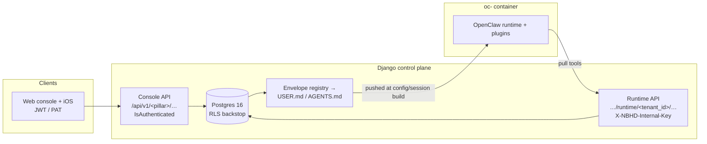

# Content pillars — reflective features the console *and* the assistant share

Prereq: read [`../agents/architecture.md`](../agents/architecture.md) first — this doc assumes the three-plane
model (Django control plane, per-tenant OpenClaw container, static frontend) and the tenant lifecycle it
describes. Here we cover the **content pillars**: the reflective/PKM features whose data lives in Postgres and is
read *and written* from two directions — the authenticated **console** (Next.js web + iOS, `/api/v1/<pillar>/…`)
and the **assistant runtime** (the OpenClaw container calling back into Django over `…/runtime/<tenant_id>/…`).

Pillars in scope: **Journal** (`apps/journal`), **Lessons/Constellation** (`apps/lessons`), **Insights**
(`apps/insights`, the cross-pillar analytics layer), **Core** (`apps/core`, mindfulness + generated meditations),
**Automations** (`apps/automations`, user-defined recurring workflows). Fuel and Gravity/Finance are sibling
pillars but out of scope here (they feed Insights; see cross-pillar notes).

The defining property: **the container has no database of its own.** Everything durable is Postgres, reached by
Django. The assistant reaches it in two ways — pull-style HTTP tools (`…/runtime/…`) and proactive injection of
rendered text into its workspace files (USER.md / AGENTS.md envelopes) at session start. Both are detailed below.

---

## The two access surfaces

| | Console surface | Runtime surface |
|---|---|---|
| Caller | Web/iOS user | OpenClaw container plugins |
| Route shape | `/api/v1/<pillar>/…` | `…/runtime/<uuid:tenant_id>/…` |
| Auth | `IsAuthenticated` (JWT/PAT); tenant from `request.user.tenant` | `permission_classes=[AllowAny]` + manual `X-NBHD-Internal-Key` + `X-NBHD-Tenant-Id` check |
| Tenant scope | `request.user.tenant`, ORM `.filter(tenant=…)` | tenant from URL, validated against header, then `set_rls_context(service_role=True)` |
| Auth code | DRF permission class | `apps/integrations/internal_auth.py:123` `validate_internal_runtime_request()` |

**Runtime auth is per-tenant, constant-time.** `validate_internal_runtime_request` compares the supplied key
against that tenant's own `Tenant.internal_api_key` with `secrets.compare_digest`
(`apps/integrations/internal_auth.py:179`) and rejects any header↔URL tenant-id mismatch (`:155`). The legacy
shared fleet key was removed in Phase 1d (`internal_auth.py:15`). Every pillar reimplements the same
`_internal_auth_or_401(request, tenant_id)` wrapper (e.g. `apps/core/runtime_views.py:38`,
`apps/insights/runtime_views.py:65`, `apps/journal/runtime_purpose_views.py:36`) — copy-paste, not a shared mixin.

**Two runtime namespaces exist for historical reasons.** The newest pillars mount runtime routes under their own
app (`/api/v1/insights/runtime/…`, `/api/v1/core/runtime/…`, `/api/v1/journal/runtime/…`). The older journal +
lessons runtime surface lives in the catch-all **`apps/integrations`** app, mounted at
`/api/v1/integrations/runtime/…` (`config/urls.py:28`). Both are "add-don't-replace" — new endpoints were added
beside the old ones rather than migrating them (`apps/journal/query_views.py:6`).

---

## Pillar-by-pillar

### Journal (`apps/journal`) — the PKM core

Stores the user's notes, goals, tasks, purpose, and the document corpus the assistant recalls against. Models
(`apps/journal/models.py`), all tenant-FK-scoped:

| Model | Table | Role |
|---|---|---|
| `Document` | `journal_document` | v2 unified markdown doc (`kind` = daily/weekly/monthly/goal/project/tasks/ideas/memory); the search + recall corpus (`models.py:145`) |
| `DocumentChunk` | `journal_document_chunks` | ~500-token embedded slices of daily notes for vector recall (`models.py:598`) |
| `Goal` | `journal_goals` | typed lifecycle (active/achieved/abandoned) replacing `Document(kind=goal)` markdown blobs — fixed the "contradictory duplicate-doc" bug (`models.py:277`) |
| `Task` | `journal_tasks` | typed actionable item; completion is a DB UPDATE, not a markdown edit → no stale snapshot ships (`models.py:438`) |
| `Purpose` | `journal_purposes` | the user's **North Star**; consent-first (proposed→confirmed) — see below (`models.py:365`) |
| `JournalEntry` / `WeeklyReview` / `DailyNote` / `UserMemory` / `NoteTemplate` | `journal_entries`, … | legacy structured/markdown models the `Document` model unifies (`models.py:52`,`80`,`110`,`134`,`17`) |
| `PendingExtraction` / `PendingTaskAction` | `journal_pending_*` | nightly-extraction proposals (net-new items) and auto-applied reconciliation actions with undo snapshots (`models.py:210`,`522`) |
| `Workspace` | `journal_workspaces` | ≤4 per tenant; each maps to a separate OpenClaw session via the chat `user` param (`models.py:625`) |
| `Session` | (via `session_models.py`) | inbound-message record the runtime marks processed |

**Console** (`apps/journal/urls.py`, all `IsAuthenticated`): full note/document CRUD (`documents/`, `today/`,
`daily/<date>/…`, `tree/`), typed **goals** (`goals/`, `goals/<id>/achieve|abandon/`) and **tasks** (`tasks/`,
`tasks/<id>/complete|reopen/`), **purposes** (`purposes/`), templates/reviews, and the nightly-extraction
approve/dismiss endpoints (`urls.py:55-115`). Workspaces and sessions are mounted at the top level:
`/api/v1/workspaces/` (list/create/switch/detail, `apps/journal/workspace_urls.py`) and `/api/v1/sessions/`
(`apps/journal/session_urls.py`).

**Runtime** — split across two apps:
- *Legacy, in `apps/integrations`* (`/api/v1/integrations/runtime/<tenant_id>/…`): `journal-entries/`,
  `daily-note/` + `daily-note/append/`, `long-term-memory/`, `goals/…`, `tasks/…` typed lifecycle, `document/` +
  `document/append/`, `journal/search/` (full-text), `memory-sync/` (bulk doc export), `journal-context/`
  (session-init bundle), `sessions/pending/` + `sessions/<id>/mark-processed/` (`apps/integrations/urls.py:68-257`).
- *New, in `apps/journal`* (`/api/v1/journal/runtime/<tenant_id>/…`): `query/` (parameterized structured query,
  `query_views.py:JournalQueryView`) and the **North Star** endpoints `purposes/`, `purposes/propose/`,
  `purposes/<id>/confirm|retire|link-goal/` (`apps/journal/urls.py:92-129`).

**North Star consent is enforced in transport, not just the prompt.** `RuntimePurposeProposeView` always writes
`status=proposed, origin=assistant_proposed` (`runtime_purpose_views.py:112`); `RuntimePurposeConfirmView`
returns **403** unless the body carries `user_confirmed: true` (`runtime_purpose_views.py:142`). Only
confirmed/evolving purposes render into USER.md, so an un-assented hypothesis never grounds the assistant.

**Parameterized query (`nbhd_journal_query`)** — `JournalQueryView` (`query_views.py:154`) is a strict, allow-list
query builder over `entries`/`tasks`/`goals`: pydantic `extra="forbid"` request (`:41`), per-resource field /
filter / group-by / window-field allow-lists (`:73-148`), aggregation limited to `count` because journal columns
are categorical (`:144`). It exists so the assistant can ask "tasks completed last month" precisely instead of
free-text guessing; it shares auth/RLS/windowing with `apps/common/query_view.BaseQueryView`.

#### Journal search routes through Postgres — the SQLite invariant

Free-text recall is `nbhd_journal_search` → `RuntimeJournalSearchView`
(`apps/integrations/runtime_views.py:2030`). It is a **Postgres full-text query**, not a container-local index:
a weighted `SearchVector("title", weight="A") + SearchVector("markdown", weight="B")` with a
`SearchQuery(q, search_type="websearch")`, ranked by `SearchRank`, filtered `rank > 0`, tenant-scoped
(`runtime_views.py:2072-2077`). This is deliberate. OpenClaw's built-in `memory_search` used to index workspace
files into `memory/main.sqlite` **on the per-tenant Azure File Share**; SMB lock/fsync semantics corrupted those
SQLite files fleet-wide (a container kill mid-write left 0-byte DBs). `memory_search` was disabled fleet-wide and
all search re-routed through Postgres (`RuntimeMemorySyncView` docstring, `runtime_views.py:2326`;
`apps/journal/tasks.py:17`). **Invariant: never put SQLite on the share; route search through Postgres.** The
container still receives a markdown mirror of documents via `memory-sync/` as a journal-of-record, but never
indexes it locally. A grounding probe (`apps/orchestrator/grounding_probe.py`) replicates this exact query to
verify which docs the assistant can actually reach.

**Cross-pillar:** `Document`/`Goal`/`Task` carry a `pillar` tag + optional `topic` FK into
`insights.TopicRegistry` (`models.py:185-192`,`301-308`); journal reuses `apps/lessons` embeddings
(`extraction.py`), and the journal session-init bundle folds in constellation context (see Lessons).

### Lessons / Constellation (`apps/lessons`) — the "personal galaxy"

Stores durable lessons as "stars" the user can cluster, connect, and tutor on. Models (`apps/lessons/models.py`):
`Lesson` (`:13`, pgvector `embedding(1536)`, `pillar`, `status` approval flow, galaxy game state:
`star_stage` proto→ignited→radiant→supernova, `position_x/y`), `LessonConnection` (edges, `:125`),
`TutoringSession` (5-phase Socratic transcript + honest player-signal fields, `:153`), `StarJournalEntry`
(star-scoped reflections, `:195`).

What it *does*: `services.py` (embed + cosine similarity via pgvector, `create_connections`, semantic
`search_lessons`), `clustering.py` (agglomerative clustering + PCA 2D positions + `refresh_constellation`),
`growth.py` (monotonic star-stage promotion), `tutoring.py` (5-phase LLM tutoring engine, `anthropic/claude-sonnet-4.6`
via OpenRouter, session state in Redis), `copilot.py` (Galaxy "Reflect" — backend computes spatial evidence, LLM
phrases one line, PII scrubbed on egress), `agent_context.py` (the single shaper of assistant-facing constellation
context), `pillars.py` (`infer_pillar_from_tags`, over-classifies toward private pillars).

**Console** (`/api/v1/lessons/…`, single `LessonViewSet`, `IsAuthenticated`, `views.py:34`): CRUD + `approve/`,
`dismiss/`, `share/`, `refresh/`, `pending/`, `constellation/`, `galaxy/` (+ `summary/`, `insights/`,
`reflect/`), `tutor/start|message|end|state/`, `journal/`, `pin-note/`, `connect/`, `clusters/`, `search/`.

**Runtime** (in `apps/integrations`, `/api/v1/integrations/runtime/<tenant_id>/…`): `lessons/` (create —
auto-approves, embeds, re-clusters), `lessons/search/`, `lessons/pending/`,
`lessons/<id>/propose-share/`, `constellation/notes/` (backs the `nbhd_constellation_notes` pull tool)
(`apps/integrations/runtime_views.py:1647,1742,1806,1834`; `urls.py:187-229`). Note tutoring **writes**
(`TutoringSession`/`StarJournalEntry`) go through the authenticated console ViewSet, not a runtime endpoint.

**Cross-pillar:** Lessons is the most-referenced pillar. It feeds Core meditations
(`apps/core/services.py:110` calls `build_constellation_context`), the Journal session bundle
(`RuntimeJournalContextView` embeds constellation context), Insights (`Pillar.LESSONS`/`Pillar.CONSTELLATION`;
`yesterdays_signals.py:34`), and the Friends/Neighborhood share tables (the only cross-tenant RLS-policy tables).

### Insights (`apps/insights`) — the all-pillars analytics + assistant-memory layer

This pillar aggregates *across* the others. Models (`apps/insights/models.py`): `PillarSnapshot` (append-only
per-pillar time series, `payload` JSON, `:23`), `AssistantInsight` (the assistant's durable recorded observations
about a tenant — statement + evidence + confidence + open/confirmed/refuted status, `:134`), `UserVoicePref`
(per-tenant/topic voice overrides: register/tone/volume, `:175`), and a global (non-tenant) topic taxonomy
`TopicRegistry` + `TopicAlias` (`:55`,`:104`).

**A "pillar" here is a stable product concept** (`pillars.py`), enumerated as `Pillar(TextChoices)`:
`gravity` (=finance), `fuel`, `core`, `lessons`, `constellation`, `horizons`, `journal` (`pillars.py:17-24`), each
with a default snapshot cadence in `PILLAR_CONFIG` (`:34-42`).

**How aggregation works — mostly formula, one LLM step:**
- **Snapshots** (`snapshots.py`): one `compute_*_snapshot(tenant)` per pillar, each reaching into the *other*
  app's models — `compute_gravity_snapshot` reads `apps.finance` (`:209`), `compute_fuel_snapshot` reads
  `apps.fuel` (`:70`), `compute_core_snapshot` reads `apps.core.MeditationSession` (`:136`),
  `compute_journal_snapshot` reads `apps.journal` entries/goals/tasks (`:170`). `lessons`/`constellation`/`horizons`
  are enumerated but have no snapshot computer yet.
- **Baselines** (`baselines.py`): pure rolling-window stats over snapshot history (mean, stdev, z-score, trend) —
  "no judgment… the intelligence lives in the LLM, not here" (`baselines.py:4`). Extractors currently only cover
  gravity topics (`:47`).
- **Signals** (`signals.py`) and **yesterday's-signals** (`yesterdays_signals.py`): assemble raw evidence blocks
  for the LLM to weigh — no score, no register chosen (`signals.py:5`); the only mechanical rails are "hard floors"
  (e.g. ≥4 snapshots before the assistant may be direct, `:226`). `yesterdays_signals.compute()` is the distinct
  cross-pillar, day-scoped roll-up (Fuel/Journal/Lessons/Core + gravity counts) behind the Personal-Question and
  Heartbeat crons.
- **Markers** (`markers.py`): the LLM emits inline `[[insight:<pillar>/<slug>]]…[[/insight]]` markers in replies;
  `extract_and_record_insights_with_ids()` parses them into `AssistantInsight` rows (`:109`). Gravity markers are
  refused unless `tenant.finance_active` (`:163`).
- **Weekly synthesis** = the one true LLM step (`synthesis.py`): `generate_weekly_reflection()` runs Django-side
  (works for hibernated tenants, bills the platform), reads gravity's last 4 weeks + every other pillar's latest
  snapshot + open/confirmed insights, and emits one prose reflection + one insight marker via DeepSeek-V4
  (`SYNTHESIS_MODEL`, `synthesis.py:48,113,354`). Idempotent per ISO week.

**Scheduling** (`tasks.py`, via QStash → `apps/cron/views.py`): `snapshot_gravity_weekly` and
`snapshot_pillars_weekly` (formula, write `PillarSnapshot`); `weekly_gravity_reflection` (hourly dispatcher firing
per tenant at local Sunday 09:00 → the LLM synthesis, `tasks.py:103-184`).

**Console** (`/api/v1/insights/…`, `IsAuthenticated`): `history/`, `snapshots/<id>/`, `compare/`, `baseline/`,
`insights/` + `insights/record|<id>/confirm|<id>/refute/`, `signals/`, `voice-prefs/` + `voice-prefs/set/`
(`views.py`, `urls.py:34-58`). **Runtime** (`/api/v1/insights/runtime/<tenant_id>/…`, the `nbhd-insights-tools`
plugin): the same set plus `yesterdays-signals/` (`runtime_views.py`, `urls.py:59-124`), reusing the console
serializers/helpers by import.

**Envelope** (`insights/envelope.py`): the observation gate (~2.1 KB) renders into **AGENTS.md** behavior rules
(`render_observation_mode_rules`), while a tiny counts-only block ("Gravity memory: N open, N confirmed…") renders
into **USER.md** (`render_observation_mode`) — both gated on `finance_active`. The voice-register selection rules
(~1.9 KB) do **not** live in AGENTS.md: a finance + friends-propose tenant's AGENTS.md overran OpenClaw's 24 KB
bootstrap cap and silently truncated the register tail, and a `rules/X.md` pointer is unreliable (loaded at most
once per conversation — the "white whale"). They now ride the `nbhd_insights_signals` tool response
(`REGISTER_GUIDANCE`, `signals.py`), delivered deterministically on every finance-topic call — the gate mandates
that call and says the response carries them.

### Core (`apps/core`) — mindfulness + generated meditations

Stores a per-tenant `CoreProfile` (voice, duration, opt-in daily cron, `core_profiles`, `models.py:33`) and
`MeditationSession` rows — each a **render manifest + rendered audio location** (`core_meditation_sessions`,
`models.py:82`; status pending→rendering→ready→delivered/failed).

**Generation is a locked two-step split: the LLM *authors* a manifest (judgment), the backend *renders*
deterministically.** There are two authoring entry points:
1. **Assistant-authored** (runtime): the OpenClaw plugin POSTs a manifest to
   `RuntimeMeditationCreateView` (`/api/v1/core/runtime/<tenant_id>/meditation/`). It is validated against the
   fixed 6-phase arc *before any TTS spend* (`runtime_views.py:138`), persisted PENDING, then enqueued
   (`publish_task("render_meditation", …)`, `:160`).
2. **Web-orb-authored** (backend): `compose.py` `author_manifest()` gathers raw signals and asks an ordered chain
   of low-cost OpenRouter models to fill the fixed 6-phase scaffold (Gemma-4 primary, DeepSeek fallbacks;
   JSON-mode; each candidate parsed *and* `validate_manifest`-checked, `compose.py:302-366`). Signals come from
   `gather_meditation_signals` — constellation stars, recent journal themes, active goals, fuel summary
   (`services.py:69-138`), i.e. Core reads *every other pillar* to personalize the sit.

The renderer (`services.render_meditation`, `services.py:231`) voices speech segments with Gemini TTS
(`GEMINI_TTS_MODEL`), stitches programmatic silence (most of the 10 minutes is free silence — sparse ~6–12 TTS
calls to stay under rate caps), transcodes to mp3 + ogg, and **writes the audio to the per-tenant Azure File Share
as binary** (`upload_workspace_file_binary`, `services.py:335-344`) — binary write bypasses the SMB text-sanitize
chokepoint, which is correct for audio, and never SQLite-on-the-share.

#### Unauthenticated audio serving

Rendered audio is served by `serve_meditation_audio` (`apps/router/views.py:507`), routed at
`/api/v1/meditations/<uuid:tenant_id>/<filename>` (`config/urls.py:16`) with **no authentication** — the same model
as chart images (`serve_chart_image`, `:403`). Security rests entirely on the **unguessable UUID filename**
(`<session_uuid>.mp3|ogg`), enforced by a strict `^[\w-]+\.(mp3|ogg)$` regex that also blocks path traversal
(`:520`). The handler pulls the bytes from `ws-<tenant>/workspace/meditations/…` via a `ShareFileClient` built
from the storage-account key (`:540-553`) and returns a **Range-aware** response (`_audio_range_response`, `:460`)
— iOS `AVPlayer`/Safari need HTTP Range/`Accept-Ranges` to learn a finite duration, else the sit "loops forever."
Cached `public, max-age=3600`. Same unauthenticated-UUID posture backs `serve_chart_image` (LINE fetches chart
PNGs by URL). See Risks.

**Console** (`/api/v1/core/…`, `IsAuthenticated`): `settings/`, `restart/`, `profile/`, `compose/` (web orb
trigger), `sessions/` + `sessions/<id>/`. **Runtime** (`/api/v1/core/runtime/<tenant_id>/…`): `summary/`,
`profile/` (GET/PATCH), `meditation/` (create), `meditation/<id>/` (`apps/core/urls.py:20-37`).

### Automations (`apps/automations`) — user-defined recurring workflows

Stores an `Automation` (kind = `daily_brief` | `weekly_review`; structured `schedule_type`/`schedule_time`/
`schedule_days`, not a raw cron string; `status` active/paused; self-advancing `next_run_at`; `automations` table,
`models.py:12`) and an `AutomationRun` per execution (status, trigger_source, idempotency_key, input/result
payloads, `automation_runs`, `models.py:50`).

**How it runs:** there is **no per-automation schedule** — a single global QStash cron `* * * * *` hits
`/api/cron/trigger/run_due_automations/` (registered in `register_system_crons.py:142`), which sweeps
`status=ACTIVE AND next_run_at <= now` (`scheduler.py:18`). Each due row's action is to **POST a synthetic
Telegram message into the tenant's own container** — a canned "Run PKM Loop…" prompt
(`services._dispatch_to_openclaw` → `forward_to_openclaw`, `services.py:208-226`) — i.e. it triggers the assistant
as if the user texted it, and the assistant's PKM-loop skill produces the brief/review. Pause just flips `status`
(dropping it from the sweep); resume recomputes `next_run_at` from now so a long-paused automation doesn't
backfire (`services.py:367-386`). Guards: ≤5 active per tenant, ≥120-min interval, ≤12 runs/day
(`services.py:20,266-282`).

**Console** (`/api/v1/automations/…`, all `IsAuthenticated`): list/create, detail (GET/PATCH/DELETE), `pause/`,
`resume/`, `run/` (manual), `runs/` (`apps/automations/urls.py`, `views.py`). **Runtime: none.** The OpenClaw
assistant **cannot** create or trigger `apps/automations` rows — there is no runtime endpoint for this app; it is
console/iOS-only, firing autonomously only via the QStash system cron. (Beware the naming clash: a separate
`nbhd-automation-tools` plugin lets the assistant create **`apps/cron` typed-cron reminders** — a different
subsystem it confusingly also calls "the user's automations.")

---

## Summary: pillar → models → endpoints

| Pillar | Key models | Console (`/api/v1/…`) | Runtime (`…/runtime/<tenant_id>/…`) |
|---|---|---|---|
| **Journal** | `Document`, `DocumentChunk`, `Goal`, `Task`, `Purpose`, `JournalEntry`, `Workspace`, `Session`, `PendingExtraction` | `journal/`, `journal/goals/…`, `journal/tasks/…`, `journal/purposes/…`, `workspaces/`, `sessions/` | *integrations:* `journal-entries/`, `daily-note/`, `document/`, `journal/search/`, `memory-sync/`, `journal-context/`, `goals/…`, `tasks/…`, `sessions/pending/`; *journal:* `query/`, `purposes/…propose\|confirm\|retire\|link-goal/` |
| **Lessons** | `Lesson`, `LessonConnection`, `TutoringSession`, `StarJournalEntry` | `lessons/` (+ `approve/`, `galaxy/`, `tutor/*`, `reflect/`, `connect/`, `search/`) | *integrations:* `lessons/`, `lessons/search/`, `lessons/pending/`, `lessons/<id>/propose-share/`, `constellation/notes/` |
| **Insights** | `PillarSnapshot`, `AssistantInsight`, `UserVoicePref`, `TopicRegistry`/`TopicAlias` | `insights/history\|compare\|baseline\|signals/`, `insights/…record\|confirm\|refute/`, `voice-prefs/…` | `insights/…` (all console reads/writes) + `yesterdays-signals/` |
| **Core** | `CoreProfile`, `MeditationSession` | `core/settings\|profile\|compose\|sessions/` + `GET /api/v1/meditations/<tenant>/<file>` (unauth) | `core/summary\|profile/`, `core/meditation/` (create), `core/meditation/<id>/` |
| **Automations** | `Automation`, `AutomationRun` | `automations/` (+ `pause\|resume\|run\|runs/`) | *(none — console/iOS only; fires via QStash system cron)* |

## How pillar data reaches the assistant without a call (the envelope layer)

Beyond pull-tools, each pillar registers **envelope sections** with `apps.orchestrator`'s registry, which
Django renders into the container's workspace files at config/session build time — so recent context rides in every
turn without a tool call. Journal (North Star, recent docs), Lessons (`recent_lessons`, `constellation_activity` →
USER.md, `apps/lessons/envelope.py`), Insights (observation rules → AGENTS.md, counts → USER.md), and Core all
publish sections. This is the "proactive injection" half of the model; `RuntimeJournalContextView`
(`…/journal-context/`) is the session-init bundle that also carries constellation context. See
[`../agents/architecture.md`](../agents/architecture.md) ("OpenClaw workspace + config") for how these files are
generated and pushed via the sanitize chokepoint — and note **image-first-then-config** applies to any envelope
change that assumes a newer runtime.

---

## Risks & improvement opportunities

- **[high] Unauthenticated audio/chart serving leaks on UUID guess or log exposure.** `serve_meditation_audio` /
  `serve_chart_image` (`apps/router/views.py:507,403`) authorize *only* by unguessable filename — no session, no
  tenant check beyond the URL. A meditation's `audio_url`/`ogg_url` is a plaintext `Document`/model field and is
  handed to LINE/Telegram; anyone who obtains the URL (referrer leak, proxy log, chat forward, LINE CDN cache)
  can fetch another tenant's private meditation audio or financial charts indefinitely (`max-age=3600` caches it
  at intermediaries). Consider short-lived signed URLs (HMAC + expiry) or an authenticated proxy for the web `<audio>`
  path, keeping unguessable-UUID only for the messaging-CDN fetch that genuinely can't send auth headers.
- **[high] Runtime auth is `AllowAny` + hand-rolled per view.** Every runtime endpoint declares
  `permission_classes=[AllowAny]` and relies on the first line of each handler calling `_internal_auth_or_401`
  (duplicated verbatim in `journal/runtime_purpose_views.py`, `core/runtime_views.py`, `insights/runtime_views.py`,
  `integrations/runtime_views.py`). A new endpoint that forgets that first line is silently world-open with no
  failing test to catch it. A shared `IsInternalRuntime` DRF permission class (or `authentication_class`) would
  make the default deny and remove the copy-paste.
- **[med] Two runtime namespaces for the same domain.** Journal + lessons runtime endpoints live in the
  grab-bag `apps/integrations` (`/integrations/runtime/…`) while newer ones live under the owning app
  (`/journal/runtime/…`). Split ownership makes the journal runtime surface hard to enumerate and audit (search,
  memory-sync, and query sit in different apps). Consolidating under the owning app would align with the
  architecture's per-pillar model.
- **[med] Insights aggregation is Gravity-heavy; other pillars are half-wired.** `lessons`/`constellation`/
  `horizons` are enumerated pillars with **no snapshot computer**; baseline extractors and compare-diffs are
  gravity-only (`baselines.py:47`, `views.py`). The cross-pillar promise ("insights aggregate across pillars") is
  currently mostly finance + fuel/core/journal snapshots; the doc/tooling implies broader coverage than exists.
- **[med] Tenant isolation on content tables is application-enforced, RLS is only a backstop.** No content pillar
  declares per-table RLS *policies*; isolation is `.filter(tenant=…)` in every query plus a blanket
  `ENABLE ROW LEVEL SECURITY` swept in by the tenants "relock" migrations (Django connects effectively
  BYPASSRLS). A missing `.filter(tenant=…)` on any endpoint is a cross-tenant read with no DB-level catch. The
  runtime path is safer (`set_rls_context(service_role=True)` still scopes GUC), but console ORM queries are the
  exposure. Worth a test that asserts every list endpoint is tenant-scoped.
- **[med] North Star / meditation writes trust the container's self-reported consent.** `purpose/confirm` requires
  `user_confirmed=true` (`runtime_purpose_views.py:142`) but the flag is set by the plugin, not verified against a
  real user action server-side; a compromised/confused runtime could confirm a purpose or author a meditation with
  fabricated `user_confirmed`. The transport gate is a good guardrail against prompt drift, not against a hostile
  container. Acceptable given the container is per-tenant and trusted, but note the trust boundary.
- **[low] "Automations" overloads one word across two subsystems.** `apps/automations` (daily-brief/weekly-review,
  console-only) vs. the `nbhd-automation-tools` plugin that creates `apps/cron` typed-cron reminders. Same word,
  different tables, different auth surface — a real trap for a new engineer or auditor tracing "where do automations
  live." A rename or a doc note at both call sites would prevent conflation.
- **[low] Journal free-text search has no GIN index in-migration.** `RuntimeJournalSearchView` computes
  `SearchVector` on the fly per query (`runtime_views.py:2072`) rather than against a stored/indexed `tsvector`
  column; fine at current per-tenant doc counts, but it is a sequential scan that will degrade as the corpus grows.
  A stored `SearchVectorField` + GIN index is the standard fix.
