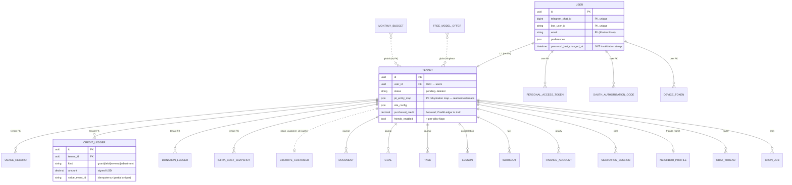

# Data Model Catalog

Authoritative catalog of every Django model in the NBHD United control plane, its
tenant-scoping column, and its row-level-security posture. Written for a new senior
engineer onboarding to the schema **and** for a security auditor reasoning about
tenant isolation.

Read these first — this doc cross-links them and does not repeat their prose:

- [`docs/agents/invariants.md`](../agents/invariants.md) — permanent platform rules
  (SQLite-on-share ban, sanitize chokepoint, inbound dedup, no external calls in
  `transaction.atomic()`, the RLS GUC re-set pattern).
- [`docs/rls-tenant-isolation.md`](../rls-tenant-isolation.md) — the *designed* RLS
  model: two Postgres roles, `set_rls_context()`, three auth paths, GUC variables.
  **The "Tenant isolation & RLS" section below records where production diverges
  from that document — read both.**

## Conventions & legend

- **ORM/DB names.** Every model is a `django.db.models.Model`. Where a model sets
  `Meta.db_table` the physical table name is given; otherwise Django derives
  `<app>_<model>` (noted as *derived*).
- **PK.** Almost all models use `id = UUIDField(default=uuid.uuid4)`. Exceptions are
  called out (`FriendMessage.seq` BigAuto; singleton small-int PKs; the legacy
  `DailyNote`/`UserMemory` auto-int PKs).
- **Tenant-scope column** — how a row is bound to a subscriber:

  | Marker | Meaning |
  |---|---|
  | `tenant` FK | `ForeignKey(tenants.Tenant)` → `tenants.id`. The dominant pattern; the RLS/scoping key. |
  | `tenant` O2O | `OneToOneField(Tenant)` — one row per tenant (profiles, memory). |
  | `user` FK | `ForeignKey(tenants.User)` → `users.id`. Control-plane identity scope, **no** tenant column. |
  | cross-tenant | Row spans **two** tenants (Neighborhood edges/shares). Isolation is the audited accessor, not a single-tenant filter. |
  | global | No tenant column — control-plane / fleet-wide / singleton. |

- **PII** column flags rows that store real user-identifying or sensitive content
  (names, emails, message bodies, health, finance). "scrubbed" = deliberately
  PII-neutralized at rest. See the dedicated PII section for the consolidated list.
- `Tenant` is `OneToOne` on `User`, so a `user` FK and a `tenant` FK ultimately
  resolve to the same subscriber; they differ in **which** table the row hangs off
  and therefore how it is (or isn't) RLS-scoped.

## Core cluster ER

The control-plane spine: `User` (auth identity) ↔ `Tenant` (subscriber / OpenClaw
instance), the billing/usage ledgers that hang off `Tenant`, and the representative
per-pillar roots. Stripe subscription objects live in the third-party **dj-stripe**
schema (`djstripe_customer` / `djstripe_subscription`); `Tenant` only caches
`stripe_customer_id` / `stripe_subscription_id` for quick lookup.

---

## App: `tenants` — control plane core

`apps/tenants/models.py` plus five sibling modules imported for migration discovery
(`agenda_models`, `line_models`, `oauth_models`, `pat_models`, `promo_models`,
`telegram_models`).

| Model | Table | Scope | Purpose (one line) | Notable fields / constraints |
|---|---|---|---|---|
| `User` (`AbstractUser`) `models.py:23` | `users` | global (is the identity) | Auth identity; Telegram/LINE binding, locale, location, marketing opt-out. **PII.** | `telegram_chat_id`/`line_user_id` unique; `password_last_changed_at` invalidates pre-rotation JWTs (`set_password`/`set_unusable_password` override); `chat_last_read_at` drives APNs badge; `preferences`/`pii`-adjacent fields JSON. |
| `Tenant` `models.py:149` | `tenants` | control-plane root | One subscriber = one OpenClaw container. Central record tying user↔container↔billing↔config↔pillar flags. **PII** (`pii_entity_map`, `site_config`, `identity_growth`, Stripe ids). | O2O→`User`; `status` state machine (`pending…deleted`); container/KV/OpenRouter-key columns; **`pii_entity_map`** = placeholder→real value rehydration map; `pii_denylist`; `internal_api_key` (per-tenant); usage counters + `purchased_credit` (hot cache of `CreditLedger`); per-pillar `*_enabled` flags (`finance/fuel/core/site_publishing/friends/byo_models`); many `experimental_*` canary gates; `active_workspace` FK→`journal.Workspace`. |
| `AgendaEngagement` `agenda_models.py:35` | *derived* `tenants_agendaengagement` | `tenant` FK | Per-thread engagement overlay (surface/suppress/defer agenda items). | Unique `(tenant, kind, item_id)`; `state` machine; `response_signals` append-log JSON. |
| `PersonalAccessToken` `pat_models.py:33` | `personal_access_tokens` | `user` FK | Long-lived revocable API token (YardTalk etc.). | Stores **SHA-256 hash only** (`token_hash` unique) + `token_prefix`; `scopes` JSON; `is_valid` checks revoke/expiry. |
| `OAuthAuthorizationCode` `oauth_models.py:56` | `oauth_authorization_codes` | `user` FK | Single-use PKCE code for web→iOS sign-in handoff. | `code_hash` unique (raw never stored); `code_challenge` (S256) compared constant-time; short TTL, `consumed_at`. |
| `TelegramLinkToken` `telegram_models.py:9` | `telegram_link_tokens` | `user` FK | One-time deep-link token binding Telegram to a User (10-min TTL). | `token` unique; single-use `used`. |
| `LineLinkToken` `line_models.py:9` | `line_link_tokens` | `user` FK | One-time deep-link token binding LINE to a User (15-min TTL). | `token` unique; single-use. |
| `PromoCampaign` `promo_models.py:21` | `promo_campaigns` | global | Fleet-wide promo event (trial extensions). | `code` unique slug; `valid_until` hard deadline; `audience_snapshot` JSON. |
| `PromoRedemption` `promo_models.py:68` | `promo_redemptions` | `user` FK | One redemption per (campaign, user). | **`unique_together (campaign, user)`** = DB-level double-click idempotency; `outcome` enum. |

---

## App: `billing` — usage, credit, donations, model health

`apps/billing/models.py`. Subscription objects proper are **dj-stripe** tables; this
app holds NBHD's own ledgers and fleet controls.

| Model | Table | Scope | Purpose | Notable fields / constraints |
|---|---|---|---|---|
| `UsageRecord` `:11` | `usage_records` | `tenant` FK | Per-message token/cost usage for billing + analytics. | `is_system_event` charges platform not tenant; idx `(tenant, created_at)`, `(event_type, created_at)`. |
| `CreditLedger` `:246` | `credit_ledger` | `tenant` FK | Append-only audit + idempotency log for prepaid credit; `Tenant.purchased_credit` is its denormalized cache. | `kind` grant/debit/reversal/adjustment; **partial `UniqueConstraint` on `stripe_event_id`** for grant & reversal (Stripe redelivery lock); idx on `stripe_payment_intent_id`. |
| `DonationLedger` `:40` | `donation_ledger` | `tenant` FK | Monthly surplus-donation calc + disbursement. | Unique `(tenant, month)`; `status` pending/completed/failed/skipped. |
| `InfraCostSnapshot` `:93` | `infra_cost_snapshots` | `tenant` FK | Daily real Azure infra cost per tenant. | Unique `(tenant, month)`; `source` azure/estimate. |
| `MonthlyBudget` `:121` | `monthly_budgets` | global | Fleet-wide monthly spend cap / kill switch. | `month` unique; `is_capped` blocks non-essential API. |
| `ModelHealth` `:150` | `model_health` | global | Per-model OpenRouter availability + pricing. | `model_id` unique; `consecutive_failures`, `pricing` JSON. |
| `FreeModelOffer` `:197` | `free_model_offer` | global **singleton** (`pk=1`) | Limited-time free-model promo state (advertised default). | `enabled` operator kill-switch vs `is_active` (health-driven); `.load()` accessor. |

---

## App: `journal` — daily notes, typed goal/task lifecycle, sessions

`apps/journal/models.py` + `session_models.py`. Home of the v2 unified `Document`
and the typed `Goal`/`Task`/`Purpose` lifecycle that supersedes markdown blobs
(gated by `Tenant.experimental_typed_journal_lifecycle`). **All content here is
user PII.**

| Model | Table | Scope | Purpose | Notable fields / constraints |
|---|---|---|---|---|
| `Document` `:145` | *derived* `journal_document` | `tenant` FK | v2 unified markdown doc (daily/weekly/monthly/goal/project/tasks/ideas/memory). | Unique `(tenant, kind, slug)`; `pillar` + `topic`→`insights.TopicRegistry`; `kind=goal/tasks` **deprecated** → promoted to typed `Goal`/`Task`. |
| `Goal` `:277` | `journal_goals` | `tenant` FK | Typed intention with target + status lifecycle. Replaces `Document(kind=goal)`. | `status` active/achieved/abandoned; self-FK `parent_goal`; FK `purpose`; `migrated_from_document`; idx `(tenant,status)`, `(tenant,pillar,status)`, `(tenant,target_date)`. |
| `Task` `:438` | `journal_tasks` | `tenant` FK | Typed actionable item with status. Replaces `Document(kind=tasks)` bullets. | `related_ref` JSON points into any pillar's row (e.g. `FinanceAccount`); `parent_goal`, self-FK `parent_task` (CASCADE). |
| `Purpose` `:365` | `journal_purposes` | `tenant` FK | North Star — durable direction above goals. Consent-first (proposed→confirmed). | `status` proposed/confirmed/evolving/retired; `origin`; `evidence` JSON. |
| `PendingExtraction` `:210` | `journal_pending_extractions` | `tenant` FK | Nightly-extracted lesson/goal/task/purpose awaiting user approval (7-day TTL). | `kind`/`status` enums; FKs to minted `Goal`/`Task`; `expires_at` idx. |
| `PendingTaskAction` `:522` | `journal_pending_task_actions` | `tenant` FK | Auto-applied Task/Goal reconciliation with undo (`before_state` snapshot). | `kind` task_*/goal_* ; `status` applied/undone/failed. |
| `DocumentChunk` `:598` | `journal_document_chunks` | `tenant` FK | ~500-tok embedded chunk of a `Document` for vector recall. | `embedding` `VectorField(1536)` (pgvector); unique `(document, chunk_index)`. |
| `Workspace` `:625` | `journal_workspaces` | `tenant` FK | Focused conversation context → separate OpenClaw session. Max 4 (app-enforced). | Unique `(tenant, slug)`; `description_embedding` for routing; `is_default` "General". |
| `NoteTemplate` `:17` | `note_templates` | `tenant` FK | Sectionized daily-note template. | Unique `(tenant, slug)`; `sections` JSON. |
| `Session` `session_models.py:10` | `journal_sessions` | `tenant` FK | Work session pushed by external app (YardTalk); assistant distills it. | Partial unique `(tenant, idempotency_key)`; `processed_at` gates distillation. |
| `JournalEntry` `:52` *(legacy)* | `journal_entries` | `tenant` FK | Pre-v2 structured mood/energy entry. | Superseded by `Document`. |
| `WeeklyReview` `:80` *(legacy)* | `weekly_reviews` | `tenant` FK | Pre-v2 weekly review. | Superseded by `Document`. |
| `DailyNote` `:110` *(legacy)* | *derived* `journal_dailynote` | `tenant` FK | Pre-v2 one-markdown-per-date. Auto-int PK. | Unique `(tenant, date)`. |
| `UserMemory` `:134` *(legacy)* | *derived* `journal_usermemory` | `tenant` O2O | Pre-v2 MEMORY.md doc. Auto-int PK. | Superseded by `Document(kind=memory)`. |

---

## App: `router` — message queues, dedup, cross-device chat, push

`apps/router/models.py`. The inbound/outbound plumbing; see invariant #3 (every
inbound handler claims the event) and #4 (cover all channels). **Message-body
columns carry raw user PII.**

| Model | Table | Scope | Purpose | Notable fields / constraints |
|---|---|---|---|---|
| `BufferedMessage` `:9` | `buffered_messages` | `tenant` FK | Raw webhook stored while container hibernated; forwarded on wake. | `payload` JSON; soft-lease `delivery_in_flight_until`; attempts cap. |
| `PendingMessage` `:75` | `pending_messages` | `tenant` FK | Per-(tenant, channel, channel_user_id) serialized forward queue for warm containers. | `SELECT…FOR UPDATE SKIP LOCKED` + soft lease; channel incl. `ios`; drain idx. |
| `ProcessedInboundEvent` `:189` | *derived* `router_processedinboundevent` | **global** | Idempotency ledger — every inbound handler claims here first (invariant #3). | `event_key` unique (`line:<id>`/`tg:<update_id>`); probabilistic prune. |
| `ProactiveOutbound` `:231` | `proactive_outbounds` | `tenant` FK | Records proactive/cron pushes so next inbound surfaces them as context. | `channel` incl. `app`; `parsed_items` JSON; `notified_at` idempotent APNs claim; `?since=` feed idx. |
| `ConversationTurn` `:707` | `conversation_turns` | `tenant` FK | Captured Telegram/LINE turn (user+reply) so isolated cron sessions see "today". **Raw content at rest.** | `local_date` (tenant-local); 35-day probabilistic prune; iOS/web NOT stored here (in `AppChatMessage`). |
| `AppChatMessage` `:557` | `app_chat_messages` | `tenant` FK + `user` FK | Rich-client (iOS/web) turn; client polls for reply. | Unique `(tenant, client_msg_id)` idempotency; `source` tenant/on_device; `phase`/`partial_text`/`partial_seq` live progress; `attachment_path` (bytes on share, not in payload). |
| `ChatThread` `:504` | `chat_threads` | `tenant` FK + `user` FK | Channel-independent conversation thread; `is_main` shared across devices. | **Partial unique** `is_main` per tenant; OpenClaw `user`=`thread:<id>`. |
| `DeviceToken` `:792` | `device_tokens` | `tenant` FK + `user` FK | APNs token per iOS install. | `token` **globally unique** (atomic re-point on re-register); 410-prune. |
| `LineOutboundMessage` `:347` | `line_outbound_messages` | `tenant` FK | Sent-LINE-message store for quote-reply resolution. | `line_message_id` unique; probabilistic prune. |
| `LineQuotaState` `:395` | `line_quota_state` | global **singleton** (`pk=1`) | Fleet LINE Push quota state (one bot, one allowance). | `save()` pins `pk=1`; `.get()`; drives channel-selector gate + warn/exhaust/recover emails. |

---

## App: `cron` — Postgres-canonical OpenClaw cron store

`apps/cron/models.py`. Canonical source of truth for tenant cron schedules
(OpenClaw's SQLite is a derived view); per-tenant cutover via
`Tenant.postgres_cron_canonical`. See invariant #6 (QStash, not Celery) and #9
(cron lifecycle).

| Model | Table | Scope | Purpose | Notable fields / constraints |
|---|---|---|---|---|
| `CronJob` `:77` | *derived* `cron_cronjob` | `tenant` FK | One cron schedule row; `data` mirrors the gateway job dict. | Unique `(tenant, name)`; `source` system/user/fuel_session/agent; `pattern`+`typed_payload` overlay; **CheckConstraints**: freeform requires `user_confirmed_at`, typed requires `pattern`; `managed` gates reconciler. |

Enums `CronJobSource` / `CronPattern` / `CronCreationPath` (`:27`–`:75`) drive
reconciler classification and fire-time validation.

---

## App: `automations` — scheduled brief/review workflows

`apps/automations/models.py`.

| Model | Table | Scope | Purpose | Notable fields / constraints |
|---|---|---|---|---|
| `Automation` `:12` | `automations` | `tenant` FK | Daily-brief / weekly-review schedule config. | `kind`/`status`/`schedule_type`; quiet-hours; `next_run_at` idx. |
| `AutomationRun` `:50` | `automation_runs` | `tenant` FK | One execution attempt of an `Automation`. | **`idempotency_key` unique** (global); `status`/`trigger_source`; input/result JSON. |

---

## App: `actions` — irreversible-action gating

`apps/actions/models.py`. Confirmation flow for destructive agent actions (Gmail
delete, Calendar delete, etc.). Governed at the tenant level by `Tenant.gate_all_actions`.

| Model | Table | Scope | Purpose | Notable fields / constraints |
|---|---|---|---|---|
| `PendingAction` `:29` | *derived* `actions_pendingaction` | `tenant` FK | A destructive action awaiting user confirmation (5-min TTL). | `action_payload` JSON (may contain email subjects → PII); `platform_message_id` for edit-in-place; `is_expired`. |
| `GatePreference` `:84` | *derived* `actions_gatepreference` | `tenant` FK | Per-action-type auto-approve toggle. | Unique `(tenant, action_type)`. |
| `ActionAuditLog` `:106` | *derived* `actions_actionauditlog` | `tenant` FK | Permanent record of every gated action's outcome. | `result` approved/denied/expired; append-only. |

---

## App: `insights` — pillar telemetry, topic taxonomy, assistant memory

`apps/insights/models.py`. Note the **two global** taxonomy tables (fleet-shared,
no tenant column) vs the per-tenant snapshot/insight/pref tables.

| Model | Table | Scope | Purpose | Notable fields / constraints |
|---|---|---|---|---|
| `PillarSnapshot` `:23` | `insights_pillar_snapshot` | `tenant` FK | Append-only pillar-state time series. | `pillar`/`granularity`; `payload` JSON; idx `(tenant, pillar, -ts)`. |
| `AssistantInsight` `:134` | `insights_assistant_insight` | `tenant` FK | Patterns the assistant noticed about a tenant (compounds the relationship). **Behavioral PII.** | `topic` FK **PROTECT**; `status` open/confirmed/refuted/expired (refuted kept); `confidence` float. |
| `UserVoicePref` `:175` | `insights_user_voice_pref` | `tenant` FK | Per-tenant (opt. per-topic) tone/volume/register overrides. | Unique `(tenant, pillar, topic)`. |
| `TopicRegistry` `:55` | `insights_topic_registry` | **global** | Curated per-pillar topic taxonomy (canonical/proposed/deprecated). | Unique `(pillar, slug)`; self-FK `parent_topic`. |
| `TopicAlias` `:104` | `insights_topic_alias` | **global** | Synonyms collapsing into a canonical topic. | Unique `(topic, alias)`. |

---

## App: `lessons` — constellation (stars, tutoring, star journals)

`apps/lessons/models.py`. Note: `LessonConnection` and `TutoringSession` have **no
direct `tenant` column** — they scope transitively through their `Lesson`/star FK.

| Model | Table | Scope | Purpose | Notable fields / constraints |
|---|---|---|---|---|
| `Lesson` `:13` | `lessons` | `tenant` FK | One learning/insight = a star in the personal galaxy. **PII** (reflections). | `embedding` `VectorField(1536)`; `tags` ArrayField; `pillar` auto-derived in `save()`; `status` approval flow; `star_stage` lifecycle; galaxy `position_x/y`. |
| `LessonConnection` `:125` | `lesson_connections` | via `from_lesson`/`to_lesson` FK (transitive) | Edge between two related lessons. | Unique `(from_lesson, to_lesson)`; `similarity`, `connection_type`. |
| `TutoringSession` `:153` | `tutoring_sessions` | via `star` FK (transitive) | Full tutoring dialogue + player signals. **PII** (`messages`). | `messages`/`phases_completed` JSON/Array; `mastery_achieved`. |
| `StarJournalEntry` `:195` | `star_journal_entries` | `tenant` FK | Star-scoped reflection orbiting a lesson. **PII.** | `entry_type`; `tags` ArrayField. |

---

## App: `fuel` — workout & body-metric tracking

`apps/fuel/models.py`. Gated by `Tenant.fuel_enabled`; writes bump `Tenant.fuel_version`
for optimistic-concurrency refresh prompts. **Body-metric logs and profile
limitations (injuries) are sensitive health PII.**

| Model | Table | Scope | Purpose | Notable fields / constraints |
|---|---|---|---|---|
| `WorkoutPlan` `:44` | `fuel_workout_plans` | `tenant` FK | Named multi-week program grouping planned workouts. | `schedule_json`/`week_overrides` JSON; `status` active/completed/paused/archived. |
| `PlanSlot` `:94` | `fuel_plan_slots` | `tenant` FK | Stable identity for a planned session `(plan, week, weekday)`; survives plan regen. | **Partial unique** active slot `(plan, week_index, weekday)` where `archived_at IS NULL`. |
| `Workout` `:159` | `fuel_workouts` | `tenant` FK | One session (planned/done/skipped). | Partial unique `(tenant, external_id)` (HealthKit idempotency); `version`+`edit_lock_until/owner` optimistic concurrency; `scheduled_at` windows; `detail_json`/`notes_thread`. |
| `FuelProfile` `:324` | `fuel_profiles` | `tenant` O2O | Fitness profile (level, goals, **limitations/injuries**, equipment). | `use_session_scheduling` cutover flag; `healthkit_tombstones` guard resurrect-on-reinstall. |
| `WorkoutTemplate` `:401` | `fuel_workout_templates` | `tenant` FK | Reusable workout template. | `detail_json`. |
| `PersonalRecord` `:422` | `fuel_personal_records` | `tenant` FK | A PR achieved in a workout. | FK `workout`; `metric` est_1rm/distance/hold_s/reps. |
| `FuelGoal` `:447` | `fuel_goals` | `tenant` FK | Fitness goal with target value/date. | (distinct from journal `Goal`). |
| `RestingHeartRateLog` `:467` | `fuel_resting_heart_rate` | `tenant` FK | Daily RHR. **Health PII.** | Unique `(tenant, date)`; bpm 20–250. |
| `SleepLog` `:485` | `fuel_sleep` | `tenant` FK | Daily sleep duration/quality. **Health PII.** | Unique `(tenant, date)`. |
| `BodyWeightLog` `:515` | `fuel_body_weight` | `tenant` FK | Daily body weight (kg). **Health PII.** | Unique `(tenant, date)`. |

---

## App: `finance` — Gravity module (budgets, debt payoff)

`apps/finance/models.py`. Gated by `Tenant.finance_active` (per-tenant flag **AND**
platform `settings.GRAVITY_ENABLED` kill switch). **All rows are sensitive financial
PII.**

| Model | Table | Scope | Purpose | Notable fields / constraints |
|---|---|---|---|---|
| `FinanceAccount` `:10` | `finance_accounts` | `tenant` FK | A debt/savings/asset. | `account_type` enum + `DEBT_TYPES`; `payoff_progress` property; idx `(tenant, is_active)`. |
| `FinanceTransaction` `:94` | `finance_transactions` | `tenant` FK | A payment/charge against an account. | FK `account`; `transaction_type`; idx `(tenant,date)`, `(account,date)`. |
| `PayoffPlan` `:125` | `finance_payoff_plans` | `tenant` FK | Saved debt-payoff strategy calc. | `strategy` snowball/avalanche/hybrid; `schedule_json`. |
| `FinanceSnapshot` `:161` | `finance_snapshots` | `tenant` FK | Monthly point-in-time balance snapshot. | Unique `(tenant, date)`; `accounts_json`. |

---

## App: `core` — mindfulness / guided meditations

`apps/core/models.py`. Gated by `Tenant.core_enabled`. Rendered audio lives on the
per-tenant Azure File Share (never SQLite — invariant #1).

| Model | Table | Scope | Purpose | Notable fields / constraints |
|---|---|---|---|---|
| `CoreProfile` `:33` | `core_profiles` | `tenant` O2O | Mindfulness profile (voice, duration, context). **PII** (`additional_context`). | `onboarding_status`; `daily_cron_enabled`. |
| `MeditationSession` `:82` | `core_meditation_sessions` | `tenant` FK | One composed meditation (manifest + rendered audio location). **PII** (`guidance_text`). | `status` pending…delivered/failed; `manifest` JSON re-renderable; `audio_url`/`ogg_url`; idx `(tenant,date)`, `(tenant,status)`. |

---

## App: `friends` — Neighborhood (cross-tenant layer)

`apps/friends/models.py`. The **only cross-tenant** app. Product surface is
"Neighborhood"; code stays `friends_*`. Gated by `Tenant.friends_enabled`
(+`friends_agent_propose_enabled`). Every cross-tenant `.objects` read is confined to
the audited accessor `apps/friends/access.py` (CI-enforced by
`test_access_chokepoint`); three tables additionally carry a **FORCE-RLS DB
backstop** (see RLS section).

| Model | Table | Scope | Purpose | Notable fields / constraints |
|---|---|---|---|---|
| `NeighborProfile` `:40` | `neighbor_profiles` | `tenant` O2O | Public neighbor identity (`@handle`). **PII** (handle/display/bio). | `handle` unique; `accepted_terms_at/version` (EULA). |
| `Friendship` `:68` | `friendships` | cross-tenant (`requester`+`addressee` FK) | The consent atom — one row per unordered pair. | **`pair_key` unique** `min:max` (only dedup; recomputed in `save()`); CheckConstraint no-self; `status` pending…blocked. |
| `FriendInvite` `:125` | `friend_invites` | `tenant` FK (`inviter`) | Link/QR referral invite (incl. non-subscribers). | `token` unique high-entropy; `max_uses`/`uses`/`expires_at`. |
| `SharedLesson` `:151` | `shared_lessons` | `tenant` FK (`owner_tenant`) | **Frozen, PII-scrubbed** snapshot of a `Lesson`, safe for any neighbor. **Scrubbed (no rehydration map).** **FORCE RLS.** | O2O `source_lesson`; `scrub_status` fail-closed; `content_hash`/`scrub_model_version` drive re-scrub. |
| `LessonShareGrant` `:201` | `lesson_share_grants` | cross-tenant (via `friendship`/`circle`) | WHO may see a `SharedLesson` (read-through; revoke = instant). **FORCE RLS.** | CheckConstraint friendship **XOR** circle; partial uniques per audience. |
| `PendingShare` `:257` | `pending_shares` | `tenant` FK | Agent proposes / human approves a share. | `proposed_by` agent/user; `status` pending…blocked; `source_context` never egressed; APNs `notified_at`. |
| `WormholeVisit` `:305` | `friend_wormhole_visits` | `tenant` FK (`viewer_tenant`) | "New since last visit" watermark per (viewer, friendship). | Unique `(viewer_tenant, friendship)`. |
| `AbsorbedItem` `:332` | `friend_absorbed_items` | `tenant` FK (absorber) + `from_tenant` | Transparency/purge pointer ledger (no knowledge field). | Unique `(tenant, source_kind, source_id)`; `purged_at` tombstone. |
| `FriendThread` `:377` | `friend_threads` | cross-tenant (via `friendship`/`circle`) | 1:1 (later circle) chat thread — control-plane (router `ChatThread` forbids cross-tenant). | Partial unique one direct thread per edge. |
| `FriendThreadMembership` `:408` | `friend_thread_memberships` | `tenant` FK | A tenant's membership + read/absorb cursors. | Unique `(thread, tenant)`; `agent_absorb_enabled`, `last_read_seq`. |
| `FriendMessage` `:433` | `friend_messages` | `tenant` FK (`sender_tenant`) | Human-authored cross-tenant chat text (NOT agent-scrubbed). **PII** (human text). **FORCE RLS.** | `seq` **BigAuto PK**; `public_id` unique; unique `(sender_tenant, client_msg_id)` idempotency; keyset idx. |
| `SharedGoal` `:463` | `shared_goals` | cross-tenant (`created_by` + `friendship`/`circle`) | Cross-tenant "Mission". Each member's tasks stay local (`journal.Task.related_ref`). | `target` JSON; `version`+`edit_lock_*` optimistic concurrency. |
| `SharedGoalMembership` `:505` | `shared_goal_memberships` | `tenant` FK | Membership + weekly-digest idempotency. | Unique `(shared_goal, tenant)`. |
| `SharedGoalUpdate` `:527` | `shared_goal_updates` | `tenant` FK | Append-only mission activity stream. | `kind` joined/task_*/milestone/note/progress. |
| `PendingGoalAction` `:556` | `pending_goal_actions` | `tenant` FK | Agent proposes a Mission task for its own human (human-gated). | Mints local `journal.Task` on approve. |
| `Circle` `:582` | `friend_circles` | `tenant` FK (`created_by`) | Named set of accepted neighbors. | `invite_code` unique. |
| `CircleMembership` `:602` | `friend_circle_memberships` | `tenant` FK | Membership = the consent grant inside a Circle. | Unique `(circle, tenant)`. |
| `ContentReport` `:624` | `content_reports` | `tenant` FK (`reporter_tenant`) | MVP moderation: report hides item for the reporter. | `target_kind` shared_lesson/friend_message/general. |

---

## App: `integrations` — external OAuth connections

`apps/integrations/models.py`. Token values live in **Key Vault**, not Postgres —
only metadata + secret-name here.

| Model | Table | Scope | Purpose | Notable fields / constraints |
|---|---|---|---|---|
| `Integration` `:14` | `integrations` | `tenant` FK | Tracks a tenant↔provider OAuth connection (Google/Sautai/Reddit). | Unique `(tenant, provider)`; `key_vault_secret_name`; `provider_email` (**PII**); `composio_connected_account_id`. |

---

## App: `byo_models` — bring-your-own AI credentials

`apps/byo_models/models.py`. Token never in Postgres (Key Vault secret name only).
Gated by `Tenant.byo_models_enabled`.

| Model | Table | Scope | Purpose | Notable fields / constraints |
|---|---|---|---|---|
| `BYOCredential` `:21` | *derived* `byo_models_byocredential` | `tenant` FK | Records a connected Anthropic/OpenAI key or CLI-subscription OAuth. | Unique `(tenant, provider)`; `key_vault_secret_name` only; `mode` api_key/cli_subscription; `seed_version`. |

---

## App: `platform_logs` — assistant self-reported issues

`apps/platform_logs/models.py`.

| Model | Table | Scope | Purpose | Notable fields / constraints |
|---|---|---|---|---|
| `PlatformIssueLog` `:8` | `platform_issue_logs` | `tenant` FK | Assistant-logged capability gap / tool error (detail is "no user PII" by contract). | `category`/`severity`; `resolved`; idx `(tenant, -created_at)`, `(category, resolved)`. |

---

## Tenant isolation & RLS

This section is the auditor's map of *how* the tables above are (or are not) isolated
at the database layer. It supplements [`docs/rls-tenant-isolation.md`](../rls-tenant-isolation.md)
and **flags where production diverges from that document** — read both.

### The designed model (per `rls-tenant-isolation.md`)

Two Postgres roles: `app_user` (RLS enforced) for runtime, `postgres` (BYPASSRLS)
for migrations. `set_rls_context()` (`apps/tenants/middleware.py:21`) sets three
session GUCs — `app.tenant_id`, `app.user_id`, `app.service_role` — and policies
key off them. Three auth paths set the context (JWT / internal-key / QStash).

### The production reality (per the code in this repo)

**RLS is currently defense-in-depth, and largely *inert*, in production. Primary
tenant isolation is application-layer query filtering** (and, for the Neighborhood
layer, the single audited accessor). The load-bearing facts:

1. **`startup.sh` runs `manage.py disable_rls` on every boot** (`startup.sh:8`, via
   the admin/`postgres` connection). That command
   (`apps/tenants/management/commands/disable_rls.py`) `ALTER TABLE … DISABLE ROW
   LEVEL SECURITY` on **every** owned table **except** the three friends backstop
   tables in `RLS_KEEP_ENABLED` (`shared_lessons`, `lesson_share_grants`,
   `friend_messages`).
2. **Django connects as a BYPASSRLS superuser** in prod (documented in
   `apps/friends/access.py:12-19`): even the FORCE-RLS friends policies are
   "INERT belt-and-suspenders … start enforcing only if the app connects as a
   non-BYPASSRLS role." The live verdict is `manage.py check_friends_rls`.
   *(Note: this repo's code comments and the project's operational memory disagree
   on whether the runtime role is BYPASSRLS — treat the role's actual `rolbypassrls`
   as the source of truth and re-verify; see Risks.)*
3. The migration lockdowns **`tenants/0059_lock_down_public_schema_rls`** and
   **`tenants/0066_relock_public_schema_rls`** `ENABLE ROW LEVEL SECURITY` on every
   owned `public.*` table, but their stated purpose is to close the **Supabase
   PostgREST `anon`/`authenticated` Data API** surface — paired with
   `REVOKE ALL PRIVILEGES … FROM anon/authenticated` and matching
   `ALTER DEFAULT PRIVILEGES`. `disable_rls` then turns RLS back off at boot; the
   **grant revocation persists** and is what actually keeps the Data API from
   reading these tables. A long tail of `tenants/00xx_relock_after_*` migrations
   re-runs the enable-loop after each app adds new tables (topo-ordering hazard).

Net: for all non-friends tables in prod, isolation = the ORM adding tenant filters
(and `set_rls_context` setting GUCs that policies *would* consult *if* enforced) +
the anon/authenticated grant revocation. The GUCs are set on every request but do no
isolation work while RLS is disabled/bypassed.

### RLS state by table class

| Class | RLS enabled at rest? | FORCE RLS? | Tables |
|---|---|---|---|
| Friends backstop | **Yes** (kept via `RLS_KEEP_ENABLED`) | **Yes** (`friends/0008`) | `shared_lessons`, `lesson_share_grants`, `friend_messages` |
| Everything else owned | Enabled by 0059/0066/relocks, then **disabled at boot** by `disable_rls` | No | all other `public.*` app tables |
| Supabase/third-party internal | Untouched (not owned by migrate role) | — | `auth.*`, `saml_*`, etc. |

### The friends FORCE-RLS predicate (`friends/0008`)

SELECT policies are named `TO app_user` (never `TO public` — that would re-expose via
the anon Data API; the lockdown test forbids it). They **fail closed** on an unset
GUC:

- Tenant GUC: `nullif(current_setting('app.tenant_id', true), '')::uuid` → NULL when
  unset → no rows.
- Service bypass: `coalesce(current_setting('app.service_role', true), '') = 'true'`.
- Visibility mirrors the accessor: `shared_lessons` = owner OR reached by an active
  grant; `lesson_share_grants` = the grant's friendship party / circle member
  (non-recursive by construction); `friend_messages` = active thread member.
- **Writes are permissive** (`WITH CHECK (true)`) — the accessor + AST chokepoint
  govern writes; the backstop guards the read leak (the real blast radius).

### Control-plane / global tables (no tenant column)

No per-tenant scoping column; these are fleet-wide, singleton, or identity-level:

- **Identity:** `users` (the subscriber identity itself; `Tenant` hangs off it O2O).
- **User-scoped, not tenant-scoped** (`user` FK only): `personal_access_tokens`,
  `oauth_authorization_codes`, `telegram_link_tokens`, `line_link_tokens`,
  `promo_redemptions`.
- **Fleet controls / singletons:** `monthly_budgets`, `model_health`,
  `free_model_offer` (pk=1), `line_quota_state` (pk=1), `promo_campaigns`.
- **Shared taxonomy:** `insights_topic_registry`, `insights_topic_alias`.
- **Global dedup ledger:** `router_processedinboundevent` (`event_key` unique),
  `automation_runs.idempotency_key` (unique), `journal_sessions` idempotency (partial
  unique).
- **Third-party control-plane:** `djstripe_*`, Django `auth_*`/`django_session`,
  `token_blacklist_*`.

### `app_user` role hardening (`tenants/0087`)

`app_user` carries `idle_session_timeout = 0` (let the transaction-mode Supavisor
pooler own backend lifecycle) and `idle_in_transaction_session_timeout = '60s'` (reap
sessions that abandon an open transaction). This is why invariant #8 forbids external
calls inside `transaction.atomic()` and mandates the lease pattern + RLS-GUC re-set on
reconnect.

### PII-bearing tables (auditor quick-reference)

Highest sensitivity first:

- **Rehydration map / identifiers:** `Tenant.pii_entity_map` (placeholder→**real
  name/email**), `Tenant.pii_denylist`, `Tenant.identity_growth`; `users`
  (telegram/line ids, email, location); `Integration.provider_email`;
  `DeviceToken.token`.
- **Message bodies (pseudonymized at rest):** `ConversationTurn`, `AppChatMessage`,
  `ProactiveOutbound`, `BufferedMessage`/`PendingMessage` payloads,
  `LineOutboundMessage`, `FriendMessage`. As of the encryption-at-rest Phase-0 work
  (#1084 pseudonymize-at-rest, #1082 queue hard-delete + TTL), assistant-authored
  copies are stored in placeholder space (`[PERSON_1]`) and rehydrated only at
  owner-facing egress; transient queue rows are hard-deleted after drain. See
  [`../security/pii-and-llm-egress.md`](../security/pii-and-llm-egress.md).
- **Health:** `fuel_body_weight`, `fuel_sleep`, `fuel_resting_heart_rate`,
  `Workout.notes/detail_json`, `FuelProfile.limitations` (injuries).
- **Finance:** all `finance_*` tables.
- **Reflective / behavioral:** journal `Document`/`Goal`/`Task`/`Purpose`/entries,
  `DocumentChunk` (text+embeddings), `Lesson`/`TutoringSession`/`StarJournalEntry`,
  `AssistantInsight`, `MeditationSession`, `CoreProfile`, `Session`.
- **Deliberately scrubbed (no rehydration map by design):** `SharedLesson`
  (`redacted_text`/`redacted_context`).
- **Secrets kept OUT of Postgres (KV secret-name only):** `BYOCredential`,
  `Integration`, `Tenant.openrouter_key_secret_name`; token tables store SHA-256
  hashes, not raw tokens (`PersonalAccessToken`, `OAuthAuthorizationCode`).

---

## Risks & improvement opportunities

- **[high] Doc↔code divergence on the runtime DB role.** `docs/rls-tenant-isolation.md`
  describes an `app_user` role with **RLS enforced** at runtime; `apps/friends/access.py:12-19`
  and the `disable_rls` boot sweep state the app connects as a **BYPASSRLS superuser**
  and RLS is inert. An auditor cannot currently trust the isolation doc at face value.
  Resolve authoritatively (`SELECT rolbypassrls, rolname FROM pg_roles` for the runtime
  role + `manage.py check_friends_rls`), then reconcile the two docs so the *stated*
  isolation guarantee matches the *enforced* one.

- **[high] Non-friends tenant isolation is application-layer only.** With RLS disabled
  at boot on all but three tables, a single ORM query that forgets its tenant filter
  leaks cross-tenant data with **no database net** (the friends layer has both the
  accessor chokepoint *and* the FORCE-RLS backstop; the pillar tables have neither).
  Consider either (a) actually running as a non-BYPASSRLS role so the enabled policies
  bind, or (b) extending the FORCE-RLS backstop pattern to the highest-PII pillar
  tables (finance, fuel health logs, message-body tables).

- **[med] RLS re-enable depends on migration topo-ordering.** The `0059`/`0066` +
  `relock_after_*` chain only catches tables that exist when each runs; a new app that
  doesn't add its latest migration to the relock `dependencies` list escapes the
  lockdown (and its anon-grant revocation posture). This is a recurring manual step
  guarded by a runtime-guard test — a structural fix (event-trigger or a single
  post-migrate hook) would remove the foot-gun.

- **[med] Transitive-only scoping on `LessonConnection` / `TutoringSession`.** Neither
  carries a `tenant` column; isolation relies on always joining through `Lesson`/star.
  Any query that starts from these tables without the join has no tenant anchor — add a
  denormalized `tenant` FK (as `PlanSlot` already does for the same reason) or ensure
  every access path is chokepoint-guarded.

- **[med → partially-mitigated] Message content at rest.** Since encryption-at-rest
  Phase 0 (#1082/#1084, ~2026-07-09) `ConversationTurn`, `AppChatMessage`,
  `ProactiveOutbound` assistant copies are stored **pseudonymized** (placeholder space,
  rehydrated at owner-facing egress), and transient queue rows are hard-deleted after
  drain with TTL sweepers. Residual: the rehydration key (`Tenant.pii_entity_map`) is
  still plaintext (directive Phase 4, not built), and probabilistic 35-day pruning on the
  long-lived tables still has no guaranteed janitor. See
  [`../security/pii-and-llm-egress.md`](../security/pii-and-llm-egress.md).

- **[low] `pii_entity_map` on `Tenant` is a high-value plaintext target.** It maps
  redaction placeholders back to **real names and emails** and sits on the hot control-plane
  row (`tenants`), unencrypted at the column level. It is load-bearing for rehydration, so
  removal isn't trivial — but it warrants explicit at-rest-encryption consideration and
  tight audit of every read path.

- **[low] Global uniqueness / singleton invariants rely on app code, not just DB.**
  `LineQuotaState`/`FreeModelOffer` pin `pk=1` in `save()`/accessors rather than a DB
  constraint; `Workspace` max-4-per-tenant is app-enforced only. These are low-severity
  but are the kind of invariant that drifts — a DB-level guard (or a check constraint /
  partial unique) would make them self-defending.
