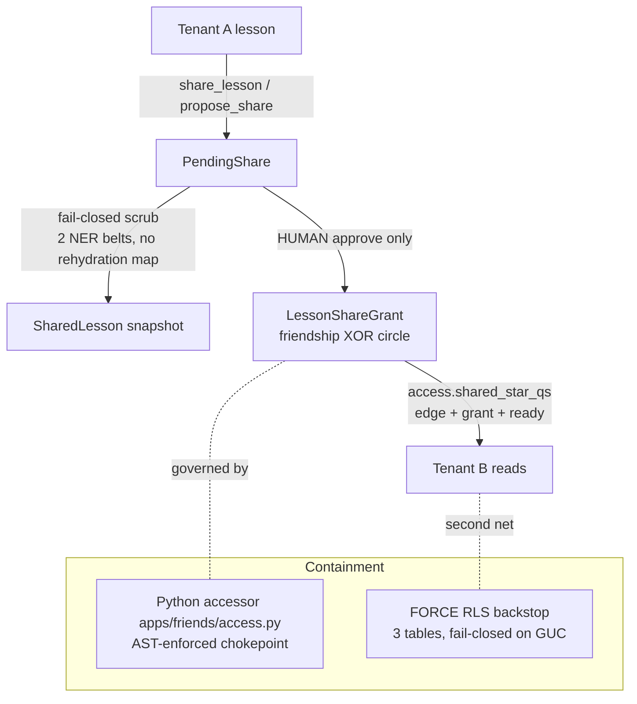

# Domain feature modules — Fuel, Finance, Friends

The three "pillar" apps that hold the user's own life data: **Fuel** (fitness),
**Finance** (debt/budget, product name *Gravity*), and **Friends**
(the *Neighborhood* social layer). They are pure Django↔Postgres — no container
round-trip — so they keep working while a tenant is hibernated
(`docs/agents/architecture.md`, "DB-backed features"). Read the invariants doc
first (`docs/agents/invariants.md`); this doc assumes RLS-backstop and
tenant-scoping mechanics from there. Friends is the load-bearing security story:
it is the **one place tenant data legitimately crosses the tenant boundary**, so
most of this doc is about how that crossing is contained.

## Shared shape across all three

Every pillar follows the same skeleton, so learn it once:

| Concern | Mechanism |
|---|---|
| Enablement | Per-tenant boolean on `Tenant` — `fuel_enabled` / `finance_enabled` / `friends_enabled` (`apps/tenants/models.py:617-664`). Off by default; gated feature. |
| Two access planes | **Consumer** views (`views.py`, JWT auth, `IsAuthenticated`) serve the frontend + iOS app; **runtime** views (`runtime_views.py`, `permission_classes=[AllowAny]`) serve the OpenClaw plugin and authenticate with an internal key. |
| Runtime auth | `validate_internal_runtime_request(...)` checks the `X-NBHD-Internal-Key` header against the per-tenant path id (`apps/fuel/runtime_views.py:17,85`, `apps/finance/runtime_views.py:15,36`). `AllowAny` is the DRF class; the internal-key check *is* the auth (see `apps/integrations/internal_auth.py`). |
| Agent context | Each module registers a USER.md envelope section via `@register_section` (`apps/fuel/envelope.py:21`, `apps/finance/envelope.py:25`) so the assistant sees current state without a tool call. Friends injects context via `neighborhood_context()` instead. |
| Optimistic concurrency | Rows edited by both user and assistant carry `version` + `edit_lock_until`/`edit_lock_owner` (Fuel `Workout`, `apps/fuel/models.py:261-279`; reused by `SharedGoal`, `apps/friends/models.py:491-494`). |
| Tenant scoping | Every model FKs `Tenant`; queries filter `tenant=`. Friends is the sole exception, and only inside its audited accessor (below). |

---

## apps/fuel — fitness & nutrition tracking

Workout logging, plans, body metrics, and Apple Health sync. All rows are
tenant-scoped; there is no cross-tenant surface here.

### Models (`apps/fuel/models.py`)

| Model | Purpose | Scope |
|---|---|---|
| `WorkoutPlan` | Named program grouping planned sessions; `schedule_json` weekly template + `week_overrides` for progression/deload | tenant |
| `PlanSlot` | Stable identity `(plan, week_index, weekday)` for a planned session; survives plan-regen so an open browser drawer's workout UUID never 404s (`models.py:94-156`) | tenant |
| `Workout` | One session (planned/done/skipped/…); `detail_json` holds category-specific sets/pace; `external_id` = HealthKit anchor | tenant |
| `FuelProfile` | One-per-tenant fitness profile + prefs; `distance_unit`, `use_session_scheduling`, `healthkit_tombstones` | tenant (OneToOne) |
| `WorkoutTemplate` | Reusable quick-log template | tenant |
| `PersonalRecord` / `FuelGoal` | PRs achieved + target goals | tenant |
| `BodyWeightLog` / `SleepLog` / `RestingHeartRateLog` | Daily metric logs, `unique_together (tenant, date)` | tenant |

Storage is always metric (`weight_kg`, distance km); the UI converts on display
(`models.py:334-342`). Workouts stay **editable in any status** by design — they
are personal data, not audited transactions (`models.py:159-167`).

### HealthKit ingestion (`apps/fuel/healthkit.py`, `POST /fuel/healthkit/sync/`)

The idempotency-critical path. iOS pushes batches of Apple Health samples; the
endpoint must be safe to replay (at-least-once client anchor loop). Anchors:

- **`external_id`** (HealthKit sample UUID) is the idempotency key, backed by the
  partial unique constraint `unique_workout_external_id` on `(tenant, external_id)`
  where non-empty (`models.py:293-299`). Existing rows are **never** overwritten by
  a re-delivery — user edits survive (`healthkit.py:8-13`).
- **No batch-wide transaction**: each item commits in its own atomic block, so one
  `IntegrityError` cannot poison the batch (`healthkit.py:14-17`).
- **Planned-workout auto-complete** takes `select_for_update` on the candidate and
  re-checks `status=planned` after the lock (same shape as finance's
  `record_transaction`) — a device sync racing an assistant complete degrades to a
  standalone create, never a double-complete (`healthkit.py:18-22, 314-357`).
- **Adopt** stamps the HK `external_id` onto a pre-existing manual DONE log for the
  same session so a chat/in-app log and its HK twin don't duplicate
  (`healthkit.py:359-467`).
- **Tombstones**: a deleted HK-sourced workout is recorded in
  `FuelProfile.healthkit_tombstones` (FIFO-capped 200) via a `post_delete` signal
  (`signals.py:133`, `models.py:382-390`) so a client anchor reset (app reinstall)
  cannot resurrect it.

Caps: 50 workouts / 31 daily metrics per call (`healthkit.py:60-62`); throttled
hourly (`HealthKitSyncHourThrottle`, `views.py:1424`).

### Fuel BFF for iOS (`FuelOverviewView`, `GET /fuel/overview/`)

Backend-for-frontend aggregate: one round trip returns `{profile, workouts,
calendar}` so a cold tab open is one request instead of three
(`views.py:524-578`). ETag/`If-None-Match` → 304 on repeat loads via
`ETagMiddleware`; `@tenant_cache(ttl=30, tag="fuel")` fronts it. The dedicated
`/fuel/profile/`, `/fuel/workouts/`, `/fuel/calendar/` endpoints are unchanged
for web/Telegram/paging.

### Per-session cron scheduling (`apps/fuel/signals.py`)

When `FuelProfile.use_session_scheduling=True`, every `Workout` save/delete
enqueues a 30s-debounced QStash task `regenerate_fuel_crons` that diffs the
desired cron set (derived from `Workout.scheduled_at`) against the OpenClaw
container's crons (`signals.py:1-6, 72-101`). `suppress_cron_regen()` /
`suppress_refresh()` context managers silence per-row churn during batch imports;
the HealthKit view restores state with one push after the loop
(`healthkit.py:23-29`). Every write also bumps `Tenant.fuel_version` (a
tenants-row lock) so clients can detect drift.

### Envelope (`apps/fuel/envelope.py`) — USER.md "Fuel — fitness state"

A schedule window (last 5d → next 7d), a computed 4-week trends digest
(`weekly_trends_digest`), the most-recent done session with provenance (HK vs
manual), last body weight (7d delta), sleep, resting HR. Anchored on
`tenant_today(tenant)`, not server UTC, so a JST tenant's "today" doesn't flip at
09:00 local (`envelope.py:34-36`). Truncates at 1200 chars with a pointer to
`nbhd_fuel_summary`.

---

## apps/finance — debt payoff & budgeting (product: *Gravity*)

Tracks debts/savings, computes payoff plans, and snapshots monthly progress.
Tenant-scoped, no cross-tenant surface.

### The Gravity kill switch

`finance_active` is a **property**, not a column: `finance_enabled AND
settings.GRAVITY_ENABLED` (`apps/tenants/models.py:792-803`), and
`GRAVITY_ENABLED` is **False in the production default**. This is an authoritative
platform-wide pause: while off, the finance USER.md section is not written
(`envelope.py:31` gates on `finance_active`) and monthly snapshots are skipped
(`snapshot.py:31-45`) — real debt data stops being egressed into the highest-volume
prompt surface even though the per-tenant flag may be on. Because it is a property
it cannot appear in `.filter()`; callers apply the coarse `finance_enabled` ORM
filter, then check `finance_active` in Python.

### Models (`apps/finance/models.py`)

| Model | Purpose | Scope |
|---|---|---|
| `FinanceAccount` | A debt / savings / asset. `DEBT_TYPES` set drives `is_debt`; `payoff_progress` property computes % paid (`models.py:81-91`) | tenant |
| `FinanceTransaction` | A payment/charge/transfer/refund/interest against an account; mutates balance | tenant |
| `PayoffPlan` | Saved snowball/avalanche/hybrid calculation with `schedule_json` month-by-month | tenant |
| `FinanceSnapshot` | Monthly point-in-time balances, `unique_together (tenant, date)` | tenant |

### Transaction idempotency invariant (`record_transaction`, `services.py:293`)

**The load-bearing rule.** A pre-existing row with the same `(tenant, account,
transaction_type, amount, date)` is treated as a re-record (an agent/client retry
after a silent timeout) and the existing row is returned **without debiting the
balance again** (`services.py:306-355`). `select_for_update` on the account
serialises concurrent writes so the dedup check and balance mutation are atomic.
This is the forward fix for the 2026-05 incident where agent retries
triple-recorded a loan payment. Note this is a **behavioural dedup, not a DB
constraint** — two *genuinely distinct* same-amount payments on the same day
collapse to one (see Risks). Payment/refund decrement balance; charge/interest
increment (`services.py:365-369`).

### Payoff engine + snapshots

`calculate_payoff` (`services.py:62`) simulates month-by-month interest accrual +
minimum-then-priority allocation, with a 600-month safety cap; `_get_priority_order`
implements snowball (smallest balance), avalanche (highest rate), hybrid (weighted)
(`services.py:179-214`). `create_monthly_snapshots` (`snapshot.py:18`) runs on the
1st via QStash, skipping duplicate `(tenant, date)` and tenants with no accounts.
Decimal throughout, `ROUND_HALF_UP` to two places.

### Envelope (`apps/finance/envelope.py`) — USER.md "Gravity — finance state"

Active-account/total-debt summary, active plan, top-priority debt
(avalanche→highest APR, else snowball→lowest balance), due dates within 7 days,
recent transactions. Anchored on `tenant_today` (`envelope.py:79`). Gated on
`finance_active` (the Gravity pause folds in).

---

## apps/friends — the Neighborhood (cross-tenant social layer)

This is the security core of the doc. Full product spec:
`docs/features/friends-neighborhood-design.md`; vision:
`docs/features/shared-intelligence.md` (agents backstage, humans get credit). The
feature lets two tenants share knowledge, chat, and pursue shared goals — so
**tenant data crosses the tenant boundary here, and only here, on purpose.** The
containment story has four layers.

### Models (`apps/friends/models.py`, 653 lines — the largest models file)

Naming stays `friends_*` in code; product copy ("Neighborhood", "wave", "spark",
"Mission") is UI-only (`models.py:10-13`).

| Model | Purpose | Scope |
|---|---|---|
| `NeighborProfile` | Your identity to neighbors — unique `@handle`, display name, `avatar_hue`; OneToOne on `Tenant`; server-side EULA consent (`accepted_terms_at`) | tenant |
| `Friendship` | **The consent atom** — one row per unordered pair via `pair_key` (`min:max` of the two tenant UUIDs); `accepted` unlocks visibility, `blocked` freezes it | **pair (cross-tenant edge)** |
| `FriendInvite` | High-entropy single-use expiring link/QR to bring in a neighbor (incl. non-subscribers, the referral loop) | tenant-owned |
| `SharedLesson` | **Frozen, PII-scrubbed snapshot** of one `Lesson`, safe for any neighbor; NO rehydration map ever attached; fail-closed `scrub_status` | owner tenant, read cross-tenant |
| `LessonShareGrant` | **WHO may see** a `SharedLesson` — exactly one audience: a `friendship` XOR a `circle`; revoke = instant, zero residue | cross-tenant grant |
| `PendingShare` | Agent proposes / human approves a share; agent writes `proposed_by="agent"` and can **never** flip to approved | tenant (author) |
| `WormholeVisit` | Per-`(viewer, friendship)` "new since last visit" watermark; the wormhole itself is a derived query, never materialized | viewer tenant |
| `AbsorbedItem` | Transparency + purge ledger — a **pointer only**, no knowledge field; knowledge lives in the source rows and is re-derived live | absorber tenant |
| `FriendThread` / `FriendThreadMembership` / `FriendMessage` | Cross-tenant 1:1 chat (control-plane table because `router.ChatThread` forbids cross-tenant); per-member absorb/read cursors; human text, not agent-scrubbed | cross-tenant thread |
| `SharedGoal` (*Mission*) / `SharedGoalMembership` / `SharedGoalUpdate` | Cross-tenant shared goal; each member's work stays in their **own** `journal.Task` (no cross-tenant FK); append-only update stream feeds projection/digest/envelope | cross-tenant goal |
| `PendingGoalAction` | Agent proposes a Mission task for **its own** human; approve mints the member's own local task | tenant |
| `Circle` / `CircleMembership` | Named set of neighbors (the blueprint's Group); membership itself is the consent grant | cross-tenant group |
| `ContentReport` | MVP moderation — report hides the item for the **reporter** (no global queue at launch scale) | tenant (reporter) |

**Consent atom mechanics.** `compute_pair_key(a, b)` sorts the two UUIDs so a wave
A→B and B→A collide on the `uq_friendship_pair` unique constraint — the DB is the
*only* dedup; a service-layer check would race to duplicate edges
(`models.py:26-37, 115-119`). `are_neighbors` is true iff an `accepted` row exists
and is not `blocked`; direct edge only, never transitive
(`access.py:87-108`).

### Layer 1 — the single audited accessor (`apps/friends/access.py`)

**Every** cross-tenant read in the whole feature routes through this one module
(`access.py:1-25`). Nothing else hand-rolls a cross-tenant query.

- The **chokepoint** is enforced by an AST-walking CI test
  (`apps/friends/test_access_chokepoint.py:11-16`): the managers `SharedLesson`,
  `FriendMessage`, `SharedGoal`, `LessonShareGrant` `.objects` may be touched
  **only** in `access.py`; `Lesson.objects` may **never** be touched anywhere under
  `apps/friends/`; and runtime views must broker cross-tenant reads through the
  accessor. The build fails on any offender.
- **Addressing is by opaque `friendship_id` / `thread_id` / `circle_id`, never a
  client-supplied `tenant_id`** — those ids exist only if the relationship exists,
  and the accessor **still re-verifies the caller is a party** (`assert_neighbors`,
  `assert_participant`), so IDOR is defeated by construction (`access.py:21-24,
  111-128, 641-658`).
- `shared_star_qs` is the **only** code permitted to omit a `tenant=` filter,
  because it substitutes the edge+grant+`scrub_status='ready'` check for that filter
  (`access.py:151-193`); everywhere else dropping `tenant=` is a leak. Blocked pairs
  see nothing of each other even via a shared circle (`access.py:171-174`).
- `backstop_service_context()` marks the connection `app.service_role` for trusted
  background reads (scrub task, envelope push thread) that run outside a tenant
  request, so they don't fail closed under the RLS policies (`access.py:60-85`).
- `adopt_shared_lesson` (souvenir — "bring a spark home") is the **one legitimate
  `Lesson` write** in any friends path, and it writes only the viewer's **own**
  tenant via the reverse relation, of already-neutralized text, entering the normal
  pending-approve gate (`access.py:530-587`).

### Layer 2 — the FORCE-RLS DB backstop (`migrations/0008_friends_rls_backstop.py`)

Defense in depth on the three highest-blast-radius tables — `shared_lessons`,
`lesson_share_grants`, `friend_messages`. `ENABLE` + `FORCE ROW LEVEL SECURITY`
with tenant-scoped `SELECT` policies keyed on the GUC `app.tenant_id` (set per
request by `TenantContextMiddleware`), or `app.service_role` for background work.

- **Currently inert.** Django connects to Postgres as a BYPASSRLS role, so these
  policies enforce nothing today — cross-tenant isolation is **100% the Python
  accessor** (`access.py:14-19`). They begin enforcing the moment the app role stops
  bypassing RLS; `manage.py check_friends_rls` gives the live verdict. (Note the
  architecture doc: Django connects as non-BYPASSRLS `app_user` — the friends tables
  are the exception, kept RLS-enabled but the app currently OWNs/bypasses; `FORCE`
  covers the owner-bypass case.)
- **Fails closed:** an unset/empty GUC → `nullif(...,'')::uuid` → NULL → zero rows
  (`0008:44-47`).
- **Non-recursive by construction:** the grant policy keys only on `friendships` +
  `friend_circle_memberships` (both RLS-exempt in the boot `disable_rls` sweep), and
  because the owner is itself a party of the grant's friendship / a member of its
  circle, that single rule covers owner **and** recipient without referencing back to
  `shared_lessons` (`0008:22-32, 50-64`).
- **Writes are permissive** (`WITH CHECK true`): the accessor + AST chokepoint govern
  writes; the backstop guards the **read** leak, which is the actual blast radius
  (`0008:24-31`). Policies are `TO app_user`, never `TO public` (that would re-expose
  rows via the anon Supabase Data API).

### Layer 3 — the fail-closed scrub (`apps/friends/scrub.py`)

The single egress class for lesson content leaving a tenant. **The whole point is
fail-closed** because the PII pipeline degrades silently: `redactor._detect_pii`
swallows a model-load failure and continues with Presidio-only recognizers, which
have **no PERSON recognizer**, so real names would pass through
(`scrub.py:1-22`). A bare try/except does not protect against this. So `scrub.py`
runs two belts:

1. **Belt 1** — `_assert_ner_available()` calls `get_pii_pipeline()` directly
   (raising if the DeBERTa model is unavailable/error-cached) and probes it with a
   known-name string, requiring a PERSON detection. Anything short → `scrub_status=
   "failed"`, never `ready` (`scrub.py:54-79`).
2. **Belt 2** — `_assert_output_clean()` re-runs the verified NER pass over the
   *scrubbed* output; a surviving high-confidence PERSON/EMAIL/PHONE means an
   upstream step silently degraded on this text → fail closed (`scrub.py:91-118`).

The scrubbed text neutralizes **every** `[TYPE_N]` placeholder to a generic word
via `copilot._scrub_placeholders` and **persists no rehydration map**, so the
recipient is structurally unable to un-scrub (`scrub.py:132-137`). Tags are
allowlisted to lowercase slugs (`scrub.py:140-146`). `content_hash` drift (owner
edited the source, or supplied edited `final_text`) triggers a re-scrub
(`scrub.py:149-217`).

### Layer 4 — the human-approve-only share gate (`apps/friends/services.py`)

- **"No preview → no grant" binds every path.** Neither `share_lesson`
  (human-initiated) nor `propose_share` (agent-initiated) creates a grant — they only
  create a `PendingShare` + ensure a `SharedLesson` + enqueue the scrub
  (`services.py:696-720, 1009-1053`).
- `approve_share` is **the only path that creates a grant** (`create_grant`), and it
  is a human action; an agent writes `proposed_by="agent"` and can never approve
  (`services.py:794-825`, `models.py:257-264`). An edited `final_text` re-scrubs
  fail-closed and forces a fresh preview+approve (202), keeping the invariant intact
  for edits too.
- Revocation is per-grant and instant (read-through): flip `status=revoked`, and the
  snapshot is deleted when no active grant remains — zero residue
  (`access.py:415-427`).

### Endpoints (`apps/friends/urls.py`, mounted `/api/v1/friends/`)

Consumer JWT surface only (no runtime plugin for friends yet). Highlights: `waves/`
(+ `accept`/`decline`/`block`), `shares/preview|pending|<id>/approve|reject`,
`shares/<id>/adopt/`, `absorbed/` (+ `purge`), `threads/` chat, `missions/` (+
join/leave/updates/tasks), `mission-actions/<id>/approve|reject`, `circles/`,
`report/`, `wormholes/` and `<friendship_id>/galaxy|visited|unblock`. URL ordering
matters: literal routes (`circles/join/`, `<id>/galaxy/`) sit above the bare
`<friendship_id>/` unfriend catch-all (`urls.py:` inline comments).

---

## Risks & improvement opportunities

- **[high] The friends cross-tenant boundary is single-layer in production.** The
  RLS FORCE backstop is inert while Django connects as a BYPASSRLS role
  (`access.py:14-19`, `0008:6-8`), so isolation is 100% the Python accessor. A single
  missing edge/tenant filter, or a cross-tenant read added outside `access.py` in a
  way the AST test can't see (e.g. a `.objects` reached via an alias/`getattr`, a
  raw SQL string, or a `values()` join from another app's model) leaks another
  user's private data with no DB net. Prioritise moving Django to a non-BYPASSRLS
  role for these tables and wiring `check_friends_rls` into CI as a gate.
- **[high] Finance transaction dedup collapses genuinely distinct same-day
  payments.** `record_transaction` treats any matching `(tenant, account, type,
  amount, date)` as a replay and skips the balance debit (`services.py:306-355`).
  Two real $50 payments to the same card on the same day record once and under-debit
  the balance — silent financial inaccuracy. A client-supplied idempotency key
  (like `FriendMessage.client_msg_id`) would separate "retry" from "second real
  payment".
- **[med] The scrub's safety depends on a 554MB model being present and healthy.**
  Fail-closed is correct, but it means the entire share/absorb feature hard-stops
  whenever the DeBERTa pipeline is unavailable (`scrub.py:54-79`). There is no queued
  retry surfaced here — a failed snapshot needs the owner to edit+retry. Confirm a
  background re-scrub sweep exists for transient model outages, and monitor
  `scrub_status='failed'` rates.
- **[med] `LessonShareGrant` write policies are permissive (`WITH CHECK true`).**
  The design argues a cross-tenant write can't exfiltrate and the accessor governs
  writes (`0008:24-31`), which is sound — but it means the DB net only ever catches
  *read* leaks. If the app role ever loses BYPASSRLS, a bug that writes a grant with
  the wrong audience is not caught by RLS; only the accessor + chokepoint stand
  between it and a mis-scoped share.
- **[med] HealthKit tombstone cap is a silent FIFO (200).** Beyond 200 deleted
  HK-sourced workouts, the oldest tombstones fall off and a reinstall/anchor-reset
  could resurrect a very old deleted workout (`healthkit.py:64-65`, `models.py:382`).
  Low likelihood but worth a metric on tombstone-list saturation.
- **[low] Gravity is globally paused by default (`GRAVITY_ENABLED=False`).** Anyone
  reading the finance code should know the envelope + snapshots are suppressed
  platform-wide unless explicitly enabled (`apps/tenants/models.py:792-803`) — a new
  engineer testing finance locally will see empty USER.md sections and think it is
  broken. Document the flag prominently in the finance envelope/settings surfaces.
- **[low] Friends has no runtime (OpenClaw) plugin surface yet.** Fuel and Finance
  expose `runtime/<tenant_id>/…` endpoints for the agent; friends is console-JWT
  only. Agent-mediated absorb/propose currently runs server-side via
  `neighborhood_context()`; a future runtime plugin would need to extend the AST
  chokepoint's runtime-view rule (`test_access_chokepoint` rule 3) to cover it.
