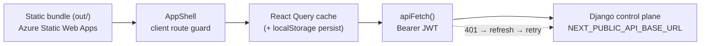

# Frontend — Next.js Subscriber Console

The subscriber-facing web dashboard: a Next.js App Router app that **statically
exports** to `out/` and is served by Azure Static Web Apps. It is a pure
single-page client that talks to the Django control plane over a JWT-authenticated
REST API. There is **no SSR, no Node server, and no server-side secret** in this
build — everything ships to the browser.

**Read first (this doc builds on, doesn't duplicate):**
- [`../../DESIGN.md`](../../DESIGN.md) — design system: tokens, typography, components, do's/don'ts. All color/spacing/type facts live there; this doc links, never re-documents.
- [`../agents/frontend.md`](../agents/frontend.md) — the working-in-this-area playbook: build model, CI-failing lint rules, layout traps, dependency pins.
- Root `CLAUDE.md` → *Frontend Conventions* section.

Source root: [`../../frontend/`](../../frontend/). Django API surface is documented separately; this doc covers the client only.

---

## Stack & build

| Concern | Choice | Evidence |
|---|---|---|
| Framework | Next.js 16.2 (App Router), React 19 | [`frontend/package.json:22-25`](../../frontend/package.json) (README says "14+" — stale) |
| Output | **Static export** (`output: 'export'` → `out/`) | [`frontend/next.config.mjs:9`](../../frontend/next.config.mjs) |
| Images | `unoptimized: true` (no image server) | [`frontend/next.config.mjs:10-12`](../../frontend/next.config.mjs) |
| Styling | Tailwind 3.4 + `@tailwindcss/typography`; tokens are CSS vars | [`frontend/tailwind.config.ts`](../../frontend/tailwind.config.ts) → see [`DESIGN.md`](../../DESIGN.md) |
| Data layer | TanStack Query v5 + typed fetch client | [`frontend/lib/queries.ts`](../../frontend/lib/queries.ts), [`frontend/lib/api.ts`](../../frontend/lib/api.ts) |
| Editor | TipTap 3 (pin `@tiptap/core ^3.25.0`) | [`frontend/package.json:15,44-46`](../../frontend/package.json) |
| Game | Phaser 4 (Constellation play canvas) | [`frontend/package.json:23`](../../frontend/package.json) |
| Markdown | `react-markdown` + `remark-gfm`/`remark-breaks` | [`frontend/components/markdown-renderer.tsx`](../../frontend/components/markdown-renderer.tsx) |
| Tests | **None wired** — no jest/vitest, no `test` script | [`frontend/package.json:5-11`](../../frontend/package.json); CI gate = `eslint` + `next build` |

Static-export consequences (the mental model that explains most of the rest):
- **No `middleware.ts`, no route handlers, no `getServerSideProps`.** Every route
  guard, redirect, and data fetch is client JavaScript. There is no server to
  enforce anything — the Django API is the only trust boundary.
- **No server secrets.** The only build-time env var is
  `NEXT_PUBLIC_API_BASE_URL` ([`frontend/.env.example`](../../frontend/.env.example)), inlined into the bundle. Anything
  `NEXT_PUBLIC_*` is public by definition.
- Every page component is `"use client"`; the root layout only sets fonts,
  metadata, and mounts providers.

---

## Route map

40 `page.tsx` files under [`frontend/app/`](../../frontend/app). Auth is enforced
by **`AppShell`** (see [Auth gating](#auth--session-client-side)), which treats a
fixed `publicPages` allowlist + `/legal/*` as unauthenticated and redirects
everything else to `/login` when no token is present.

| Path | Purpose | Auth |
|---|---|---|
| `/` | Marketing landing (redirects logged-in users → `/journal`) | Public |
| `/login`, `/signup` | Credential auth; store JWTs, route to `/onboarding` or `/journal` | Public |
| `/forgot-password`, `/reset-password` | Password reset request / confirm | Public |
| `/onboarding` | Post-signup tenant provisioning + persona pick | Public* (full-bleed) |
| `/app/authorize` | Web→iOS PKCE handoff (mints one-time code) | Public* |
| `/promo/redeem`, `/promo/redeemed` | Comeback-campaign promo redemption | Public |
| `/legal/{terms,privacy,refund,commerce-disclosure,community-rules}` | Legal pages | Public |
| `/journal` (+ `/today`, `/memory`, `/templates`, `/goal/[slug]`) | Daily notes, docs, goals — TipTap editor | **Auth** |
| `/constellation` (+ `/play`, `/pending`) | Lessons star-map + Phaser game | **Auth** |
| `/horizons` | Goals / North Star / assistant insights | **Auth** |
| `/finance` | Gravity money module (flag-gated) | **Auth** |
| `/fuel` | Workout tracking | **Auth** |
| `/core` | Mindfulness / meditation | **Auth** |
| `/friends` | Neighborhood social graph (flag-gated) | **Auth** |
| `/automations` | Daily brief / weekly review schedules | **Auth** |
| `/integrations` | OAuth connections | **Auth** |
| `/billing`, `/usage` | Stripe portal, token usage | **Auth** |
| `/settings` (+ 8 sub-tabs) | Account, integrations, connected-apps, people, cron-jobs, usage, billing, ai-provider | **Auth** |

\* `/onboarding` and `/app/authorize` are not in `publicPages` but are in
`fullBleedPages`; they render without chrome and manage their own auth state.
Note `/onboarding` is **not** in the `publicPages` allowlist
([`frontend/components/app-shell.tsx:28-39`](../../frontend/components/app-shell.tsx)),
so a token-less user is redirected to `/login` before it paints — onboarding is
only reachable with a token in hand.

**Nested layouts:** `app/settings/layout.tsx` (sidebar tabs + hover/touch
prefetch of each tab's queries — [`frontend/app/settings/layout.tsx:125-158`](../../frontend/app/settings/layout.tsx))
and `app/journal/layout.tsx` (full-height edge-to-edge editor frame). The root
[`app/layout.tsx`](../../frontend/app/layout.tsx) wraps everything in
`ThemeProvider → Providers → AppShell`.

---

## Auth & session (client-side)

JWT access + refresh tokens, stored in **`localStorage`**
([`frontend/lib/auth.ts`](../../frontend/lib/auth.ts)):

| Key | Contents | Lifetime |
|---|---|---|
| `nbhd_access_token` | Short-lived access JWT (Bearer) | Until refresh |
| `nbhd_refresh_token` | Long-lived refresh JWT | Until logout / rotation-blacklist |

`isLoggedIn()` is simply "an access token exists" ([`auth.ts:24-26`](../../frontend/lib/auth.ts)) — it does not validate expiry or signature.

### The single route guard

There is exactly one gate, and it is client-side. `AppShell` runs an effect: if
the current path is not public and `isLoggedIn()` is false, `router.replace("/login")`
([`app-shell.tsx:282-286`](../../frontend/components/app-shell.tsx)). Individual
authed pages do **not** re-check; they rely on the shell plus every data hook
being `enabled: isLoggedIn()`. Because this is JS running after hydration, the
protected page's HTML/JS is fully delivered to an unauthenticated browser — the
guard only prevents *data* from loading (the API rejects token-less requests),
not code disclosure. This is acceptable for a SPA but must be understood: **the
frontend enforces nothing; the Django API is the real authorization boundary.**

### Token lifecycle in `apiFetch`

All requests flow through `apiFetch<T>` ([`frontend/lib/api.ts:98-183`](../../frontend/lib/api.ts)):

1. **Proactive refresh** — before firing, decode the access JWT's `exp` client-side
   (base64, unverified) and if it's within a 60s skew, await a refresh first
   ([`api.ts:57-110`](../../frontend/lib/api.ts)). Fails open.
2. **Bearer injection** — `Authorization: Bearer <access>` added when a token exists ([`api.ts:117-119`](../../frontend/lib/api.ts)).
3. **Reactive refresh** — on `401` with a refresh token present, refresh once and
   retry the original request ([`api.ts:126-138`](../../frontend/lib/api.ts)).
4. **Deduped refresh** — concurrent callers share one in-flight refresh promise
   (`getDedupedRefresh`, [`api.ts:35-45`](../../frontend/lib/api.ts)) so a burst of
   401s triggers a single `/auth/refresh/`.
5. **Rotation-aware** — with `ROTATE_REFRESH_TOKENS` the response carries a new
   refresh token that must be persisted or the next refresh dies
   ([`api.ts:90-95`](../../frontend/lib/api.ts)).
6. **Terminal 401** — if refresh fails *and there was a prior session*, clear
   tokens and hard-redirect to `/login`. If there was *no* prior session (a fresh
   login/signup 401), surface the server's `detail` so the login page can show a
   password-reset CTA ([`api.ts:140-169`](../../frontend/lib/api.ts)).

Non-2xx non-401 responses throw an `Error` with a `.status` property attached, so
hooks can branch on HTTP status (e.g. Fuel's 404-means-deleted handling).

**Logout** ([`app-shell.tsx:288-298`](../../frontend/components/app-shell.tsx)):
best-effort server revocation, then `clearTokens()` + `clearPersistedCache()` +
route to `/login`. The persisted-cache clear is essential — otherwise the next
user on the same browser rehydrates the previous account's data (see gotcha
below).

### iOS PKCE handoff (`/app/authorize`)

The one genuinely security-shaped flow in the frontend. The iOS app opens
`/app/authorize?...` inside an `ASWebAuthenticationSession` carrying a PKCE
challenge + state; the SPA validates params, routes through login/signup, then
POSTs `/api/v1/auth/authorize/` to mint a one-time code and redirects
`nbhd://auth/callback?code=&state=`.

- Params validated **before** any token spend
  ([`frontend/lib/app-authorize.ts:54-65`](../../frontend/lib/app-authorize.ts)):
  `response_type=code`, `client=ios`, `code_challenge_method=S256`, non-empty
  challenge+state, and `redirect_uri ∈ ALLOWED_REDIRECT_URIS` (`["nbhd://auth/callback"]`).
  Keep this allowlist in sync with the backend `AUTH_ALLOWED_REDIRECT_URIS`.
- A leftover browser session is **never trusted blindly** — `probeIdentity()`
  resolves whose session it is and the user confirms "Continue as X / use a
  different account" ([`app-authorize.ts:125-150`](../../frontend/lib/app-authorize.ts),
  routing logic in [`lib/authorize-decision.ts`](../../frontend/lib/authorize-decision.ts), the
  only unit-tested module: `authorize-decision.test.ts`).
- Params stashed in `sessionStorage` (`nbhd_authorize_params`) to survive the
  login round-trip; login/signup check `hasPendingAppAuthorize()` and bounce back
  ([`app/login/page.tsx:29-32`](../../frontend/app/login/page.tsx)).

---

## Talking to the API

Two layers, both in `lib/`:

- **[`lib/api.ts`](../../frontend/lib/api.ts)** (~2170 lines) — one exported async
  function per endpoint (~150 of them), all delegating to `apiFetch`. Base URL is
  `process.env.NEXT_PUBLIC_API_BASE_URL ?? "http://localhost:8000"`
  ([`api.ts:33`](../../frontend/lib/api.ts)). Types live in
  [`lib/types.ts`](../../frontend/lib/types.ts). Response-shape normalization
  (array-vs-`{results}`, gateway cron-job coercion) happens here, e.g.
  `normalizeCronJob` ([`api.ts:990-1010`](../../frontend/lib/api.ts)).
- **[`lib/queries.ts`](../../frontend/lib/queries.ts)** (~2650 lines) — a
  `use*Query` / `use*Mutation` hook per resource wrapping the api.ts functions in
  TanStack Query.

### React Query configuration

`Providers` ([`frontend/app/providers.tsx`](../../frontend/app/providers.tsx))
creates one `QueryClient`:

| Option | Value | Why |
|---|---|---|
| `staleTime` | 60s default (per-query overrides common) | Cheap revalidation cadence |
| `gcTime` | 24h | Keep detached queries warm across in-session navigation |
| `refetchOnWindowFocus` | `true` | Re-sync on tab return |
| `retry` | 1 | One retry on failure |
| mutation `onError` | global error toast, **skips 401** (redirect handles it); opt out via `meta.skipErrorToast` | [`providers.tsx:30-35`](../../frontend/app/providers.tsx) |

**Conventions worth knowing** (all in [`lib/queries.ts`](../../frontend/lib/queries.ts)):
- Every read hook is `enabled: isLoggedIn()` so nothing fetches pre-auth.
- **Conditional polling via `refetchInterval`**: tenant polls until
  `applied_model === preferred_model` ([`queries.ts:247-255`](../../frontend/lib/queries.ts));
  Telegram/LINE pairing polls 3s while a QR is live, 15s otherwise, and stops once
  linked ([`queries.ts:537-550`](../../frontend/lib/queries.ts)); provisioning polls
  5s until `ready`; refresh-config polls 15s only while an update is pending.
  Pending reminders are deliberately **not** polled (a background interval would
  cold-start a hibernated tenant container).
- **Optimistic mutations** with `onMutate` snapshot + `onError` rollback are the
  norm for toggles (channel, model, cron enable, integration disconnect).
- **Fuel invalidation fan-out**: `invalidateFuelLists()`
  ([`queries.ts:1383-1390`](../../frontend/lib/queries.ts)) invalidates all six
  fuel list keys together — hand-rolling subsets historically caused the Schedule
  tab to lag the Calendar.
- Detail hooks like `useWorkoutQuery` use `refetchOnMount: "always"` and skip
  retry on 404/401, because a persisted/primed row may have been deleted upstream
  by the assistant runtime.

### Persisted cache — the notorious stale-data gotcha

[`lib/query-persist.ts`](../../frontend/lib/query-persist.ts) mirrors selected
queries into `localStorage` under **`nbhd_qc_v3`**:

- Only queries whose key matches a prefix in `PERSISTED_PREFIXES` are persisted
  (user/tenant/preferences/personas/sidebar-tree, horizons, constellation, galaxy,
  and the fuel family — [`query-persist.ts:24-50`](../../frontend/lib/query-persist.ts)).
- On boot, `seedQueryClient` hydrates the cache **synchronously before any child
  mounts** ([`providers.tsx:39-43`](../../frontend/app/providers.tsx)) so pages
  paint from cache instead of a blank fetch state. Each entry stores `{d: data, u:
  dataUpdatedAt}` so the true fetch time survives reload and `staleTime` math
  still works ([`query-persist.ts:88-107`](../../frontend/lib/query-persist.ts)).
- Writes are debounced 500ms via a query-cache subscription
  ([`query-persist.ts:109-143`](../../frontend/lib/query-persist.ts)).

**Operational reality (from [`../agents/frontend.md`](../agents/frontend.md) and
memory): "stale data after deploy" reports are almost always this cache, not
cookies or the API.** The mitigation is the version suffix — bumping `_v3` on a
persisted-shape change makes old blobs unreadable and forces a one-time refetch.
Logout clears it (`clearPersistedCache`).

### All client-side storage keys (audit surface)

| Key | Store | Sensitivity |
|---|---|---|
| `nbhd_access_token`, `nbhd_refresh_token` | localStorage | **High** — full account access; XSS = takeover |
| `nbhd_qc_v3` | localStorage | Cached PII (journal, finance, profile) in plaintext |
| `nbhd_authorize_params` | sessionStorage | PKCE handoff params (transient) |
| `nbhd_invite_token` | localStorage | Friend/neighborhood invite ([`lib/invite-token.ts`](../../frontend/lib/invite-token.ts)) |
| `nbhd_fuel_orphan_drafts_v1`, `nbhd_fuel_autosave_v1` | localStorage | Unsaved workout drafts ([`lib/orphan-drafts.ts`](../../frontend/lib/orphan-drafts.ts), [`lib/fuel-draft-autosave.ts`](../../frontend/lib/fuel-draft-autosave.ts)) |
| `nbhd_constellation_hint_dismissed`, `nbhd_play_beta` | localStorage | UI flags (non-sensitive) |

---

## Components

Shared components live at the top of [`frontend/components/`](../../frontend/components)
(33 files: `app-shell`, `error-boundary`, `toast`, `markdown-renderer`,
`prompt-editor`, `schedule-builder`, `persona-selector`, `timezone-selector`,
`status-pill`, `stat-card`, `skeleton`, `web-vitals`, etc.), with feature groups
in subfolders:

| Group | Scope |
|---|---|
| `journal/` (9) | TipTap document view, sidebar tree, task cards |
| `fuel/` (19) | Workout calendar, schedule, drawers, draft banners, charts |
| `core/` (8) | Meditation orb + session UI |
| `finance/` (5) | Gravity accounts, payoff plans, snapshots |
| `onboarding/` (6) | Onboarding shell + scenes |
| `constellation-game/` (2) | Phaser mount + HUD |
| `horizons/` (3), `landing/` (3), `byo/` (3), `billing/` (1), `icons/` (1), `ui/` (1) | Feature-scoped |

Cross-cutting behaviors:
- **`ErrorBoundary`** wraps the app and each page's `<main>` content
  ([`app-shell.tsx:415-427`](../../frontend/components/app-shell.tsx)); the page-level
  boundary shows a "Go to Journal" recovery link.
- **`GlobalToastHost` + `emitToast`** is the app-wide notification channel; the
  QueryClient's mutation `onError` funnels here.
- **Dark-theme only.** `ThemeProvider`
  ([`frontend/components/theme-provider.tsx`](../../frontend/components/theme-provider.tsx))
  hard-sets `data-theme="dark"`; `setTheme`/`toggleTheme` are no-ops. The context
  exists for forward-compat but there is no light mode.
- **Feature-flag navigation.** `useNavItems`
  ([`app-shell.tsx:47-77`](../../frontend/components/app-shell.tsx)) builds the nav
  from tenant flags (`finance_enabled && gravity_available`, `fuel_enabled`,
  `core_enabled`, `friends_enabled`). Flags are cosmetic gating only — the backend
  still authorizes each endpoint.

### Design system

Do not re-document tokens here. Tailwind maps semantic names
(`ink`, `surface`, `accent`, `c-purple`…) to CSS variables
([`tailwind.config.ts:20-73`](../../frontend/tailwind.config.ts)); the variables
are defined in `frontend/app/globals.css` and canonicalized in
[`../../DESIGN.md`](../../DESIGN.md). Rule of thumb from CLAUDE.md: **tokens/CSS
variables only, never hardcoded hex** — though several page components (login,
app-authorize) still use raw `#12161b`/`#7C6BF0` literals, a known drift.

---

## Client-side security posture

For a static SPA the client is untrusted by design, but note:

- **Tokens in `localStorage`, not httpOnly cookies.** Any XSS that executes in the
  origin reads `nbhd_access_token`/`nbhd_refresh_token` and both API PII cached in
  `nbhd_qc_v3`. This is the highest-impact client risk and the reason the XSS
  surface below matters.
- **XSS surface is small and clean.** No `dangerouslySetInnerHTML` anywhere in
  `app/`, `components/`, or `lib/`. User/assistant markdown is rendered via
  `react-markdown` with `remark-gfm`/`remark-breaks` and **no `rehype-raw`**
  ([`markdown-renderer.tsx:77-83`](../../frontend/components/markdown-renderer.tsx)),
  so raw HTML in content is escaped, not injected. Preserve this — adding
  `rehype-raw` or any innerHTML sink would expose the token store.
- **Secrets the client handles but never stores:** PAT minting
  ([`api.ts:1528-1535`](../../frontend/lib/api.ts) — token shown once, then
  server-only) and BYO Anthropic/OpenAI subscription credentials
  ([`api.ts:1547-1556`](../../frontend/lib/api.ts) — POSTed to Django, which stores
  in Key Vault). The frontend transmits these to the backend; it must not log or
  cache them.
- **Redirect safety** in the PKCE handoff rests entirely on the client-side
  `ALLOWED_REDIRECT_URIS` check plus the backend's own allowlist; the `state`
  nonce is echoed byte-identical
  ([`app/app/authorize/page.tsx:76-80`](../../frontend/app/app/authorize/page.tsx)).
- **No CSP is set by this app** (static export; any CSP must come from Azure Static
  Web Apps config, out of this repo's scope).
- **API base URL is baked into the bundle** — fine, it's a public endpoint, but it
  means environment is fixed at build time, not runtime.

---

## Risks & improvement opportunities

- **[high] JWTs live in `localStorage`.** Combined with cached PII in `nbhd_qc_v3`,
  a single XSS yields full account takeover and data exfiltration. The clean
  markdown pipeline is the main thing standing between the app and this outcome —
  any future raw-HTML rendering, third-party script, or `innerHTML` sink is a
  critical regression. Consider httpOnly-cookie sessions or at least a documented
  XSS-invariant guarding `markdown-renderer` and dependency additions.
- **[high] The only route guard is client-side and code is fully delivered
  pre-auth.** Correct for a SPA, but the security story depends *entirely* on the
  Django API authorizing every endpoint. This should be an explicit, tested
  backend invariant, not an implicit assumption — the frontend gives zero
  protection.
- **[med] Cached PII persists in plaintext across sessions on shared devices.**
  Logout clears `nbhd_qc_v3`, but a crash, tab close, or token expiry without an
  explicit logout leaves journal/finance/profile data in `localStorage`.
  Consider not persisting the most sensitive query families, or encrypting/expiring
  the persisted blob.
- **[med] Near-zero automated test coverage.** Only `authorize-decision.ts` and two
  date helpers have tests; the CI gate is lint + build. The auth/refresh state
  machine in `apiFetch`, the persisted-cache seeding/versioning, and the optimistic
  mutation rollbacks are intricate and untested. A lightweight vitest harness for
  `lib/` would catch regressions the type-checker can't.
- **[med] `lib/api.ts` (~2170 lines) and `lib/queries.ts` (~2650 lines) are
  monoliths.** Every endpoint and hook in two files makes ownership and review
  hard. Splitting per feature domain (fuel, finance, journal, tenant/auth) would
  localize churn and shrink diffs.
- **[low] Hardcoded hex in auth/onboarding pages** contradicts the "tokens only"
  rule (`login/page.tsx`, `app/authorize/page.tsx`, `app-shell.tsx` use raw
  `#0B0F13`/`#7C6BF0`). Migrate to CSS-var tokens for theme consistency and to keep
  `DESIGN.md` authoritative.
- **[low] Stale README.** [`frontend/README.md`](../../frontend/README.md) claims
  "Next.js 14+" and lists only 5 routes; the app is Next 16 with 40 pages. Minor,
  but misleads new engineers on day one.
- **[low] Proactive JWT-expiry check decodes the token unverified with `atob`**
  ([`api.ts:57-69`](../../frontend/lib/api.ts)). This is safe (server still
  validates and it fails open), but a malformed/oversized token is parsed on every
  request; a guard on payload size would be belt-and-suspenders.
