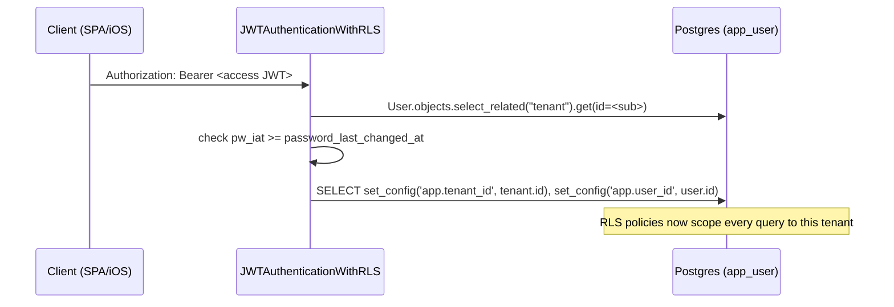

# Identity, Auth, Billing & Integrations

Reference for the control-plane subsystems that answer *who is this*, *what may they do*, *are they paying*, and *what third parties are they connected to*. Read the platform primers first — this builds on them and does not repeat them:

- [Architecture](../agents/architecture.md) — the three planes, tenant lifecycle, message flow.
- [Invariants](../agents/invariants.md) — permanent rules (secrets discipline, KV identity prefix, idempotent revision ops).
- [RLS & tenant isolation](../rls-tenant-isolation.md) — the three RLS auth paths (JWT / internal-key / QStash) and `set_rls_context`. **That doc is the canonical reference for RLS; this doc covers the identity layer that feeds it.**

Scope: `apps/tenants` (identity + auth + provisioning), `apps/billing` (Stripe + credit + donation), `apps/byo_models` (bring-your-own LLM keys), `apps/integrations` (OAuth connectors + internal runtime auth).

---

## 1. Identity model: User ⇄ Tenant

One human = one `User` = one `Tenant` = one OpenClaw container. The two rows are a strict 1:1.

| Model | Table | Key facts | Cite |
|---|---|---|---|
| `User` | `users` | Custom `AbstractUser`, UUID pk. Carries channel bindings (`telegram_chat_id` unique, `line_user_id` unique), `email` (app-unique but **no DB constraint**), `timezone`, `password_last_changed_at`. | `apps/tenants/models.py:23` |
| `Tenant` | `tenants` | UUID pk, `OneToOneField(User, on_delete=CASCADE, related_name="tenant")`. Holds container identity, Stripe ids, budget/credit, ~40 feature flags. | `apps/tenants/models.py:149`, `:167` |

Because the FK is `OneToOne` with `related_name="tenant"`, `user.tenant` is the join used everywhere. Deleting a `User` cascade-deletes the `Tenant`; a `pre_delete` signal best-effort hibernates the container so a delete blocked by the prod resource-group lock doesn't strand a running (billing) container (`apps/tenants/signals.py:15`).

Entitlement helpers on `Tenant`: `has_entitlement` (paid sub OR unexpired trial, `:806`), `entitled_active()` (positive-inclusion queryset used by cron seeding, `:814`), `has_spendable_budget` (exempt OR within included cap OR holds prepaid credit, `:864`). `Status` enum: `pending → provisioning → active ⇄ suspended → deprovisioning → deleted` (`:155`).

### How a login maps to a tenant and sets the RLS GUC

`JWTAuthenticationWithRLS` (`apps/tenants/authentication.py:18`) subclasses SimpleJWT. `get_user` preloads `tenant` via `select_related` to avoid a second cross-region query (`:51`); `authenticate` sets `_tenant_context.tenant` + calls `set_rls_context(tenant_id=..., user_id=...)` on success (`:89-92`). `TenantContextMiddleware` does the same for any already-authenticated request and clears the GUC in `process_response` (`apps/tenants/middleware.py:75`, `:96`). Only the tenant+user GUCs are set on this path — **never `service_role`** — so a JWT user sees only their own tenant.

---

## 2. Authentication classes & credentials

Three credential types resolve to a `(user, auth)` pair and set RLS; a fourth (internal key) is header-validated per-request (§7).

| Class | Credential | Lookup | Sets RLS | Cite |
|---|---|---|---|---|
| `JWTAuthenticationWithRLS` | `Bearer <SimpleJWT>` | `sub` claim → User (+tenant) | tenant + user | `authentication.py:18` |
| `PersonalAccessTokenAuthentication` | `Bearer pat_<secret>` | SHA-256 hash → `PersonalAccessToken` | tenant + user | `authentication.py:97` |
| (internal key) | `X-NBHD-Internal-Key` header | per-tenant key compare | tenant + `service_role` | `apps/integrations/internal_auth.py:123` |

**Force-logout on password rotation.** JWTs carry a `pw_iat` claim = `password_last_changed_at` as a unix timestamp, injected by `EmailTokenObtainPairSerializer.get_token` (`apps/tenants/serializers.py:236`). `authenticate` rejects any token whose `pw_iat` predates the user's current `password_last_changed_at` (`authentication.py:74-88`). `User.set_password`/`set_unusable_password` overrides bump the stamp on every change (`models.py:121`, `:134`), so a reset/rotation invalidates **all** outstanding access + refresh tokens with no `token_blacklist` app. Every token-minting path (signup, reset-confirm, PKCE exchange) must mint via `get_token` — `RefreshToken.for_user` omits `pw_iat` and would self-reject.

**PATs** (`apps/tenants/pat_models.py:33`) are long-lived, revocable, SHA-256-hashed at rest (`pat_` prefix, raw shown once). `scopes` is a JSON list; allowed = `{sessions:read, sessions:write}` (`apps/tenants/permissions.py:12`). `HasPATScope` enforces scope for PAT requests and passes JWT requests through (`permissions.py:15`). Used by external apps (YardTalk) to push data. `last_used_at` is stamped throttled to 1/min (`authentication.py:140`).

---

## 3. Account & auth flows

All mounted at `api/v1/auth/` (`apps/tenants/auth_urls.py`). Password login resolves the account by **`email__iexact`**, not the `username` column — the Telegram path creates users as `tg_<chat_id>`, so a username match would silently lock them out (`serializers.py:239-267`). The serializer always runs one password hash (a dummy `User().set_password` when the account is missing) before the `is_active` gate so response timing never reveals whether an email is registered/inactive (`serializers.py:262`).

| Endpoint | Method | Auth | Purpose | Cite |
|---|---|---|---|---|
| `/auth/signup/` | POST | AllowAny | Create User; optional `PREVIEW_ACCESS_KEY` invite gate; 409 on dup email; returns JWT pair. **Does not create the tenant.** | `auth_views.py:199` |
| `/auth/login/` | POST | AllowAny | JWT obtain; throttled per-IP (30/min) + per-email (10/min). | `auth_views.py:41`, `throttling.py:130` |
| `/auth/refresh/` | POST | AllowAny | SimpleJWT `TokenRefreshView`. | `auth_urls.py:18` |
| `/auth/logout/` | POST | IsAuthenticated | Blacklist the refresh token. | `auth_views.py:260` |
| `/auth/me/` | GET | IsAuthenticated | User + serialized Tenant; 60s tenant-cached. | `auth_views.py:283` |
| `/auth/password-reset/request/` | POST | AllowAny | **Always 200** (no account-existence oracle); rate-limited 5/IP + 3/email per hour; email send failures swallowed. | `auth_views.py:102` |
| `/auth/password-reset/confirm/` | POST | AllowAny | Django `default_token_generator` verify → `set_password` (persist `password_last_changed_at`) → fresh JWT pair. | `auth_views.py:133` |
| `/auth/tokens/`, `/tokens/create/`, `/tokens/<id>/` | GET/POST/DELETE | IsAuthenticated | PAT list / mint (10/hour) / revoke. | `pat_views.py` |
| `/auth/authorize/` | POST | IsAuthenticated | Web→app PKCE **begin** — mint one-time code. | `oauth_views.py:57` |
| `/auth/exchange/` | POST | AllowAny | Web→app PKCE **exchange** — code+verifier → JWT pair. | `oauth_views.py:92` |

### Web-signup → tenant handoff (iOS "Create an account")

The iOS app runs an **RFC 7636 PKCE** flow through the hosted web SPA (`apps/tenants/oauth_models.py:1`). The device keeps a `code_verifier`, sends only the S256 `code_challenge` to the web page; after web sign-in the SPA calls `POST /auth/authorize/` (Bearer-authed) to mint a one-time, short-TTL code (`AuthorizeBeginView:57`), redirects `nbhd://auth/callback?code=…`, and the app calls `POST /auth/exchange/` with `code + code_verifier` (`ExchangeView:92`). Security shape:

- Only the SHA-256 `code_hash` is stored, never the raw code (`oauth_models.py:28`); single-use + TTL re-checked under `select_for_update` (`oauth_views.py:110-128`).
- `redirect_uri` must be in `AUTH_ALLOWED_REDIRECT_URIS`; PKCE + redirect compared with `hmac.compare_digest` (constant-time). **Every** failure collapses to an identical `400 invalid_grant` — no oracle; reasons logged server-side only (`oauth_views.py:47`, `:145`).
- Exchange is the chokepoint that guarantees a backend workspace exists: it calls `ensure_tenant_provisioned(user)` (best-effort — a provisioning hiccup never blocks auth; the repair-stale cron retries) (`oauth_views.py:173`). This fixed the incident where handoff users had no tenant and every feature tab 404'd.

### Provisioning entry points

`ensure_tenant_provisioned(user)` (`apps/tenants/services.py:21`) is the **single idempotent** "new user gets a workspace" path — both web onboarding and the PKCE exchange route through it. It creates a `PROVISIONING` trial tenant, seeds journal templates, and publishes a `provision_tenant` QStash task; a publish failure downgrades to `PENDING` for the repair cron. The `IntegrityError` branch handles the OneToOne race. The Telegram path (`create_tenant`, `:93`) creates a `PENDING` tenant with `key_vault_prefix=tenants-<uuid>`; container provisioning is later triggered by the Stripe webhook.

---

## 4. Subscription lifecycle (Stripe → provisioning)

Billing is dj-stripe-adjacent but the webhook is hand-rolled at `POST /api/v1/billing/webhook/` (`apps/billing/views.py:129`). Flow: verify `Stripe-Signature` against `DJSTRIPE_WEBHOOK_SECRET` (`:135`, 400 on failure) → **grant `service_role`** (the webhook is unauthenticated so `TenantContextMiddleware` never ran, and handlers write across tenants) (`:148`) → coerce the `StripeObject` to a plain dict via `to_dict()` (stripe-py 15.x is no longer a `Mapping`) (`:98`) → `match` on `event["type"]`. Tenant resolution tries `metadata.user_id` → `subscription` id → `customer` id (`services.py:32`).

| Event | Handler | Effect | Cite |
|---|---|---|---|
| `checkout.session.completed` / `async_payment_succeeded` | `handle_checkout_completed` **or** `handle_credit_topup_completed` | Credit top-up (`mode=payment` + `metadata.kind=credit_topup`) branches **first**; otherwise subscription → provision or reactivate. | `views.py:163`, `services.py:421` |
| `charge.refunded` | `handle_credit_refund` | Claw back credit proportional to the refund. | `credits.py:304` |
| `charge.dispute.created` | (log only) | Manual review. | `views.py:181` |
| `customer.subscription.deleted` | `handle_subscription_deleted` | Deprovision (or finalize a `pending_deletion` hard-delete). | `services.py:494` |
| `customer.subscription.updated` | (log only) | Tier changes not yet handled. | `views.py:185` |
| `invoice.payment_failed` | `handle_invoice_payment_failed` | Dunning grace → suspend only on terminal decline. | `services.py:607` |
| `invoice.paid` / `payment_succeeded` | `handle_invoice_paid` | Auto-reactivate a billing-suspended tenant. | `services.py:686` |

**Checkout → provisioning** (`handle_checkout_completed:421`): guards against payment-mode mis-routes; short-circuits duplicate completions for an already-active tenant; sets Stripe ids, `is_trial=False`, resets budgets to tier default. If the tenant was `SUSPENDED` it flips to `ACTIVE` and wakes the container (`restore_tenant_runtime`); otherwise → `PROVISIONING` + `provision_tenant` task.

**Dunning grace** (`handle_invoice_payment_failed:607`): Stripe re-emits this on *every* auto-retry. The handler suspends **only** when `next_payment_attempt` is null/absent (retries exhausted) (`:635`); while retries remain it holds service and sends a one-time "update your card" email, idempotent per invoice via `Tenant.dunning_notice_invoice_id` (`services.py:557`). On terminal decline it disables crons, sets `SUSPENDED`, and scales the container to zero replicas.

**Auto-reactivation** (`handle_invoice_paid:686`): only subscription invoices, only `SUSPENDED` tenants (that status is set solely by billing failure), never `pending_deletion`. Clears `dunning_notice_invoice_id`, calls `restore_tenant_runtime`; if the scale-up fails it marks the tenant `hibernated_at=now` so the next inbound message self-heals via `wake_hibernated_tenant`.

`restore_tenant_runtime` (`services.py:299`) is the shared wake sequence (scale to 1 replica, queue pending config apply, resume crons via QStash after a 30s delay, eager cron-row refresh). All Azure ops treat already-in-requested-state (409) as success per [invariant #5](../agents/invariants.md).

Status transitions driven here (full lifecycle in [architecture.md](../agents/architecture.md)): `checkout` → `PROVISIONING`/reactivate; terminal `payment_failed` → `SUSPENDED` (container scaled to 0); `invoice.paid` / new checkout / promo redeem → `ACTIVE`; `subscription.deleted` → `DEPROVISIONING` → `DELETED`. Budget-exempt tenants (canary, internal) are never auto-deprovisioned on subscription events (`services.py:528`).

---

## 5. Prepaid credit & donation ledgers

**Credit** (`apps/billing/credits.py`, model `CreditLedger` `apps/billing/models.py:246`). Prepaid USD that **extends** the monthly included allowance once spent; persists across months, never expires (monthly reset explicitly skips `purchased_credit`, `apps/tenants/services.py:143`). `Tenant.purchased_credit` is the hot-read cache; the append-only ledger is reconstructable truth (`SUM(amount)`), with a reconcile drift-check.

- Packs are **server-defined** (`CREDIT_PACKS`, `constants.py:221`); the client picks only a `pack_id`, and the granted amount is re-derived server-side in both checkout and webhook — never trusted from client input (`views.py:323`, invariant enforced by test: `price_cents >= credit_dollars*100`).
- Grants/refunds are idempotent on the Stripe `event["id"]` via partial unique constraints (`models.py:300`); Stripe redelivers and may deliver concurrently. `grant_credit` refuses an empty event id (`credits.py:190`).
- Per-turn overage debits are atomic + race-safe (conditional `UPDATE … WHERE purchased_credit >= actual`), never go negative, and favour the customer on contention (`debit_overage_credit:82`). Refund clawbacks lock the grant row and claw only the incremental delta (partial refunds are cumulative) (`handle_credit_refund:304`).
- When per-tenant OpenRouter sub-keys are enabled, `sync_or_key_limit` raises the sub-key spend ceiling to `included_cap + purchased_credit` so credit is actually spendable before OpenRouter 402s (`credits.py:42`).

**Donations** (`apps/billing/donation_service.py`, model `DonationLedger` `models.py:40`). A **platform commitment**, not a user-routed choice: once a month a `pending` ledger row per *paying* subscriber is written for `subscription_price * DONATION_REVENUE_PCT/100` (default 10%). The per-tenant `donation_enabled`/`donation_percentage` fields exist for the transparency UI but **do not gate** this ledger (`donation_service.py:10-15`). Disbursement is manual (a human flips `pending → completed` with a receipt). Revenue-% (not surplus) is used deliberately so a heavy-usage month can't zero the donation.

---

## 6. BYO (bring-your-own) LLM credentials

`apps/byo_models` lets a tenant route chat through their own Anthropic Claude Pro/Max subscription (Phase 1 = `(anthropic, cli_subscription)` only; `views.py:41`). BYO turns cost the platform **$0** — `record_usage` writes an audit row with `cost_estimate=0`, bumps message/token counters but not `estimated_cost_this_month` or the global budget, so BYO usage can't falsely trip the $5 cap or the platform breaker (`apps/billing/services.py:202`, keyed off `BYO_MODEL_DISPLAY` `constants.py:138`).

**The token value never lives in Postgres.** `BYOCredential` (`models.py:21`) stores only `key_vault_secret_name`, `provider`, `mode`, `status`, and `seed_version`. `upsert_credential` writes the token to Key Vault first, then upserts the row, so a KV failure leaves no orphan row (`services.py:115`); the secret name is `<key_vault_prefix>-byo-<provider>-<mode>` with `_`→`-` sanitization for KV's charset (`services.py:31`). The container reads the token at boot via an env-var-mapped KV reference (`CLAUDE_CODE_OAUTH_TOKEN`); Django never reads it back. One credential per `(tenant, provider)` (unique constraint).

Endpoints at `api/v1/tenants/byo-credentials/` (mounted **before** `tenants/` so the path isn't parsed as a tenant PK, `config/urls.py:25`). All gated on `tenant.byo_models_enabled` — **404 when off** (feature not advertised, `views.py:69`). Defense-in-depth against token leakage: the view never names the token in a variable that hits a traceback, never logs `request.body`/`data`, and a `RedactBYOPasteBody` logging filter scrubs any JSON-shaped content on records touching the BYO path (`apps/byo_models/logging_filters.py:30`). Paste/delete trigger a two-write coupling — regenerate `openclaw.json` (agentRuntime `claude-cli` on, `ANTHROPIC_API_KEY` off) **then** the container env+revision, order-sensitive (`views.py:123-153`). Runtime billing/auth failures on the BYO route flip the credential to `error` with user-facing copy via `mark_credential_error` (`services.py:166`), driven by the internal `RuntimeBYOErrorReportView` (§7).

---

## 7. Integrations & the internal runtime trust boundary

`apps/integrations` covers third-party OAuth connectors **and** the internal auth used by every runtime callback.

### Third-party connectors

`Integration` (`apps/integrations/models.py:14`) tracks one OAuth connection per `(tenant, provider)`; providers = Google Workspace, Sautai, Reddit. Tokens live in Key Vault, not Postgres.

- **Direct OAuth** (Google, Sautai): `OAuthAuthorizeView` builds an auth URL with a signed, nonce-backed `state` (`views.py:220`, `_build_oauth_state:105`); `OAuthCallbackView` (AllowAny) validates state + single-use nonce, exchanges the code, and stores tokens. It sets `service_role` RLS for the cross-tenant write (`views.py:319`). Scopes per provider are pinned in `OAUTH_PROVIDERS` (`services.py`, Google requests gmail.readonly/modify, calendar, drive.file, tasks).
- **Composio-managed** (Reddit): auth delegated to Composio; the connected-account id is stored on the `Integration` row and tools are proxied (`services.py:583`, `execute_reddit_tool`).
- Token storage: `store_tokens_in_key_vault` writes `<prefix>-<provider>-token` (`services.py:356`). **Note:** for Google Workspace the refresh token is *also* written in plaintext to the tenant's SMB file share as `gws-credentials.json` so the in-container `gws` CLI can read it (`services.py:637`) — this is a deliberate but sensitive placement (see Risks).

### Internal runtime auth (the internal-key path)

Per-tenant OpenClaw containers call back to Django on `…/runtime/<tenant_id>/…` endpoints. Every one is `permission_classes=[AllowAny]`, `authentication_classes=[]`, and instead calls `_internal_auth_or_401` → `validate_internal_runtime_request` (`internal_auth.py:123`), which:

1. Requires `X-NBHD-Internal-Key` + `X-NBHD-Tenant-Id` headers.
2. Requires `X-NBHD-Tenant-Id` to equal the URL path tenant (scope mismatch → 401).
3. Compares the key **constant-time** against that tenant's `Tenant.internal_api_key` (`models.py:332`) — the **only** accepted credential since Phase 1d (2026-06-22 removed the shared-global fallback after a 7-day zero-hit audit). A tenant with no per-tenant key is rejected outright.
4. Emits a structured audit event (provenance + outcome) on every attempt, then sets `service_role` RLS scoped to that tenant (`runtime_views.py:141`).

Per-tenant keys close the cross-tenant pivot: a key exfiltrated from container A's `process.env` cannot authenticate as tenant B (the pre-2026-05 global-key design allowed exactly that). The same validator guards the runtime views in `apps/tenants/runtime_views.py` (welcome-mark, agenda-engagement, preferred-model) and the `apps/integrations` runtime surface.

### Usage / error reporting endpoints

| Endpoint | Purpose | Cite |
|---|---|---|
| `…/runtime/<tid>/usage/report/` | Polling-mode turns POST token counts → `record_usage`. | `runtime_views.py:2118` |
| `…/runtime/<tid>/byo/error/` (+ `api/v1/internal/…`) | Runtime reports a BYO billing/auth failure → flips `BYOCredential` to `error`. | `runtime_views.py:2202`, `config/urls.py:46` |
| `…/runtime/<tid>/platform-issue/report/` | Agent logs a platform issue. | `urls.py:273` |
| `…/runtime/<tid>/profile/` | Agent-initiated timezone/display-name/language update. | `runtime_views.py:2431` |

The runtime surface is large (~50 endpoints: goals/tasks, journal, gmail/calendar, lessons, neighborhood, crons) — all share the same `_internal_auth_or_401` chokepoint.

---

## 8. Trust model at a glance

| Caller | Credential | Trust granted | RLS scope |
|---|---|---|---|
| Browser / iOS user | SimpleJWT (`pw_iat`-bound) | Own tenant, session-level | tenant + user |
| External app (YardTalk) | `pat_…` (scoped) | Own tenant, only granted scopes | tenant + user |
| Web→app handoff | one-time PKCE code | Mint a JWT for the code's user | n/a (issues JWT) |
| OpenClaw container | per-tenant `X-NBHD-Internal-Key` | That tenant only, service-role | tenant + service_role |
| Stripe | `Stripe-Signature` HMAC | Cross-tenant billing writes | service_role |
| QStash cron | `Upstash-Signature` JWT | Cross-tenant background work | service_role |

Secrets never live in Postgres: BYO tokens, OAuth tokens, connection strings, and per-tenant keys all resolve through Key Vault (`kv-nbhd-prod`) via the `mi-nbhd-` managed identity ([invariant #10/#11](../agents/invariants.md)).

---

## Risks & improvement opportunities

- **[high] Google refresh token written in plaintext to the per-tenant SMB share** (`apps/integrations/services.py:637`). `gws-credentials.json` holds a long-lived Google refresh token readable by anything with file-share access and by the (LLM-driven) container itself — a prompt-injection or share-scoped compromise exfiltrates durable Google account access. It also bypasses the `_put_share_file` sanitize chokepoint ([invariant #2](../agents/invariants.md)). Consider short-lived access tokens fetched on demand, or KV-ref injection instead of an on-share file.
- **[high] `email` is app-unique but has no DB uniqueness constraint** (`apps/tenants/models.py`, checked only in app code at `auth_views.py:222`). Signup dup-check + login `order_by("date_joined","id")` mitigate races, but a concurrent double-signup can create two accounts for one email; login then deterministically picks one, silently orphaning the other's tenant/data. Add a partial unique index on `lower(email)`.
- **[med] Two Azure credential styles for KV writes.** `apps/integrations/services.py:376` uses raw `DefaultAzureCredential()` while `apps/byo_models/services.py:73` uses `_get_provisioner_credential()`. Consolidate on the provisioner helper so identity/permissions are uniform and testable.
- **[med] BYO token length is the only paste validation** (`apps/byo_models/views.py:91`, 32–4096 chars) — there is no verification the token actually authenticates before it's stored and a revision is forced; a bad paste silently yields a broken container until the runtime error-report loop fires. A synchronous verify-before-store (or a background verifier flipping `PENDING→VERIFIED`) would close the loop; the model already carries the `VERIFIED` status and `seed_version` for it.
- **[med] Stripe `customer.subscription.updated` is log-only** (`apps/billing/views.py:185`). Mid-cycle plan/price changes don't reconcile tier, budgets, or the donation revenue base until the next full checkout — divergence between Stripe truth and `Tenant.model_tier`.
- **[low] Reset-request rate limits fail open on cache outage** (`apps/tenants/auth_views.py:62`). A Redis blip removes the enumeration/spam guard on password-reset (and, by extension, transactional-email volume). Acceptable for availability, but worth an alert on sustained cache-unavailable + reset traffic.
- **[low] `RedactBYOPasteBody` is a broad-brush regex** (`apps/byo_models/logging_filters.py:24`) that redacts any `{...}` on records mentioning the BYO path. Correct as belt-and-suspenders, but it can over-redact useful diagnostics and won't catch a token logged *without* the path substring — the primary defense remains the view never logging bodies.
- **[low] `pat_` and `X-NBHD-Internal-Key` audit coverage is uneven.** Internal-key attempts are richly audit-logged (`internal_auth.py:59`); PAT auth failures raise generic `AuthenticationFailed` with no structured audit trail, so a leaked-PAT probing campaign is harder to spot. Consider mirroring the internal-auth audit event for PAT auth outcomes.
