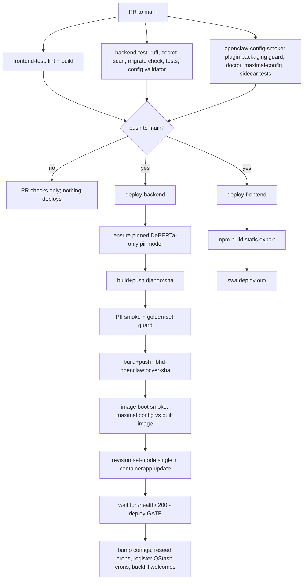

# Infrastructure & Deployment

How code becomes running production: the three container images, the push-to-main
pipeline, the env-var/secret contract, and the runtime settings that hold it
together. Read [`../agents/architecture.md`](../agents/architecture.md) for the
three-plane system map, [`../agents/workflow.md`](../agents/workflow.md) for the
git/merge rules, [`../agents/debugging.md`](../agents/debugging.md) for
post-deploy verification, and [`../infrastructure/azure-resource-naming.md`](../infrastructure/azure-resource-naming.md)
for the `oc-` / `mi-nbhd-` / `ws-` prefix contract. This doc is the build &
config layer under all of them.

There is **no staging environment** — `main` deploys straight to prod behind a
health gate. Everything below assumes that.

## Topology at a glance

| Plane | Azure resource | Image | Scaling |
|---|---|---|---|
| Control plane | Container App `nbhd-django-westus2` | `nbhdunited.azurecr.io/django:<sha>` | Single-revision, always-on 1 vCPU / 2 GiB |
| Per-tenant runtime | Container App `oc-<prefix>` | `nbhdunited.azurecr.io/nbhd-openclaw:<ocver>-<shortsha>` | Single-revision, 0.5 vCPU / 1.0 GiB, hibernates to 0 replicas |
| Frontend | Static Web App `nbhd-united-frontend` | Next.js static export (`out/`) | CDN, no server |
| Registry | ACR `nbhdunited` | `django`, `nbhd-openclaw`, `pii-model` repos | nightly purge task |
| Secrets | Key Vault `kv-nbhd-prod` | — | referenced via managed identity |

Resource group `rg-nbhd-prod`, region `westus2`. Env names in
[`.github/workflows/ci-cd.yml:43`](../../.github/workflows/ci-cd.yml).

## The three images

### `django` — control plane ([`Dockerfile`](../../Dockerfile))

`python:3.12-slim`, `DJANGO_SETTINGS_MODULE=config.settings.production` baked in
([`Dockerfile:5`](../../Dockerfile)). Build order is deliberate and fragile:

1. **CPU-only torch first** ([`Dockerfile:22`](../../Dockerfile)). The pin is
   read *out of* `requirements.txt` (`grep '^torch=='`) and installed from the
   pytorch CPU index, so the later `-r requirements.txt` sees torch satisfied and
   skips the ~1 GB CUDA wheel. A Dependabot bump that desyncs a hardcoded pin here
   once reinstalled the CUDA build and corrupted `transformers` imports — reading
   the version from the file makes that skew impossible.
2. **PII model as a frozen ACR layer** ([`Dockerfile:34`](../../Dockerfile)):
   `COPY --from=nbhdunited.azurecr.io/pii-model:deberta-liquid-a038061af92047b0-b8c9cf3d2d6ae525`.
   The ~1.7 GiB compressed artifact contains pinned FP32 DeBERTa-v3 + ai4privacy
   at `/app/pii-model` and Liquid at `/app/pii-model/liquid`, pulled into the
   Django build from *our own* ACR so ordinary deploys do not hit HF 429s. The
   immutable tag is `<shape>-<first 16 DeBERTa revision chars>-<first 16 Liquid
   revision chars>`. The first deploy of new pinned content mints that ACR layer;
   app changes do not invalidate it. CI verifies both bundles are present and
   weight-bearing. **Bump the tag in `Dockerfile:34` and the CI model-image step
   together** ([`ci-cd.yml:355`](../../.github/workflows/ci-cd.yml)).
3. `collectstatic` with a placeholder secret key ([`Dockerfile:38`](../../Dockerfile)),
   then `CMD ["./startup.sh"]`. Image is ~2.56 GB by design (PII ML stack).

The PII model itself is built by [`Dockerfile.pii-model`](../../Dockerfile.pii-model):
a two-stage `snapshot_download` (5× retry/backoff for HF 429s) → `FROM scratch`
so the layer Django pulls is *only* weights. The repo ships `pytorch_model.bin`
(no safetensors), so the `.bin` must survive `ignore_patterns`. The recipe's
default remains DeBERTa-only as a safe local fallback; CI explicitly sets
`INCLUDE_LIQUID=true` to produce the current immutable dual-model artifact.

### `nbhd-openclaw` — per-tenant runtime ([`Dockerfile.openclaw`](../../Dockerfile.openclaw))

`node:22-bookworm-slim`. Key build facts:

- `ARG OPENCLAW_VERSION=2026.5.28` ([`Dockerfile.openclaw:9`](../../Dockerfile.openclaw))
  is the OpenClaw npm version baked in **and** the tag prefix. It must stay in
  sync with `OPENCLAW_CURRENT_VERSION` in `apps/orchestrator/tool_policy.py`
  because `config_generator` version-gates features (e.g. `tools.toolSearch >=
  2026.5.28`).
- `@openclaw/line` is pinned to the same version (LINE channel externalized from
  core in 5.2); `@anthropic-ai/claude-code@2.1.123` is dormant until a
  `byo_models_enabled` tenant connects.
- `NODE_OPTIONS` sets `--dns-result-order=ipv4first` + `--no-network-family-autoselection`
  ([`Dockerfile.openclaw:21`](../../Dockerfile.openclaw)) — Azure Container Apps
  IPv6 to external APIs is unreliable and crash-loops Telegram `setWebhook`.
- **Every plugin the config generator can emit into `plugins.load.paths` must be
  `COPY`'d here** ([`Dockerfile.openclaw:46-69`](../../Dockerfile.openclaw)).
  Omitting `nbhd-friends-tools` bricked every friends tenant's boot with `plugin
  path not found` (2026-07-05). `scripts/check_openclaw_plugin_packaging.py`
  (CI gate) now fails the build on any missing plugin.
- `--require` shims injected via `NODE_OPTIONS`
  ([`Dockerfile.openclaw:104`](../../Dockerfile.openclaw)):
  `suppress-chmod-eperm.js` (chmod EPERM on SMB mounts, essential for cron) and
  `redact-stdout.js` (masks tenant content before it hits shared Log Analytics).
- The `nbhd-site-publishing` plugin gets its Azure SDK deps vendored at build
  time ([`Dockerfile.openclaw:85`](../../Dockerfile.openclaw)); all other plugins
  are Node-builtins-only.

Runs as `USER node`; `ENTRYPOINT` is `nbhd-openclaw-entrypoint`
([`runtime/openclaw/entrypoint.sh`](../../runtime/openclaw/entrypoint.sh), covered below).

### Image tagging — the two schemes matter

| Image | Tag | Moving? | Set by |
|---|---|---|---|
| `django` | `<github.sha>` (+ `:latest`) | `:latest` moves | [`ci-cd.yml:371`](../../.github/workflows/ci-cd.yml) |
| `nbhd-openclaw` | `<ocver>-<shortsha>` e.g. `2026.5.28-a1b2c3d` | **never moves; no `:latest`** | [`ci-cd.yml:403`](../../.github/workflows/ci-cd.yml) |
| `pii-model` | `deberta-liquid-a038061af92047b0-b8c9cf3d2d6ae525` | immutable by convention/content tag | deploy builds once, then verifies both bundles, [`ci-cd.yml:355`](../../.github/workflows/ci-cd.yml) |

OpenClaw deliberately has **no `:latest`** ([`ci-cd.yml:404`](../../.github/workflows/ci-cd.yml)):
a moving tag could pull an unvalidated build into a tenant on the next
restart/wake. Each build is frozen; tenants are bumped onto a specific,
canary-validated tag. Rollback = bump to a prior tag. The just-built OpenClaw tag
is threaded to Django as the `OPENCLAW_IMAGE_TAG` env var
([`ci-cd.yml:465`](../../.github/workflows/ci-cd.yml)); that env var is the fleet
default every provision/wake path reads
([`azure_client.py:856`](../../apps/orchestrator/azure_client.py)).

## How a commit reaches production

The `pull_request` event runs the three test jobs only. The `deploy-backend` and
`deploy-frontend` jobs are gated `if: github.event_name == 'push' && github.ref
== 'refs/heads/main'` ([`ci-cd.yml:329`](../../.github/workflows/ci-cd.yml),
[`:611`](../../.github/workflows/ci-cd.yml)) — so a PR merged by
`gh pr merge --auto` triggers the actual deploy on the resulting push. There are
**no required status checks**: `--auto` can land a red commit on main, but the
deploy job `needs: [frontend-test, backend-test, openclaw-config-smoke]`, so a
broken image never deploys (see [`workflow.md`](../agents/workflow.md)).

### CI/CD stage table

| Stage | Job | What it gates | Fails deploy? |
|---|---|---|---|
| Frontend lint + static build | `frontend-test` | Next.js build correctness | yes (dep of deploy) |
| ruff check + `ruff format --check` | `backend-test` | style/format ([`ci-cd.yml:109-113`](../../.github/workflows/ci-cd.yml)) | yes |
| Secret scan (regex for `sk-ant-`, `sk-or-v1-`, …) | `backend-test` | committed keys ([`ci-cd.yml:115`](../../.github/workflows/ci-cd.yml)) | yes |
| `makemigrations --check` + `migrate` + `test apps/` | `backend-test` | model↔migration drift, test suite (pgvector/pg16) | yes |
| Config validator + security audit | `backend-test` | generated OpenClaw config schema/security ([`ci-cd.yml:158`](../../.github/workflows/ci-cd.yml)) | yes |
| Plugin packaging guard | `openclaw-config-smoke` | plugin in config but missing from image ([`ci-cd.yml:232`](../../.github/workflows/ci-cd.yml)) | yes |
| OpenClaw doctor + maximal-flags config strict-validate | `openclaw-config-smoke` | friends + all experimental gates ([`ci-cd.yml:252`](../../.github/workflows/ci-cd.yml)) | yes |
| redact/chmod/toolcall sidecar `node --test` | `openclaw-config-smoke` | runtime shims + plugin unit tests | yes |
| Ensure pinned DeBERTa-only pii-model image | `deploy-backend` | exact DeBERTa revision; Liquid directory absent from serving image | yes |
| Build+push `django:<sha>` | `deploy-backend` | — | yes |
| PII stack smoke (`+cpu` torch, weights present) + golden-set | `deploy-backend` | PII regression pre-deploy ([`ci-cd.yml:380`](../../.github/workflows/ci-cd.yml)) | yes |
| Build+push `nbhd-openclaw:<tag>` | `deploy-backend` | — | yes |
| Image boot smoke (maximal config vs built image) | `deploy-backend` | `plugin path not found` / `Invalid config` ([`ci-cd.yml:425`](../../.github/workflows/ci-cd.yml)) | yes |
| `revision set-mode single` + `containerapp update` | `deploy-backend` | ships the image, sets `OPENCLAW_IMAGE_TAG` + `SENTRY_RELEASE` | yes |
| Wait for `/health/` 200 (45× / 10s) | `deploy-backend` | **the deploy gate** ([`ci-cd.yml:467`](../../.github/workflows/ci-cd.yml)) | yes |
| Sentry release | `deploy-backend` | suspect-commit tracking | no (`continue-on-error`) |
| bump-all-pending-configs | `deploy-backend` | queue config push to tenants | no (`\|\| echo`) |
| force-reseed-crons | `deploy-backend` | recreate tenant system crons | no |
| register-system-crons | `deploy-backend` | QStash schedules (idempotent) | no |
| backfill-welcomes | `deploy-backend` | Fuel/Gravity welcome crons | no |
| Static export + SWA deploy | `deploy-frontend` | frontend ships | yes |

The post-deploy `curl` steps ([`ci-cd.yml:509-558`](../../.github/workflows/ci-cd.yml))
are all **non-fatal** (`|| echo Warning`) and authenticated with the
`X-Deploy-Secret` header (repo secret `DEPLOY_SECRET`). They hit protected Django
`/api/cron/*` endpoints. Merging to main does **not** roll tenant OpenClaw images —
that is a separate `workflow_dispatch`-only `fleet-rollout` job
([`ci-cd.yml:575`](../../.github/workflows/ci-cd.yml)); hibernated tenants
self-heal their image at wake regardless.

### Single-revision mode + the health gate

`az containerapp revision set-mode --mode single` runs *before* the image update
([`ci-cd.yml:456`](../../.github/workflows/ci-cd.yml)). This is load-bearing for
the Django app: multiple active revisions would each start a Telegram poller and
fight over `getUpdates` (409 Conflict). The old revision keeps serving until the
new one passes health, so a just-merged migration can be invisible in the DB for
a few minutes (see [`debugging.md`](../agents/debugging.md) §post-deploy).

The gate itself is a bare Django view: [`config/health.py`](../../config/health.py)
returns `{"status":"ok"}`, **deliberately does not touch the database** (the
Supavisor pooler drops idle connections; coupling liveness to that would cause
false deploy failures). Routed unauthenticated at `/health/`
([`config/urls.py:11`](../../config/urls.py)) and skipped by the timing
middleware. If the new revision never serves a 200 in 45 attempts, the deploy job
`exit 1`s ([`ci-cd.yml:485`](../../.github/workflows/ci-cd.yml)).

## Runtime entrypoints

### `startup.sh` — Django ([`startup.sh`](../../startup.sh))

Auto-migrate-on-deploy lives here, not in CI:

1. `migrate --noinput` using `${ADMIN_DATABASE_URL:-$DATABASE_URL}` — migrations
   run as the **admin/`postgres` role** (bypasses RLS), app traffic runs as
   `app_user` (non-BYPASSRLS). See [`.env.example:7-12`](../../.env.example).
2. `disable_rls || true` — disables RLS on any newly created tables (non-fatal).
3. `bump_pending_configs`.
4. Starts the central Telegram poller in the background (`poll_telegram &`), then
   gunicorn. A supervisor loop restarts the poller if it dies but treats gunicorn
   death as fatal ([`startup.sh:49-66`](../../startup.sh)).

Gunicorn config ([`startup.sh:32`](../../startup.sh) + [`gunicorn.conf.py`](../../gunicorn.conf.py)):
`gthread`, **2 workers × 8 threads**, `--timeout 300`, `--max-requests 1000`
(+jitter). `gthread` (not `sync`) so the ~600 MB PII model loads once per process
and is shared across threads — capping per-container PII memory at 2×600 MB
instead of 4×600 MB > cgroup limit (issue #693 OOM). `post_worker_init`
([`gunicorn.conf.py:8`](../../gunicorn.conf.py)) **warms the PII pipeline at
worker boot** so it never cold-loads inside a user's chat POST (8–114 s in-request
otherwise → iOS "Something went wrong"); it never fails the worker (the redactor
degrades to pattern recognizers). The deploy rewrites Azure's readiness probe
from the default TCP check to HTTP `GET /health/` in the same revision as the new
image. The probe supplies `Host: localhost` (an allowed host) and
`X-Forwarded-Proto: https` (so `SECURE_SSL_REDIRECT` does not turn the check into
a redirect). A 200 therefore proves `/health/` reached a worker after its
`post_worker_init`; workers still loading the model have not entered their accept
loop and cannot receive user requests.

### `entrypoint.sh` — OpenClaw ([`runtime/openclaw/entrypoint.sh`](../../runtime/openclaw/entrypoint.sh))

Seed-once-then-share-authoritative bootstrap. The critical invariant: **AGENTS.md,
SOUL.md, IDENTITY.md, skill templates are seeded from provision-time env vars only
when the file share has no usable copy** (`[ ! -s ]`, so a 0-byte interrupted
write reseeds). Django re-renders and overwrites the share on every config-apply
and on every boot via the container-started hook, so an always-overwrite-from-env
would silently revert persona/gate/Gravity changes to the stale snapshot
([`entrypoint.sh:37-55`](../../runtime/openclaw/entrypoint.sh)). Config JSON is
only written from `OPENCLAW_CONFIG_JSON` when no share copy exists; then it
retries JSON-parse up to 30 s to tolerate in-flight Django writes
([`entrypoint.sh:98-112`](../../runtime/openclaw/entrypoint.sh)).

`TELEGRAM_BOT_TOKEN` is `unset` before launch ([`entrypoint.sh:228`](../../runtime/openclaw/entrypoint.sh))
so the container does not start its own Telegram provider (the central Django
poller owns inbound). Launches `openclaw gateway` + `node proxy.js` under a
signal-forwarding supervisor. A fire-and-forget `container-started` hook POSTs
Django (auth `X-NBHD-Internal-Key`) so the Postgres-canonical reconciler rebuilds
state immediately ([`entrypoint.sh:242`](../../runtime/openclaw/entrypoint.sh)).
BYO tenants get a Claude-CLI credential seed + tool-deny policy
([`claude-settings.json`](../../runtime/openclaw/claude-settings.json)) + a
pre-warm ping to hide the ~150 s cold `claude` spawn.

## Env-var → Azure Container App contract

**Renames break prod.** Django reads config via `django-environ`
([`base.py:13`](../../config/settings/base.py)); the env vars are set directly on
the `nbhd-django-westus2` Container App (not in this repo). CI only ever sets two
of them at deploy time — `OPENCLAW_IMAGE_TAG` and `SENTRY_RELEASE`
([`ci-cd.yml:465`](../../.github/workflows/ci-cd.yml)); the rest are configured
out-of-band. Changing a name in `config/settings/*` without updating the Container
App env var (or vice versa) silently falls back to the code default. Two documented
traps:

- `STRIPE_PRICE_ID` (setting) reads env var **`STRIPE_PRICE_STARTER`**
  ([`base.py:524`](../../config/settings/base.py)) — set `STRIPE_PRICE_STARTER`,
  not `STRIPE_PRICE_ID`.
- `OPENCLAW_IMAGE_TAG` defaults to `"latest"`, but `:latest` is never pushed for
  OpenClaw — so if the env var is missing, new-tenant provisioning fails
  `MANIFEST_UNKNOWN` ([`azure_client.py:848`](../../apps/orchestrator/azure_client.py)).

Selected contract (name → purpose → where consumed). Full surface in
[`.env.example`](../../.env.example) and [`base.py`](../../config/settings/base.py):

| Env var | Purpose | Consumed |
|---|---|---|
| `SECRET_KEY` | Django signing key (no default — hard required) | [`base.py:19`](../../config/settings/base.py) |
| `DATABASE_URL` | App DB conn — **transaction pooler :6543**, role `app_user` | [`base.py:102`](../../config/settings/base.py) |
| `ADMIN_DATABASE_URL` | Migration/ops DB conn — `postgres` role, bypasses RLS | [`startup.sh:5`](../../startup.sh) |
| `JWT_SECRET` | SimpleJWT signing key (falls back to `SECRET_KEY`) | [`base.py:148`](../../config/settings/base.py) |
| `DEPLOY_SECRET` | `X-Deploy-Secret` header for CI→cron endpoints | [`base.py:189`](../../config/settings/base.py) |
| `NBHD_INTERNAL_API_KEY` | Shared container↔Django runtime auth | [`base.py:266`](../../config/settings/base.py) |
| `OPENCLAW_IMAGE_TAG` | Fleet default OpenClaw image tag (CI-set) | [`base.py:513`](../../config/settings/base.py) |
| `REDIS_URL` | django-redis cache (rediss://) — distinct from `UPSTASH_REDIS_URL` | [`base.py:196`](../../config/settings/base.py) |
| `QSTASH_TOKEN` / `QSTASH_*_SIGNING_KEY` | scheduling (replaces Celery) | [`base.py:173`](../../config/settings/base.py) |
| `STRIPE_*` / `DJSTRIPE_WEBHOOK_SECRET` | billing | [`base.py:244`](../../config/settings/base.py) |
| `TELEGRAM_BOT_TOKEN` / `TELEGRAM_WEBHOOK_SECRET` | shared bot + webhook auth | [`base.py:251`](../../config/settings/base.py) |
| `LINE_CHANNEL_ACCESS_TOKEN` / `LINE_CHANNEL_SECRET` | LINE bot | [`base.py:288`](../../config/settings/base.py) |
| `ANTHROPIC_API_KEY` / `OPENAI_API_KEY` / `OPENROUTER_API_KEY` | shared LLM keys | [`base.py:293`](../../config/settings/base.py) |
| `AZURE_KV_SECRET_*` | KV secret **names** for per-tenant secret refs | [`base.py:392`](../../config/settings/base.py) |
| `AZURE_CONTAINER_ENV_ID` / `AZURE_ACR_SERVER` / `AZURE_KEY_VAULT_NAME` | provisioning targets | [`base.py:507`](../../config/settings/base.py) |
| `SENTRY_DSN` (+ `SENTRY_*`) | monitoring; **inert unless DSN set + not a test run** | [`base.py:618`](../../config/settings/base.py) |
| `GRAVITY_ENABLED` | finance kill-switch — **fail-safe OFF in prod** | [`base.py:497`](../../config/settings/base.py) |
| `AZURE_MOCK` | short-circuits all Azure SDK calls (dev/CI) | [`azure_client.py`](../../apps/orchestrator/azure_client.py) |
| `NBHD_DISABLE_BACKGROUND_THREADS` | run on_commit side effects synchronously (tests) | [`base.py:273`](../../config/settings/base.py) |

## Secrets: Key Vault → managed identity

Two different secret paths:

- **Django control plane** reads secrets as plain env vars on the Container App.
  In prod those are sourced from Key Vault, but Django resolves them through
  `django-environ` at boot — it does not do `keyvaultref:` itself.
- **Per-tenant `oc-*` containers** use Container Apps' native Key Vault secret
  references. Each tenant has a user-assigned managed identity `mi-nbhd-<prefix>`
  ([`azure_client.py:99`](../../apps/orchestrator/azure_client.py)) granted two
  scoped roles at provision time: **Key Vault Secrets User** (per-secret RBAC, not
  vault-wide — blast radius of a leaked MI token is just the listed secrets) and
  **AcrPull**. The container's `secrets` block references KV by URL + identity:
  `{"name": ..., "keyVaultUrl": "https://kv-nbhd-prod.vault.azure.net/secrets/<name>",
  "identity": <mi-id>}` ([`azure_client.py:84`](../../apps/orchestrator/azure_client.py)),
  and env vars point at them via `secretRef`
  ([`azure_client.py:858`](../../apps/orchestrator/azure_client.py)). The
  **`identityref:` must use the `mi-nbhd-` name, never the `oc-` name** — see
  [`azure-resource-naming.md`](../infrastructure/azure-resource-naming.md).
  Default per-tenant KV secrets: `anthropic-api-key`, `openai-api-key`,
  `openrouter-api-key`, `brave-api-key`
  ([`azure_client.py:145`](../../apps/orchestrator/azure_client.py)); the shared
  `nbhd-internal-api-key` backs both `NBHD_INTERNAL_API_KEY` and
  `OPENCLAW_GATEWAY_TOKEN`.

**Env vars are NOT rewritten on image update.** `apply_single_tenant_config_task`
and `update_container_image` only change the image; the `env`/`NODE_OPTIONS` block
is set at create time and cached by Container Apps
([`azure_client.py:869-881`](../../apps/orchestrator/azure_client.py)). Changing
`NODE_OPTIONS` or adding a `--require` shim requires a one-shot ops update for
existing tenants — mirror `Dockerfile.openclaw` ENV and the inline value in
`azure_client.py`.

## Settings modules

`config/settings/{base,production,development,test}.py`. `manage.py` defaults to
`development`; the Django image bakes `production`
([`Dockerfile:5`](../../Dockerfile)); CI runs tests under `development` with an
in-workflow Postgres service.

### `base.py` — the shared contract

- **Apps**: `django_celery_beat` explicitly removed — **QStash for all scheduling**
  ([`base.py:37`](../../config/settings/base.py)); do not re-add Celery.
- **Middleware order** ([`base.py:64`](../../config/settings/base.py)):
  `RequestTimingMiddleware` outermost (captures full request time),
  `ETagMiddleware`, then CORS, security, whitenoise, and the two tenant
  middlewares (`TenantContextMiddleware`, `UserTimezoneMiddleware`) innermost.
- **Auth/DRF** ([`base.py:134`](../../config/settings/base.py)): default auth is
  `PersonalAccessTokenAuthentication` then `JWTAuthenticationWithRLS`
  (JWT auth also sets the RLS session context); default permission
  `IsAuthenticated`; `PageNumberPagination` size 20. SimpleJWT access token 15 min,
  refresh 7 days. **Refresh-token rotation is intentionally disabled**
  ([`base.py:150`](../../config/settings/base.py)) pending a coordinated
  client/deploy rollout.
- **Cache** ([`base.py:208`](../../config/settings/base.py)): django-redis when
  `REDIS_URL` set, else in-process (local). Hardened for Upstash idle-close:
  `health_check_interval=25s`, retry-on-`ConnectionError`/`TimeoutError`,
  `IGNORE_EXCEPTIONS=True` so a Redis blip returns `None` instead of a user-facing
  500.
- **Sentry** ([`base.py:602`](../../config/settings/base.py)): initialized only
  when `SENTRY_DSN` set and not a test run. `send_default_pii=False` is
  load-bearing (no bodies/cookies/emails/IPs); `before_send` / `before_send_log`
  scrub BYO paste bodies as a backstop.

### `production.py` — Supavisor + hardening ([`production.py`](../../config/settings/production.py))

`DEBUG=False`. The whole file is essentially the transaction-mode pooling
contract (the `DATABASE_URL` must point at the **:6543** pooler endpoint):

- `DISABLE_SERVER_SIDE_CURSORS=True` — `.iterator()` materializes client-side
  (named cursors don't survive per-transaction backend leasing).
- `CONN_MAX_AGE=600` + `CONN_HEALTH_CHECKS=True` — persistent client sockets are
  safe in transaction mode (a client socket doesn't pin a backend); amortizes the
  ~900 ms cross-region TCP+TLS+SCRAM handshake.
- `prepare_threshold=None` — disables psycopg3 auto-prepared statements (a
  statement prepared on backend A may not exist on backend B under transaction
  pooling → `prepared statement "_pg3_N" does not exist`).
- TCP keepalives (`keepalives_idle=30`) keep the client socket warm past Azure
  SNAT idle reaping. History: 2026-05-15 `EMAXCONNSESSION` came from the secret
  pointing at the **session** pooler (5432) instead of 6543.
- Security: `SECURE_SSL_REDIRECT`, 1-year HSTS + preload, secure session/CSRF
  cookies, `SECURE_PROXY_SSL_HEADER=(HTTP_X_FORWARDED_PROTO, https)`.
- Email via Mailgun SMTP; falls back to console backend if `EMAIL_HOST_USER`
  unset (misconfig is loud, not silent).
- Logging to stdout → Log Analytics with the `redact_byo_paste_body` filter.

### `development.py` / `test.py`

Dev: `DEBUG=True`, `ALLOWED_HOSTS=["*"]`, `CORS_ALLOW_ALL_ORIGINS=True`, console
email, `GRAVITY_ENABLED=True`. Test: same plus `MIGRATION_MODULES` stubs the
pgvector-dependent `lessons`/`journal` migrations so SQLite can run
([`test.py:12`](../../config/settings/test.py)) — but note **CI runs the suite
under `development` against real pgvector/pg16**, not `test.py`. `base.py` sets
`TEST_RUNNER = config.test_runner.QuietCronSignalRunner` to disconnect the
CronJob→reconciler signal during tests.

### `config/` glue

- [`urls.py`](../../config/urls.py): unauthenticated routes are `/health/`,
  chart/meditation image serving (UUID-guessed), and `stripe/` webhooks; the
  `/api/v1/internal/runtime/<tenant>/…` routes are the container→Django callback
  surface (usage, BYO error, chat progress, action gating). `byo-credentials/`
  ordered before `tenants/` to dodge the DefaultRouter `<pk>` catch-all.
- [`middleware.py`](../../config/middleware.py): `RequestTimingMiddleware` logs
  `PERF method path status total_ms db_queries cache` to stdout (skips
  `/health`, `/static/`).
- [`cache_middleware.py`](../../config/cache_middleware.py): strong-ETag + 304 for
  200 GETs, default `Cache-Control: private, max-age=10, stale-while-revalidate=60`,
  and forces `Vary: Authorization` so a proxy/CDN can't leak tenant A's body to
  tenant B.

## Local dev & Makefile

[`Makefile`](../../Makefile): `make run/migrate/test/lint`, `make provision
TENANT_ID=`, and a `canary-*` set for single-tenant pre-merge OpenClaw validation
(`az acr build` a `canary-<sha>` tag → `canary_tenant_image` → poll admin-health).
[`docker-compose.yml`](../../docker-compose.yml) brings up Postgres 16 + Redis +
Django with `AZURE_MOCK=true`. Ruff config in [`pyproject.toml`](../../pyproject.toml)
(`line-length=120`, `E/F/I/UP/B/SIM`). `make setup` runs `pip-compile` — **do not
run it on macOS** (strips Linux CUDA torch pins); hand-edit `requirements.txt`.
Dependabot patch/minor PRs auto-squash-merge
([`dependabot-auto-merge.yml`](../../.github/workflows/dependabot-auto-merge.yml));
majors are held.

## Risks & improvement opportunities

- **[high] No required status checks on `main`.** `gh pr merge --auto` (and the
  Dependabot auto-merge workflow) can land a red commit on main. The deploy job's
  `needs:` protects prod images, but main history can carry broken commits and a
  failed test job simply skips the deploy — a silent "didn't ship" that looks like
  success unless someone reads CI. Add branch protection with the three test jobs
  as required checks.
- **[high] Split-brain env-var contract.** The authoritative production env vars
  live only on the Azure Container App, mirrored nowhere in-repo except by
  convention. A rename in `settings/*` silently falls back to a code default
  (`STRIPE_PRICE_ID`↔`STRIPE_PRICE_STARTER`, `OPENCLAW_IMAGE_TAG` default
  `latest`→`MANIFEST_UNKNOWN`). No CI check asserts the app's required env vars are
  actually set. Add a `manage.py check --deploy`-style startup assertion for
  must-be-nonempty keys.
- **[high] `disable_rls || true` on every deploy.** `startup.sh` swallows failures
  of the RLS-disable step, and migrations run as the RLS-bypassing admin role. A
  new `public.*` table that misses its tenants relock migration (see
  [`workflow.md`](../agents/workflow.md) step 3) can ship with RLS effectively
  off and no deploy-time signal. Make the relock state assertable post-migrate.
- **[med] Manual dual-maintenance of `NODE_OPTIONS`/plugin ENV.** The OpenClaw
  runtime env is defined in both `Dockerfile.openclaw` and inline in
  `azure_client.py`, and is *not* rewritten on image update — existing tenants
  need a one-shot ops command when it changes. Drift here is invisible until a
  shim silently stops loading. Generate one from the other, or add a CI diff.
- **[med] Health gate is liveness-only.** `/health/` returns 200 as soon as WSGI
  boots — it never checks the DB, cache, or that migrations applied. A revision
  that boots but can't reach Postgres passes the gate and serves 500s. A separate
  opt-in `/health/ready/` (already contemplated in `config/health.py`) would let
  the deploy gate catch DB/pooler misconfiguration.
- **[med] `django:latest` is a moving tag that nothing consumes but exists.**
  Deploys push both `:<sha>` and `:latest` ([`ci-cd.yml:378`](../../.github/workflows/ci-cd.yml));
  the Container App is pinned to `:<sha>`, so `:latest` is dead weight that could
  mislead a manual `az containerapp update`. OpenClaw correctly avoids `:latest` —
  apply the same discipline to Django or document why it exists.
- **[med] Post-deploy config/cron steps are all non-fatal.** bump-configs,
  reseed-crons, register-crons, backfill-welcomes each `|| echo Warning` and are
  invisible in a green run. A persistently failing `register-system-crons` (e.g.
  QStash outage or rotated `DEPLOY_SECRET`) degrades silently — the pipeline
  reports success. Surface these as a deploy annotation or a follow-up health probe.
- **[low] `infra/` Terraform is a stub.** [`infra/README.md`](../../infra/README.md)
  lists the intended modules (Container Apps env, Key Vault, ACR, Files, MIs) as
  unchecked TODOs. The control-plane Container App, environment, Key Vault, and SWA
  are provisioned/configured out-of-band, so there is no IaC source of truth for
  the non-tenant infrastructure — a rebuild would be archaeological.
- **[low] Shared `NBHD_INTERNAL_API_KEY` across the whole fleet.** All containers
  authenticate to Django with the same key (safe today because `oc-*` ingress is
  `external:false`). A per-tenant internal key exists (`tenant-<uuid>-internal-key`)
  but the shared key still backs both `NBHD_INTERNAL_API_KEY` and
  `OPENCLAW_GATEWAY_TOKEN`; narrowing runtime callbacks to the per-tenant key would
  shrink the blast radius if the shared key leaks.
- **[low] `secretRef` fallback to inline plaintext.** `_build_container_secret`
  falls back to an inline `{"name","value"}` secret if vault/secret/identity is
  missing ([`azure_client.py:96`](../../apps/orchestrator/azure_client.py)),
  logging only a WARNING. A provisioning misconfig would silently store a secret as
  a plaintext Container App secret instead of a KV reference. Consider failing hard
  when `OPENCLAW_CONTAINER_SECRET_BACKEND=keyvault` but the reference can't be built.
