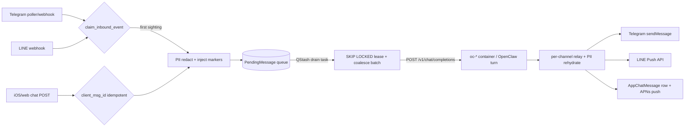

# Messaging & channel routing

How a user message reaches the per-tenant OpenClaw runtime and how the reply
gets back, across every channel: Telegram, LINE, the iOS/web app, Siri, and
cron/proactive sends. Builds on [architecture.md](../agents/architecture.md)
(the three planes, tenant lifecycle) and [invariants.md](../agents/invariants.md)
(dedup, cover-all-channels, idempotent revision ops, no-external-calls-in-txn).

Everything here lives in `apps/router/` (the `apps/telegram_bot/` app is
**empty** — two migrations, no code; treat it as vestigial). The router is both
the *ingress* (webhooks/poller/DRF views) and the *egress* (channel senders),
with a Postgres-backed serialization queue in between.

## The shape of a turn

Two cross-cutting invariants govern this whole subsystem:

- **Dedup at entry** (invariants #3). Every *provider* ingress claims a stable
  event id via `apps/router/inbound_dedup.py::claim_inbound_event` before any
  side effect. Internal enqueues (cron, buffered redelivery) are deliberately
  *not* gated — they carry no provider id.
- **Cover all channels** (invariants #4). Inbound preprocessing (PII redaction,
  datetime/proactive markers) and outbound rendering (PII rehydration, chart /
  insight / MEDIA marker handling) must be applied on *every* path. The three
  outbound relays intentionally duplicate the same steps; a feature added to one
  must be added to all.

## Inbound entry points

| Channel | Entry (`apps/router/…`) | Auth | Runs where |
|---|---|---|---|
| Telegram poller (**live**) | `poller.py:62` `TelegramPoller.start` → `:671` `_process_update` → `:721` `_handle_update` | Bot token owned by control plane | Long-lived process, `manage.py poll_telegram` |
| Telegram webhook (**latent**) | `views.py:172` `telegram_webhook` | `X-Telegram-Bot-Api-Secret-Token` via `hmac.compare_digest` (`views.py:185`) | Django request thread |
| LINE webhook | `line_webhook.py:796` `LineWebhookView.post` → `:831` `_handle_event` | HMAC-SHA256 body signature (`_verify_signature`, `line_webhook.py:64`) | Per-event daemon **thread** (`:823`) |
| iOS / web chat | `chat_views.py:475` `ChatMessageView.post` → `:230` `enqueue_tenant_turn` | User **JWT** (`IsAuthenticated`) | Django request thread |
| iOS on-device turn | `chat_views.py:631` `ChatLocalTurnView.post` | User JWT | Django request thread |
| Siri status / respond | `siri_views.py:114` / `:151` | User JWT | Django request thread |
| Cron / proactive (container→Django) | `cron_delivery.py:95` `CronDeliveryView` | `X-NBHD-Internal-Key` + `X-NBHD-Tenant-Id` | Django request thread |
| Progress stream (container→Django) | `chat_views.py:755` `ChatProgressEventView` | Internal key + tenant id | Django request thread |
| CoreAI manifest | `coreai_views.py:26` | User JWT | Django request thread |

URL wiring is in `config/urls.py`: consumer routes at `/api/v1/{telegram,line,chat,siri,push,coreai}/`; the container→Django callbacks live under `/api/v1/internal/runtime/<tenant_id>/{usage/report,byo/error,chat/progress,gate}/` plus `/api/v1/gate/`.

### Telegram poller (the live path)

Only **one** poller runs fleet-wide — a single shared bot, single-revision Django
(invariants #5) to avoid `getUpdates` 409 conflicts. `start()` (`poller.py:62`)
long-polls `getUpdates` with `allowed_updates=["message","callback_query","edited_message"]`
(`:146`) and an in-memory offset.

Three subtleties that were each a production incident:

- **Offset advances only *after* handling** (`poller.py:671`). The read offset is
  in-memory; advancing it before the DB-touching setup (RLS context, tenant
  resolve) meant a pooler-exhaustion error acked the update to Telegram
  *unprocessed* — silently dropping the user's message. Now a transient failure
  falls through to the poll-loop backoff and the update is re-fetched.
- **Dedup on `tg:<update_id>`** (`:703`) makes a poller *restart* replay (or any
  re-fetch) a harmless no-op — the offset is memory-only, so a restart re-sees
  every unacked update.
- **`close_old_connections()` every poll cycle** (`:101`). The poller bypasses
  Django's request lifecycle, so without this its DB connection pins a Supavisor
  pool slot for the process lifetime (2026-05-15 pool-exhaustion incident).

`_handle_update` (`:721`) resolves the tenant by `chat_id`
(`services.py:184`), applies an in-memory per-minute rate limit
(`services.py:228`, default 30/min), routes callback-query button taps
(onboarding `tz_`, `lesson:`, `extract:`, `task_action:`, `friend:`, `gate_*`,
`container_update:`), gates on tenant status (unknown→onboarding link,
provisioning→"waking", suspended→billing), runs the budget check → hibernate,
stamps `last_message_at`, extracts text (incl. voice transcription and document
text), and finally calls `_forward_to_container` (`:1346`).

### LINE webhook

`post` (`line_webhook.py:796`) verifies the HMAC-SHA256 signature over the raw
body (`:64`), then **spawns a daemon thread per event** (`:823`) and returns 200
immediately — LINE requires a sub-second ack. (Under `NBHD_DISABLE_BACKGROUND_THREADS`,
tests run inline so daemon threads don't outlive the test DB.) Each thread sets
service-role RLS, claims `line:<webhookEventId>` (`:848` — LINE's at-least-once
redelivery sets `deliveryContext.isRedelivery=true`), then dispatches by event
type. `_handle_message` (`:920`) handles `audio` (Whisper transcription, gated so
onboarding users can't spend a paid Whisper call), `sticker` (keywords → intent
prompt), and `text`; images/video/location get a "please send text/voice/sticker"
bounce.

### iOS / web app chat

`ChatMessageView.post` (`chat_views.py:475`) is JWT-authed. It bounds the raw body
*before* DRF materializes it (`:490` — DRF's JSONParser bypasses
`DATA_UPLOAD_MAX_MEMORY_SIZE`, so an unbounded base64 image could OOM the shared
control plane), is **idempotent on `client_msg_id` first** (a retry replays the
existing turn, so an image is written to the share exactly once), decodes+validates
an optional inbound image, resolves the `ChatThread`, and calls
`enqueue_tenant_turn` (`:230`). That helper is the single chokepoint for "route
this to the full tenant agent" — also used by the Siri escalation path. It creates
a PENDING `AppChatMessage`, budget-gates, stores any image on the tenant share
(marker `[Photo attached: <path>]`, bytes never ride the queue), redacts PII,
injects datetime/chat markers, and enqueues an `ios` `PendingMessage`. The client
then **polls** `ChatMessageDetailView` (`:694`) until `status` flips to
`ready`/`error`. iOS is a first-class channel for the idle-hibernation freshness
signal (`last_message_at` stamped at `:371`).

**On-device (private) mode** (`ChatLocalTurnView`, `:631`) records a turn that
*already happened* on the client's own model as a READY `AppChatMessage`
(`source="on_device"`) — nothing is enqueued, no container woken, no model budget
spent. The recorded text still enters the USER.md conversation digest so crons and
other channels aren't blind to on-device chats.

## The serialization queue (`pending_queue.py`)

The queue exists to enforce a **per-key single-turn invariant**: the OpenClaw
claude-cli backend rejects a second concurrent turn on the same live session
("Claude CLI live session is already handling a turn") — pre-#427 it silently fell
back to MiniMax. Keying is `(tenant, channel, channel_user_id)` so two LINE users
on the same tenant don't block each other (`models.py:75`).

**Enqueue** (`enqueue_message_for_tenant`, `:346`): insert a `PendingMessage`
(PENDING, no lease), stamp `first_message_at` (activation signal), and publish the
QStash `drain_pending_messages_for_tenant` task with `retries=3`. If the publish
throws, the per-minute reaper (`reap_stuck_inbound_messages_task`, `:2044`)
re-drives the row within ~60s — a publish failure is a delay, not a lost message.
Callers do **all** channel-specific preprocessing (PII redaction, marker injection)
before enqueuing; the queue is dumb on purpose and never re-runs redaction over the
assembled body (whose structural markers would make the NER detector misfire).

**Drain** (`drain_pending_messages_for_tenant_task`, `:583`) is the heart:

1. **No-FQDN branch** (`:610`): distinguishes *still-provisioning* (buffer + defer,
   mark iOS "waking") from *deprovisioned* (fail orphaned rows, stop rescheduling).
2. **Claim a batch** (`_claim_pending_batch_for_key`, `:451`) inside one
   `SELECT … FOR UPDATE SKIP LOCKED` txn. If any row for the key already holds a
   live lease (`delivery_in_flight_until > now`), return empty — a concurrent drain
   is mid-POST. Otherwise lease the oldest PENDING row and **coalesce** contiguous
   fresh, under-cap, non-singleton-media rows into one batch (the "cold-start
   coalesce": N quick messages become one OpenClaw turn). Voice/image rows are
   always singletons — their markers live only in `message_text` and must not be
   coalesced away.
3. **Head-of-queue drops**: a past-cap head is dropped + apologized
   (`_MAX_DELIVERY_ATTEMPTS`); a stale head (older than
   `_STALE_MESSAGE_AGE_SECONDS`) is failed without a POST + apologized ("responding
   to questions from hours ago" is worse than silence).
4. **Dispatch by channel** (`:790`): `_drain_line_batch` / `_drain_telegram_batch`
   / `_drain_ios_batch`. Each POSTs `https://<container_fqdn>/v1/chat/completions`
   with a `Bearer` gateway token (below), `model:"openclaw"` sentinel (`:1356` — the
   runtime rejects any other value; real model attribution is client-side in
   `_record_usage_safe`), and `X-Channel` / `X-User-Timezone` headers.
5. **Failure handling**: a hibernated container 404 on the *poller* path (which has
   no wake step) triggers `wake_hibernated_tenant` + free re-defer (no attempt
   burned) (`:830`); a within-grace post-wake boot also re-defers free (`:884`);
   any other failure increments `delivery_attempts` on every batch row and raises so
   QStash retries. The lease + attempt cap keep retries from firing duplicate POSTs.
6. **Stale-hibernation reconcile** (`:953`): a healthy gateway response proves the
   container is awake, so a lingering `hibernated_at` is cleared — the warm-path
   analogue of the webhook wake (the poller path never runs `handle_hibernated_message`).

Coalesced content is rebuilt at drain time from each row's raw `user_text`
(`_build_batch_chat_content`, `:1274`) — which is why the queued excerpt must be the
**redacted** text (a coalesced batch would otherwise leak raw PII to the model).

## Outbound / rich responses

Each channel has its own relay, all sharing the same steps in the same order
(cover-all-channels): **PII rehydrate → record+strip `[[insight:]]` → render/strip
`[[chart:]]` → strip `MEDIA:` → channel-format → send**.

| Path | Relay (`apps/router/…`) | Transport | Rich features |
|---|---|---|---|
| Telegram | `pending_queue.py:1677` `relay_ai_response_to_telegram`; poller's live `poller.py:317` `_send_rich_response` | Bot API `sendMessage` (HTML via `telegram_format`) | photos, `[[chart]]`, `[[button]]` inline keyboards, message splitting (4096) |
| LINE | `line_webhook.py:649` `relay_ai_response_to_line` | Push API (Reply token ignored — window closed by drain time) | Flex bubbles (`line_flex.py`), quick replies, chart images via URL, table→text, 5-message cap |
| iOS/web | `pending_queue.py:1566` `_store_ios_turn_reply` | writes `reply_text` to `AppChatMessage` + APNs push | coalesced batch → one representative reply row; `_clean_assistant_text_for_app` strips chart/MEDIA |
| Cron/proactive | `cron_delivery.py` `_send_via_telegram`/`_send_via_line`, or `app` push | per `resolve_user_channel` | markdown→HTML, PII rehydrate, `ProactiveOutbound` record for thread-continuity |

Chart markers `[[chart:type|params]]` render to PNGs (`charts.py`) uploaded to the
tenant share; Telegram sends them as photos, LINE references them by public URL
(`/api/v1/charts/<tenant>/<file>`, served by `views.py:403`). `[[insight:slug]]`
markers write `AssistantInsight` rows before chart processing on **all three**
outbound paths.

## Voice transcription

Both Telegram (`poller.py:452` `_transcribe_voice`) and LINE
(`line_webhook.py:99` `_transcribe_line_audio`) download the clip and call OpenAI
Whisper (`whisper-1`). Both pass a **vocabulary hint** built by
`transcription.py:50` `build_transcription_prompt` — the tenant's own already-known
non-PII proper nouns (`pii_denylist` keys, workspace names, display name) so a
brand like "Rakuten" isn't misheard as "Rocketen" and then frozen into
`pii_entity_map`. Contact names in `pii_entity_map` are **excluded** from the hint
(they're the third-party PERSON entities the PII layer works to keep out of provider
prompts). The audio itself already egresses to OpenAI, so the text hint adds no new
audio egress.

## Container → Django (the reverse direction)

The per-tenant runtime calls back into the control plane over internal-key auth
(`X-NBHD-Internal-Key` + `X-NBHD-Tenant-Id`, validated by
`apps/integrations/internal_auth.py:123` `validate_internal_runtime_request` —
per-tenant key, tenant-scope check, `secrets.compare_digest`, every attempt
audit-logged):

- **Progress stream** (`ChatProgressEventView`, `chat_views.py:755`): tool-call
  hooks POST `waking → thinking → tool → composing` phases plus optional per-step
  partial assistant text (seq-guarded) for pseudo-streaming. Attribution is
  careful (`:812`): partial *text* is only written to the app row whose thread
  holds a **live drain lease** — otherwise a Telegram/LINE turn's reply could leak
  into an unrelated app row. A phase-only fallback rides the newest PENDING row.
- **Cron delivery** (`CronDeliveryView`, `cron_delivery.py:95`): the runtime's
  `nbhd_send_to_user` proactive sends. Blocks non-ACTIVE tenants (200 to stop QStash
  retries), per-tenant 20/hr rate limit, routes via `resolve_user_channel` (`:48` —
  preferred channel if linked, else any linked messaging channel, else `app` if a
  device is registered). Every send records a `ProactiveOutbound` row so the next
  inbound can surface it as `[earlier-from-you …]` context.
- **Usage / BYO-error reports** — separate internal routes (out of scope here).

The **Django → container** direction uses a *different* credential: a `Bearer`
token from `apps/cron/gateway_client.py:117` `get_gateway_token_for_tenant` (the
tenant's own `NBHD_INTERNAL_API_KEY` from Key Vault) — the same value the
container's gateway checks incoming requests against.

## Siri, push, CoreAI

- **Siri** (`siri_views.py`): `SiriQuickStatusView` (`:114`) returns a
  deterministic no-LLM status snapshot (`snapshot_md` for a model, `spoken` for
  TTS via `siri_spoken.py`). `SiriRespondView` (`:151`) tries a fast OpenRouter
  model against the rehydrated snapshot (8s, `_fast_answer`), and on the
  `[[escalate]]` sentinel / failure routes to the full agent via
  `enqueue_tenant_turn` (Tier-3, iOS channel) — the client polls the chat endpoint.
- **Push** (`push_views.py`): `PushRegisterView` upserts an APNs `DeviceToken`
  (global-unique on token → re-points on reinstall, `models.py:792`).
  `_push_to_user_devices` (`:303`) fans out per-environment (sandbox vs production
  host), attaches an absolute unread badge (server-owned via `chat_last_read_at` /
  `ChatReadView`), and prunes 410-Unregistered tokens so the table self-heals.
- **CoreAI** (`coreai_views.py:26`): JWT-gated manifest (sha256 + CDN URLs) for the
  on-device model bundle; 404 when unconfigured so iOS falls back to Apple's model.

## Message-flow table (all channels)

| Channel | Inbound path | Dedup id source | Queued? | Outbound path |
|---|---|---|---|---|
| Telegram (poller, **live**) | `poller._process_update` → `_handle_update` → `_forward_to_container` → `enqueue_message_for_tenant` | `tg:<update_id>` (`ProcessedInboundEvent`) | yes (`telegram`) | `_drain_telegram_batch` → `relay_ai_response_to_telegram` → Bot API |
| Telegram (webhook, **latent**) | `views.telegram_webhook` → `forward_to_openclaw` **POST `/telegram-webhook`** (synchronous, **bypasses the queue**) | `tg:<update_id>` | **no** | container replies directly via its own bot token; Django only records usage |
| LINE | `LineWebhookView.post` → daemon `_handle_event` → `_handle_message` → `_forward_to_container` → `enqueue` | `line:<webhookEventId>` | yes (`line`) | `_drain_line_batch` → `relay_ai_response_to_line` → Push API |
| iOS / web chat | `ChatMessageView.post` → `enqueue_tenant_turn` → `enqueue` | `client_msg_id` (AppChatMessage-unique — *not* `ProcessedInboundEvent`) | yes (`ios`) | `_drain_ios_batch` → `_store_ios_turn_reply` (AppChatMessage + APNs); client polls |
| iOS on-device | `ChatLocalTurnView.post` | `client_msg_id` | no (never enqueued) | reply already produced on device; stored READY only |
| Siri status | `SiriQuickStatusView.get` | — | no | inline deterministic snapshot |
| Siri respond | `SiriRespondView.post` → fast model, else `enqueue_tenant_turn` | `client_msg_id` (on escalate) | on escalate (`ios`) | inline fast answer, or poll chat endpoint |
| Cron / proactive | container → `CronDeliveryView.post` | none (internal — invariants #3 exempts internal enqueues) | no | `_send_via_telegram`/`_send_via_line`/`app` push per `resolve_user_channel` |
| Progress stream | container → `ChatProgressEventView.post` | none (idempotent update) | no | updates `AppChatMessage.phase`/`partial_text` in place |

## Where channels diverge (gotchas)

- **The Telegram webhook path is a different animal from the poller path.** It
  POSTs `/telegram-webhook` on the container with the *webhook secret*
  (`X-Telegram-Bot-Api-Secret-Token`), **not** `/v1/chat/completions` with the
  gateway bearer, and it **never touches the PendingMessage queue** — so it gets no
  serialization, no coalescing, no wake-on-404 handling. It's latent in prod
  (single-revision poller wins) but must be kept correct per cover-all-channels.
- **LINE runs handlers in daemon threads**; Telegram/iOS run inline. That's why the
  LINE dedup claim and RLS context are set *inside* the thread, and why tests gate on
  `NBHD_DISABLE_BACKGROUND_THREADS`.
- **iOS dedup is a different mechanism.** Telegram/LINE dedup on
  `ProcessedInboundEvent`; iOS/Siri idempotency is the `AppChatMessage.client_msg_id`
  unique constraint. Both prevent duplicate turns, but they are separate tables.
- **Only iOS pseudo-streams.** The progress stream + partial text only surface on
  the polling app; Telegram/LINE just get the final message.
- **LINE never uses its Reply token from the queue** — by drain time the ~1-minute
  Reply window is closed, so it always Pushes (a metered/quota'd API — see
  `line_quota.py`).
- **`resolve_user_channel` is the single source of truth for outbound routing** and
  understands the `app` (iOS-only, no Telegram/LINE) case; proactive senders must
  reuse it, not re-derive.

## Risks & improvement opportunities

- **[high] Fleet-wide single Telegram poller is a SPOF with no HA.** One
  `poll_telegram` process serves every tenant, with an in-memory offset and
  in-memory rate-limit/route state. A crash between claim and reply is covered by
  dedup, but a wedged process stalls *all* Telegram delivery fleet-wide until
  restart; single-revision Django (required to avoid 409s) means no rolling
  redundancy. Consider a supervised restart/health-probe and an alert on poll-loop
  starvation.
- **[high] Two Telegram code paths with different auth, endpoint, and queue
  semantics.** The webhook path (`views.telegram_webhook` → `forward_to_openclaw`)
  bypasses the serialization queue and PII-redaction seam entirely and authenticates
  to the container with the webhook secret rather than the gateway token. It is
  "latent but covered," which means it can silently rot. Either retire it or route it
  through `_forward_to_container` so there is one inbound Telegram path.
- **[med] Fail-open dedup can double-reply under DB stress.** `claim_inbound_event`
  returns `True` on any dedupe-store error (`inbound_dedup.py:92`) — correct for
  "never drop a message," but during a pooler brownout a burst of redeliveries can
  each fail-open and produce duplicate assistant replies (and duplicate model spend).
  Acceptable by design; worth a metric so the duplicate rate is visible.
- **[med] `X-*` routing/identity headers are trusted from the container.** The
  progress and cron-delivery callbacks authenticate the *caller* (internal key +
  tenant scope) but then trust `client_msg_id` / `X-NBHD-Job-Name` / channel hints in
  the body. Auth is per-tenant so blast radius is one tenant, but the progress
  attribution logic (`chat_views.py:812`) is intricate specifically to avoid
  cross-thread/cross-channel reply leakage — a good place for a targeted fuzz/property
  test.
- **[med] PII redaction is fail-open and never blocks delivery.** `redact_user_message`
  swallows its own errors and returns the *original* text (by design), so a redaction
  outage sends raw PII to the model provider silently. There is no counter/alert on
  "redaction returned unchanged due to error" vs "nothing to redact." Add one so a
  silent NER-model failure is detectable.
- **[med] In-memory rate limiting is per-process, not per-fleet.** `is_rate_limited`
  (`services.py:228`) and the poller's route cache live in process memory. The webhook
  path (multiple Django workers) therefore rate-limits inconsistently, and cron
  delivery's 20/hr cap uses a separate cache. A shared store (the DB or Redis) would
  make limits uniform and survive restarts.
- **[low] Probabilistic dedup pruning.** `ProcessedInboundEvent` is pruned on ~1% of
  successful claims (`inbound_dedup.py:49`) rather than by a cron — cheap, but under a
  low-traffic tenant the table can outlive the 3-day retention window. Benign; a
  periodic sweep would be tidier.
- **[low] `_send_rich_response` regexes parse LLM output for control markers.**
  Chart/button/MEDIA extraction is regex over model text (`poller.py:349`+). A model
  emitting adversarial-looking marker syntax can't escape the tenant sandbox (paths
  are constrained to `/home/node/…`), but the parsing is brittle and duplicated across
  three relays; a shared, tested marker parser would reduce drift.
- **[low] Coalesced-batch reply fan-out relies on empty-`reply_text` suppression.**
  `_store_ios_turn_reply` attaches the combined reply to one representative row and
  flips the others to READY with empty text (`pending_queue.py:1588`); the since-feed
  and digest must *both* suppress empty assistant rows or a coalesced burst renders
  duplicates. Correct today, but it's an implicit contract across three surfaces worth
  pinning with a test.
