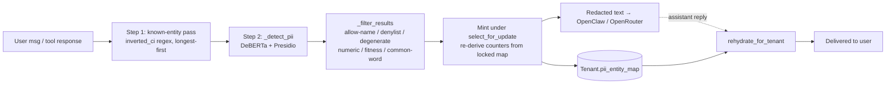

# Platform services — cross-cutting subsystems

Reference for the shared machinery that every tenant feature leans on: **scheduling**
(`apps/cron`), **PII redaction** (`apps/pii`), **platform issue logging + log scrubbing**
(`apps/platform_logs` + logging filters), **shared utilities** (`apps/common`, esp. the
canonical timezone front door), the **subscriber dashboard API** (`apps/dashboard`), and
the vestigial `apps/agents`.

Read [`architecture.md`](../agents/architecture.md) (three planes, message flow, tenant
lifecycle) and [`invariants.md`](../agents/invariants.md) first — this doc builds on them
and does not repeat the rules. Invariants #6 (QStash/dedup), #7 (timezone front door),
#8 (no external calls in `atomic()`), #9 (cron lifecycle) live here in code form. PII is
covered mechanically here; the adversarial security analysis is a separate doc.

---

## 1. Scheduling — `apps/cron` (QStash, never Celery)

All scheduling is HTTP-driven: QStash POSTs to a Django endpoint that executes the task
**synchronously in the request**. There is no worker pool, no Redis broker, no Celery
(invariant #6). Two trigger shapes:

- **Recurring schedules** — cron expressions registered once in QStash's schedule store
  (see the system-cron table below). QStash fires them on cadence.
- **On-demand fan-out** — `publish_task(...)` / `publish_batch(...)` push a one-off message
  to QStash, which delivers it (with native retries) to the same trigger endpoint.

### 1.1 Execution path

```
QStash ──POST /api/cron/trigger/<task_name>/──► trigger_task()
         (Upstash-Signature header)              apps/cron/views.py:253
                                                   │
   1. verify_qstash_signature(request)  ──────────┤ 401 on bad/missing sig
      apps/cron/qstash_verify.py:10               │
   2. set_rls_context(service_role=True) ─────────┤ tasks can touch all tenants
   3. TASK_MAP[task_name]  ────────────────────────┤ 404 on unknown task
   4. _validate_task_signature(...)  ─────────────┤ 400 (→ DLQ) on bad args
   5. execute_task_sync(path, *args, **kwargs) ───┘ import + call, return JSON
```

Key facts:

- **Auth is signature-only.** `verify_qstash_signature` (`apps/cron/qstash_verify.py:10`)
  uses the QStash `Receiver` with `QSTASH_CURRENT_SIGNING_KEY` + `QSTASH_NEXT_SIGNING_KEY`
  (dual-key for rotation). No signing key configured ⇒ verification fails closed. The
  endpoint is `@csrf_exempt` + `@require_POST`; the signature is the only gate. There is a
  `trigger_task_debug` variant (`views.py:369`) — confirm it is auth-gated / disabled in
  prod (see Risks).
- **RLS elevation.** After signature check, `set_rls_context(service_role=True)`
  (`views.py:269`) lifts row-level security so fleet-wide tasks (hibernation, reconcilers)
  can read every tenant. Signature verification is therefore load-bearing for tenant
  isolation of the whole cron surface.
- **Bad-args → 400, not 500.** `_validate_task_signature` (`views.py:48`) binds the
  incoming `{args, kwargs}` against the task's real signature. A malformed message returns
  400 so QStash parks it in the DLQ immediately instead of retrying a doomed message 3×
  (issue #557). Malformed body shapes (`{"args": null}`, `{"kwargs": "str"}`) are coerced
  to empty defaults (`views.py:298`).
- **Sync fallback for dev/tests.** When `QSTASH_TOKEN` / `API_BASE_URL` are unset,
  `publish_task` executes the task inline (`publish.py:95`) so local dev needs no QStash.

### 1.2 `publish_task` / `publish_batch` and dedup-id hygiene

`apps/cron/publish.py` is the on-demand publisher (Celery `.delay()` replacement).

- **Dedup-id validation is eager** (`publish.py:85`, `publish.py:161`). `Upstash-Deduplication-Id`
  rejects `:` and whitespace with a silent-ish 400; `_DEDUP_FORBIDDEN = (":", " ", "\t", "\n", "\r")`
  is checked at publish time so a bad key fails at the call site (and identically in the
  sync fallback) — enforces invariant #6. Use `-`/`_`/alphanumerics.
- **Client reuse** — one `QStash` client per `(process, token)` cached at module level
  (`publish.py:45`) to avoid a ~150–400 ms TLS re-handshake per publish inside the request.
- **`publish_batch`** uses QStash `batch_json` to fan out N tasks in one HTTP call
  (`publish.py:205`) instead of N serial blocking calls — used by apply-pending-configs and
  broadcast fan-outs. Optional `delay_seconds` staggers batches.
- **`retries`** defaults to QStash's 3; set to 0/1 for tasks with their own attempt cap
  (e.g. chat completions) where external retries would compound duplicate work.

### 1.3 System cron schedules

Registered by `python manage.py register_system_crons` (idempotent; run post-deploy). The
canonical list is `SYSTEM_CRONS` in
[`apps/cron/management/commands/register_system_crons.py:19`](../../apps/cron/management/commands/register_system_crons.py).
All expressions are **UTC**; timezone-sensitive tasks are hourly *dispatchers* that fire
per-tenant when the tenant's local clock matches (see invariant #7).

| Schedule (UTC) | Name | Endpoint / task | Purpose |
|---|---|---|---|
| `0 * * * *` | apply-pending-configs | `/api/cron/apply-pending-configs/` | Push workspace files + bump idle images |
| `0 * * * *` | hibernate-idle-tenants | `hibernate_idle_tenants` | Deactivate revisions idle ≥2h |
| `0 * * * *` | nightly-extraction | `nightly_extraction` | Per-tenant 21:xx local goals/tasks/lessons |
| `0 * * * *` | reconcile-fuel-crons | `reconcile_fuel_crons` | Drift-check derived Fuel session crons |
| `5 * * * *` | reconcile-tenant-crons | `reconcile_tenant_crons` | Reconcile managed crons vs Postgres truth |
| `0 * * * *` | weekly-gravity-reflection | `weekly_gravity_reflection` | Per-tenant Sun 09:00 local reflection |
| `10 * * * *` | reconcile-openrouter-spend | `reconcile_openrouter_spend` | True up per-tenant + platform spend |
| `25 * * * *` | refresh-user-md-fleet | `refresh_user_md_fleet` | Keep USER.md local-time line fresh |
| `40 * * * *` | pii-arbiter | `pii_arbiter` | LLM sweep of new PII mints → denylist (§2.6) |
| `* * * * *` | reap-stuck-inbound-messages | `reap_stuck_inbound_messages` | Republish stuck PendingMessage drains |
| `* * * * *` | run-due-automations | `run_due_automations` | Fire user Automations past `next_run_at` |
| `*/5 * * * *` | ensure-at-cron-wakes | `ensure_at_cron_wakes` | Queue wakes for one-off `kind:"at"` crons |
| `*/5 * * * *` | expire-stale-actions | `expire_stale_actions` | Sweep expired action-gate rows |
| `*/30 * * * *` | repair-stale-provisioning | `repair_stale_tenant_provisioning` | Repair tenants stuck without container meta |
| `*/30 * * * *` | model-health-check | `model_health_check` | Probe free-model offer; flip on transitions |
| `0 0 * * *` | reset-daily-counters | `reset_daily_counters` | Reset per-day usage counters |
| `5 0 1 * *` | reset-monthly-counters | `reset_monthly_counters` | Reset monthly usage counters |
| `0 2 * * *` | expire-trials / complete-elapsed-plans | `/api/cron/expire-trials/` · `complete_elapsed_plans` | End trials; complete elapsed plans |
| `0 3 * * *` | cleanup-expired-telegram-tokens | `cleanup_expired_telegram_tokens` | Reap expired pairing tokens |
| `15 3 * * *` | poll-line-quota | `poll_line_quota` | LINE monthly Push quota poll + fan-out |
| `0 4 * * *` | refresh-expiring-integrations | `refresh_expiring_integrations` | Refresh OAuth integrations |
| `0 5 * * *` | cleanup-inbound-media | `cleanup_inbound_media` | Reap old inbound media files |
| `30 6 * * *` / `0 7 * * *` | refresh-infra-costs · cleanup-delivered-buffers | `refresh_infra_costs` · `cleanup_delivered_buffers` | Azure billing pull; buffer GC |
| `20 8 * * *` | reap-orphaned-containers | `reap_orphaned_containers` | Hibernate + alert orphan `oc-*` apps |
| `30 1 * * *` | reconcile-welcomes | `reconcile_welcomes` | Watchdog for missing Fuel/Gravity welcomes |
| `0 5 * * 0` / `10 5 * * 0` | snapshot-gravity/pillars-weekly | `snapshot_*_weekly` | Weekly PillarSnapshot rows |
| `0 6 * * 0` | mission-weekly-digest | `mission_weekly_digest` | Neighborhood Mission huddle |
| `0 6 1 * *` / `0 8 2 * *` | snapshot-finance-monthly · snapshot-donations-monthly | `snapshot_finance_monthly` · `snapshot_donations_monthly` | Monthly finance + donation ledger |

Collision avoidance is deliberate: the heavy hourly jobs are offset (`:00`, `:05`, `:10`,
`:25`, `:40`) so iterate-all-tenants passes don't stack on the same minute.

The full task registry (recurring + on-demand) is `TASK_MAP` (`apps/cron/views.py:70`), ~90
entries mapping URL-safe names → dotted task paths across `tenants`, `orchestrator`,
`billing`, `router`, `friends`, `insights`, `pii`, `automations`, `core`, `finance`, `fuel`.
Adding a schedule needs **both** a `TASK_MAP` entry and (for recurring) a `SYSTEM_CRONS` row.

### 1.4 Per-tenant cron store (`CronJob`) and typed patterns

`apps/cron/models.py` is the Postgres-canonical store for **OpenClaw** cron jobs (distinct
from the QStash *system* crons above — these are the assistant's own reminders/briefings
that live in each container's SQLite). Cutover is per-tenant via `Tenant.postgres_cron_canonical`;
while False the gateway (SQLite) is source of truth and this table is a read cache.

Three discriminators shape a row (`models.py:27`–`150`):

- **`source`** (`CronJobSource`): `system` (Morning Briefing, Heartbeat), `user`,
  `fuel_session`, `agent`.
- **`creation_path`** (`CronCreationPath`): `legacy` / `typed` / `freeform` / `internal`.
  Determines whether `data` is **derived** (typed) or **source of truth** (everything else).
- **`pattern`** (`CronPattern`): `pure_reminder`, `quote_user_intent`, `domain_summary`,
  `daily_briefing` (system-only). Each maps to a handler in `apps/cron/patterns/` owning
  payload validation, OC-dict construction, and outbound-message validation.

Two DB `CheckConstraint`s (`models.py:176`) enforce integrity a buggy code path can't bypass:
freeform rows require `user_confirmed_at`; typed rows require a `pattern`.

**Creation flows** (`apps/cron/services.py`):

- `create_typed_cron` (`services.py:94`) — validates payload against the pattern schema, then
  the `pre_save` signal derives `data` from `pattern + typed_payload`. The agent's
  `nbhd_cron_create_*` tools land here. Never accepts `daily_briefing`.
- `create_freeform_cron` (`services.py:154`) — console-only escape hatch; caller **must** pass
  `user_confirmed_at`. **Never called from agent paths** by design.
- One-off `kind:"at"` crons are pushed to OC immediately (`_push_at_cron_immediately`,
  `services.py:214`, via `invoke_gateway_tool ... "cron.add"`) and marked `managed=False` so the
  reconciler leaves them alone (OC auto-deletes after fire).

**Reconciliation** is signal-driven (`apps/cron/signals.py`): a `pre_save` hook re-derives
`data` for typed rows (`signals.py:52`); `post_save`/`post_delete` enqueue a **30 s-debounced**
`regenerate_tenant_crons` task keyed `regen-cron-<tenant_id>` (`signals.py:33`) so drag-to-
reschedule / bulk edits collapse into one reconcile against `apps/orchestrator/cron_reconcile.py`.
Only fires for tenants on the `postgres_cron_canonical` flow.

**Cron lifecycle facts** (invariant #9, enforced by OpenClaw not Django): startup catch-up
runs missed fires (max 5) for *enabled* jobs — suspend before hibernation; `cron.update
{enabled:true}` does **not** trigger catch-up; `lastRunAtMs` is not patchable, so a reset means
`cron.remove` + `cron.add`.

### 1.5 Outbound cron delivery — `apps/router/cron_delivery.py`

`CronDeliveryView` (`cron_delivery.py:95`) is the seam a tenant container calls to message its
user (cron fires, proactive nudges). It is the **outbound** counterpart to the inbound routers
and is covered by invariant #4 (all-channels).

- **Auth:** `X-NBHD-Internal-Key` + `X-NBHD-Tenant-Id` via `validate_internal_runtime_request`
  (`cron_delivery.py:111`).
- **Suspended-tenant guard:** non-ACTIVE tenants get a 200 `"blocked"` (not an error) so QStash
  doesn't retry (`cron_delivery.py:128`).
- **Channel resolution:** `resolve_user_channel` (`cron_delivery.py:48`) honours
  `preferred_channel` when linked, else falls back to any linked messaging channel, else
  `"app"` if a `DeviceToken` exists (iOS-only users get an APNs push + `?since=` feed row).
- **PII rehydration before send** (`cron_delivery.py:171`) — `rehydrate_text` restores real
  names from `tenant.pii_entity_map` (see §2). This is a mandatory egress seam.
- **Rate limit:** in-memory 20 msgs/hr/tenant, counted after send across all channels
  (`cron_delivery.py:30`, `:210`) to throttle runaway cron loops.
- Telegram path renders markdown → Telegram HTML with a tag-free retry on 400
  (`cron_delivery.py:280`); LINE path builds Flex bubbles with a plain-text fallback and trips
  the monthly-quota gate on a cap 429 (`cron_delivery.py:391`).

---

## 2. PII redaction engine — `apps/pii`

`apps.pii` is a **library module, no models** (registered in `INSTALLED_APPS` only for its
management commands). Purpose: keep user PII out of third-party LLMs. Inbound user text and
tool responses are redacted to typed placeholders (`[PERSON_1]`) before reaching OpenClaw /
OpenRouter; outbound assistant text is rehydrated back to real values before delivery. Per-tenant
state lives on `Tenant.pii_entity_map` (placeholder → entity) and `Tenant.pii_denylist`
(canonical-key → provenance).

### 2.1 Detection stack (`engine.py`, `config.py`)

Two lazy singletons (`apps/pii/engine.py`):

- **DeBERTa NER** — `lakshyakh93/deberta_finetuned_pii` (DeBERTa-v3-base, ~554 MB, ~600 MB RAM),
  **vanilla PyTorch CPU** (`engine.py:60`). The ONNX/optimum path was removed deliberately: it
  produced different outputs on Linux vs macOS and caused cold-start ImportErrors (issue #695).
  Load failure is **cached and re-raised** (`_pipeline_load_error`) so callers fall back to
  pattern recognizers with no retry storm.
- **Presidio pattern recognizers** (`engine.py:106`) — deterministic financial/contact PII by
  checksum/validation: `CREDIT_CARD` (Luhn), `IBAN_CODE`, `EMAIL_ADDRESS`, `PHONE_NUMBER`
  (libphonenumber VALID-leniency; score lifted to 0.85 so validated numbers clear the tier
  threshold — `engine.py:44`).

`config.py` maps ~60 raw model labels → a small canonical set (`DEBERTA_LABEL_MAP`,
`config.py:16`) and defines the single `starter` tier policy (`TIER_POLICIES`, `config.py:99`)
with `score_threshold = 0.5`. Deliberate omissions are documented inline and are load-bearing
false-positive controls: `USERNAME`, `BUILDINGNUMBER`, `SSN`, `DATE`, and per-label overrides
(`PIN` needs ≥0.7, `LABEL_SCORE_OVERRIDES`, `config.py:95`) exist because the model fires on
fitness numbers, ISO date headings, and journal timestamps.

### 2.2 Pipeline data flow



**Inbound redaction** — `redact_user_message` → `_redact_user_message`
(`apps/pii/redactor.py:705`, `:741`):

1. **Known-entity pass** — `inverted_names_ci` gives `canonical_key → (display, placeholder)`;
   longest names first so "Jay Haughton" beats "Jay". Word-boundary-aware substitution done
   **outside** existing placeholders (`_sub_outside_placeholders`) so a stored name can't corrupt
   a placeholder interior. Denylisted / degenerate stored names are skipped (map row kept for
   rehydration). (`redactor.py:758`–`795`)
2. **Detection** on the partially-redacted text for *new* entities, filtered, with hits inside
   existing placeholders dropped (models classify `EMAIL_ADDRESS_1` internals as PERSON →
   would nest to `[[PERSON_1]]`). (`redactor.py:822`–`830`)
3. **Mint + persist under a per-tenant row lock.** `select_for_update` re-reads the map, re-derives
   per-type counters from the *locked* snapshot, assigns final `[TYPE_N]` numbers, and writes
   (`redactor.py:884`–`943`). This exists because the redactor runs from three inbound processes
   (Telegram drain, LINE webhook, iOS chat) plus the arbiter cron and memory sync; two concurrent
   mints from a stale snapshot could mint the same `[PERSON_2]` for different people and clobber
   one another — outbound rehydration would then leak the wrong name.

**Outbound rehydration** — `rehydrate_for_tenant(tenant, text)` (`redactor.py:687`) is the single
egress seam; `rehydrate_text` (`redactor.py:655`) does placeholder → `name` substitution, leaving
unknown placeholders untouched. **Every** user-facing send path carrying agent text must route
through it or a raw `[PERSON_1]` leaks.

### 2.3 Redaction seams (invariant #4 — cover all channels)

| Direction | Function | Call sites (examples) |
|---|---|---|
| Inbound (Telegram) | `redact_user_message` | `apps/router/poller.py:1404` |
| Inbound (LINE) | `redact_user_message` | `apps/router/line_webhook.py:1270` |
| Inbound (Telegram update dict) | `redact_telegram_update` | wraps `redact_user_message` (`redactor.py:957`) |
| Tool responses | `redact_tool_response` | `apps/integrations/runtime_views.py:930,1010,1092,3719` |
| Neighborhood share | `redact_user_message` (ephemeral, fresh) | `apps/friends/services.py:1158` |
| Outbound (cron) | `rehydrate_for_tenant` / `rehydrate_text` | `apps/router/cron_delivery.py:175` |
| Outbound (LINE reply) | `rehydrate_text` | `apps/router/line_webhook.py:674` |
| Outbound (actions/lessons/core/journal) | `rehydrate_for_tenant` / `rehydrate_text` | `apps/actions/messaging.py`, `apps/lessons/notifications.py`, `apps/core/services.py:534`, `apps/journal/extraction.py` |

`redact_tool_response` (`redactor.py:977`) walks JSON recursively, skipping identifier/metadata
keys (`_TOOL_SKIP_KEYS`, `redactor.py:999`: `id`, `html_link`, `thread_id`, `internal_date`, …)
and running with `allow_user_name=False` so the user's own surname is redacted too (prevents the
model mixing it with contact placeholders).

### 2.4 `RedactionSession` (`redactor.py:572`)

Cross-document numbering for batch redaction (workspace memory sync). Seeds counters + a
case-insensitive inverted index from the tenant's existing map so repeated names re-collide to
their existing placeholder and the counter base never clobbers `[PERSON_1]`. Also honours the
denylist. `entity_map` carries only *new* mints; callers union it onto the tenant map.

### 2.5 Entity registry (`entity_registry.py`)

Read/write helpers over `Tenant.pii_entity_map`, tolerating both the legacy string shape
(`{"[PERSON_1]": "Nana"}`) and the dict shape (`{"name", "relationship", "notes", "updated_at",
"arbiter_judged_at"}`). `canonical_key` (`entity_registry.py:153`) is **casefold + strip** — the
identity used for entity merging and denylist lookup (casefold over lower for "ß"/"ss" and Turkish
I). `inverted_names_ci` collapses legacy duplicate placeholders to the lowest-numbered one.

> **Same-name fusion is a known, permanent property:** one canonical key ⇒ one placeholder per
> tenant forever. Two distinct people sharing a first name collapse to the same `[PERSON_N]` and
> cannot be disambiguated. This is by design (the USER.md envelope denies the agent identity
> context to avoid hallucinated name restoration); noted as a residual privacy/UX trade-off.

### 2.6 Arbiter cron (`arbiter.py`) — false-positive pruning

NER mints conservatively (tags `goal`, `calendar`, `🏆 wins` as PERSON). The hourly `pii_arbiter`
task (`arbiter.py:326`, schedule `40 * * * *`) sweeps recently-minted `PERSON_*`/`LOCATION_*`
entries and asks **Claude Haiku 4.5** (via the platform OpenRouter key, DeepSeek fallback) whether
each is real PII (`ARBITER_SYSTEM_PROMPT`, `arbiter.py:67`). Outcomes:

- `is_pii=false` → canonical key written to `Tenant.pii_denylist` with `{reason:"arbiter",
  decided_at}`; the redactor stops driving redaction off it on the next message.
- `is_pii=true` → entry stamped `arbiter_judged_at` so the next sweep skips it.

The `entity_map` row is **never deleted** (rehydration of stored references must keep working).
The read-modify-write is serialized under `select_for_update` (`arbiter.py:248`) against the same
concurrency the redactor guards; a denied key stamps every duplicate placeholder in one pass.

### 2.7 Detection guardrails (`redactor.py` `_filter_results`, `:1270`)

Applied only to loosely-typed `PERSON`/`LOCATION` (never to checksum-validated financial/contact
types): `_is_degenerate_span` (single letters/punctuation), `_is_numeric_or_unit_span`,
`_is_fitness_span` (lift/rep vocabulary), `_is_common_word_span` (sentence-start common words),
and a date-like guard. Suppressions emit a `pii_skip` telemetry line. **Logging discipline:** the
mint/skip log lines emit tenant id, type, score, and **span length only** — never the span text —
because these logs ship to Azure Log Analytics in cleartext and the raw span could be a card
number or password (`redactor.py:933`, PCI-DSS note).

---

## 3. Platform issue logging + log scrubbing

### 3.1 `apps/platform_logs` — agent-reported issues

A narrow surface (despite the name): `PlatformIssueLog` (`apps/platform_logs/models.py:8`) is a
structured store where **tenant agents self-report** capability gaps / tool errors, categorised
(`missing_capability`, `tool_error`, `config_issue`, `rate_limit`, `auth_error`) with severity.
`PlatformIssueReportView` (`apps/platform_logs/views.py:39`) is internal-auth'd
(`X-NBHD-Internal-Key` + tenant id), rate-limited to 10/hr/tenant, and dedups identical
`(category, tool_name)` within 60 min. The `detail` field is documented "no user PII" — enforced
by convention, not code (see Risks). This is **not** the application log store; runtime logs go to
stdout → Azure Container Apps Log Analytics.

### 3.2 Log redaction filters

Application logs are cleartext in Log Analytics, so secret scrubbing is layered:

- **`RedactBYOPasteBody`** (`apps/byo_models/logging_filters.py:30`) — wired into the console
  handler in `config/settings/production.py:134`. If a log record touches the BYO credential
  paste path (`/api/v1/tenants/byo-credentials/`) and contains a JSON-shaped block, the block is
  replaced with `[REDACTED]`. Belt-and-suspenders: the primary defense is the BYO views never
  logging bodies.
- **Sentry backstops** (`config/settings/base.py`) — `_sentry_before_send` /
  `_sentry_before_send_log` mirror the same BYO scrub across both the error-event and Logs
  streams. `send_default_pii=False` is load-bearing (no request bodies/cookies/emails/IPs on
  events). Sentry only initialises when `SENTRY_DSN` is set and never during tests.
- **Telegram bot-token redaction** — a per-source concern (the token is embedded in
  `api.telegram.org/bot<token>/…` URLs the poller/webhook build). At this checkout the redaction
  is handled at the log call sites in `apps/router`; a dedicated `apps/router/logging_filters.py`
  (`RedactTelegramToken`) exists on an in-flight branch but is **not present in this tree** — the
  reference-level takeaway is that unlike the BYO path there is no wired `LOGGING["filters"]`
  entry for the Telegram token here (see Risks).

---

## 4. Shared utilities — `apps/common`

### 4.1 Timezone front door — `tenant_tz.py` (invariant #7)

`apps/common/tenant_tz.py` is the **single** canonical tenant-timezone lookup. Never write another
private `_tenant_zone` helper.

| Helper | Returns | Use for |
|---|---|---|
| `tenant_tz_name(tenant)` (`:45`) | IANA name `str`, `"UTC"` fallback | strings (window resolve, JSON, DB text) |
| `tenant_tz(tenant)` (`:66`) | `ZoneInfo`, UTC fallback | `astimezone()` |
| `safe_zoneinfo(name)` (`:71`) | `ZoneInfo`, UTC for unknown/missing | coercing an existing string |
| `tenant_today(tenant)` (`:32`) | `date` in tenant-local tz | daily-boundary features |

All fall back to UTC when `tenant.user` / the timezone field is missing or the value isn't a known
IANA zone. The module is deliberately **import-free of `apps.tenants`** (`tenant` typed `Any`) to
avoid cycles; range math lives in `apps.common.windows`, point math in `apps.common.llm_contracts`,
both sourcing tz through here.

### 4.2 Other shared modules

| Module | Role |
|---|---|
| `windows.py` | Deterministic time-window resolution for parameterized query tools |
| `query_view.py` | `BaseQueryView` — base for per-domain LLM query tool endpoints |
| `llm_contracts.py` / `llm_lookups.py` | Deterministic operations pulled out of the prompt (point math, closed-list lookups, unit conversion) — [backend computes evidence, LLM judges] |
| `openrouter.py` | Shared OpenRouter chat-completion client with multi-model fallback (used by Gravity synthesis, PII arbiter, etc.) |
| `apns.py` | Token-based (.p8 JWT) Apple Push client — the "notify on fire-and-forget completion" seam for iOS-only users |
| `cache.py` / `cache_signals.py` | Tenant-scoped, tag-invalidated DRF cache decorator + model→tag-bump wiring (keys = view qualname + tenant + tag version + request sig) |

### 4.3 `apps/agents` — vestigial

`apps/agents` has **no `models.py`** and is **not in `INSTALLED_APPS`**. Its migrations
(`0001`/`0002`) historically defined `AgentSession`, `MemoryItem`, `Message` tenant-scoped tables,
but no code in the tree references those models. Treat it as dead weight pending removal (see
Risks). Do not build new work on it — session/message state lives elsewhere (`apps/router`,
`apps/core`).

---

## 5. Subscriber dashboard API — `apps/dashboard`

Contrary to the "admin/ops" label, this is the **subscriber console's** aggregated read API for
the Next.js frontend (`apps/dashboard/views.py:1`), not an operator surface. Three endpoints
(`apps/dashboard/urls.py`), all `IsAuthenticated` and tenant-scoped via `request.user.tenant`:

- **`DashboardView`** (`/`, `views.py:107`) — tenant status/tier/provisioned-at, usage
  (messages today/month, tokens, estimated + total cost, token budget), and active
  `Integration` connections. Cached 30 s under the `dashboard` tag.
- **`UsageHistoryView`** (`/usage/`, `views.py:160`) — last 50 `UsageRecord` rows.
- **`HorizonsView`** (`/horizons/`, `views.py:187`) — goals, momentum, and Weekly Pulse for the
  Horizons UI.

Cache freshness is signal-driven: `apps/dashboard/receivers.py` bumps the `dashboard` tag on every
write to `AssistantInsight`, `UserVoicePref`, `Goal`, `Document`, `PendingExtraction`
(`receivers.py:70`–`103`) so the frontend's optimistic insight confirm/refute doesn't revert
against a still-cached response. `bump_for` swallows Redis errors so a cache hiccup never breaks a
model save.

---

## Risks & improvement opportunities

- **[high] Cron auth is a single shared signing key with fleet-wide RLS elevation.** Every
  `/api/cron/trigger/*` call runs with `service_role=True` (`views.py:269`) after only a QStash
  signature check. A leaked `QSTASH_CURRENT_SIGNING_KEY`, or any bug that lets `verify_qstash_signature`
  fail-open, exposes cross-tenant task execution. Confirm the key is Key-Vault-sourced, rotated via
  the dual-key mechanism, and that `trigger_task_debug` (`views.py:369`) is disabled/auth-gated in prod.
- **[high] Telegram bot-token redaction is not wired as a `LOGGING` filter in this tree.** The BYO
  paste body has a defense-in-depth `RedactBYOPasteBody` filter + Sentry backstops; the Telegram
  token (embedded in `api.telegram.org/bot<token>/` URLs) relies only on call-site discipline in
  `apps/router`. A stray `logger.exception` on an httpx error can leak the token to Log Analytics in
  cleartext. Land the `RedactTelegramToken` filter and attach it to the console handler.
- **[med] PII fail-open swallows every redaction error and forwards raw text.** `redact_user_message`
  / `redact_text` catch all exceptions and return the **original** text (`redactor.py:567`, `:736`).
  A model-load failure degrades to pattern-recognizers-only (names stop redacting) silently — real
  PII reaches the third-party LLM with no alert. Add a metric/alarm on the cached
  `_pipeline_load_error` and on redaction-exception counts.
- **[med] `PlatformIssueLog.detail` "no user PII" is convention-only.** Agents write free text to a
  500/2000-char field with no scrubbing (`platform_logs/views.py`, `models.py:34`). A misbehaving
  agent can persist user PII into a Postgres table that isn't part of the redaction map. Consider
  running `detail`/`summary` through `redact_text` on write.
- **[med] Same-name PII fusion is unfixable by design and can misattribute.** One canonical key ⇒ one
  placeholder per tenant (§2.5): two contacts named "Alex" share `[PERSON_N]`, so an outbound reply
  about one can rehydrate to the other's identity in the user's eyes. Document the limitation in the
  privacy posture and consider surfacing per-placeholder disambiguation in the console.
- **[low] `apps/agents` is dead code with live tables.** No models, not in `INSTALLED_APPS`, no
  references — but the `agents_*` tables persist from historical migrations. Remove the app (with a
  squash/drop migration) or document it as intentionally retained.
- **[low] In-memory cron-delivery rate limit is per-process.** The 20/hr cap
  (`cron_delivery.py:27`) resets on restart and isn't shared across Django replicas; with >1 replica
  the effective cap is N×20. Fine at current single-replica scale, but move to Redis if Django scales
  out.
- **[low] System-cron registration is manual and drift-prone.** `SYSTEM_CRONS` must be kept in sync
  with `TASK_MAP` and re-registered post-deploy by hand; a forgotten `register_system_crons` run
  means a new schedule silently never fires. Wire it into the CI post-deploy step (the pipeline
  already calls a QStash registration step — verify coverage).
