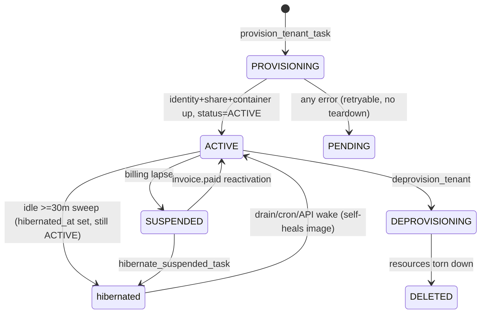

# Tenant runtime, provisioning & OpenClaw config

How a subscriber's private AI assistant is created, configured, hibernated, woken, and destroyed — and how sensitive tool calls are gated for human approval. Read [`../agents/architecture.md`](../agents/architecture.md) (the three-plane map + Azure naming) and [`../agents/invariants.md`](../agents/invariants.md) (the eleven permanent rules) first; this doc is the code-level expansion of the "Tenant lifecycle", "OpenClaw workspace + config", and message-gating sections. Citations are `path:line` into `apps/orchestrator/` and `apps/actions/` unless noted.

## Scope & module map

| Module | Role |
|---|---|
| `orchestrator/services.py` | Provisioning orchestration: `provision_tenant`, `deprovision_tenant`, `update_tenant_config`, per-tenant version bump, cron seeding, stale-provision repair. |
| `orchestrator/azure_client.py` | All Azure SDK calls: Container App, File Share, Managed Identity, Key Vault role grants, revision activate/deactivate, the **File Share sanitize chokepoint**. |
| `orchestrator/config_generator.py` | Builds the per-tenant `openclaw.json` config dict (2340 lines). |
| `orchestrator/config_validator.py` | Write-time schema gate (`assert_config_writable`) — refuses invalid configs, keeps last-good. |
| `orchestrator/config_security.py` | Provision/update-time security audit (`audit_config_security`) — blocks on error-severity findings. |
| `orchestrator/tool_policy.py` | Version-aware OpenClaw tool allow/deny policy + image-tag→version mapping. |
| `orchestrator/hibernation.py` | Idle hibernate, wake + self-heal, cron-wake lookahead, buffered-message drain. |
| `orchestrator/tasks.py` | QStash task entrypoints: provision/deprovision wrappers, config-apply, image bump, idle sweep, USER.md fleet refresh. |
| `orchestrator/personas.py`, `workspace_envelope.py`, `identity_merge.py` | Build/merge the workspace bootstrap files (AGENTS.md, USER.md, SOUL.md, IDENTITY.md). |
| `actions/` | Action-gating: intercept destructive tool calls, ask the user to approve/deny, record the outcome. |

## Tenant lifecycle

**Status vs. hibernation are orthogonal.** `Tenant.status` is the billing/provisioning lifecycle (`PROVISIONING`/`ACTIVE`/`SUSPENDED`/`DEPROVISIONING`/`DELETED`). Hibernation is a separate axis tracked by the nullable timestamp `Tenant.hibernated_at` — a hibernated tenant stays `status=ACTIVE`. There is no boolean `is_hibernated`; non-null `hibernated_at` = asleep (`hibernation.py:13`, written on hibernate at `hibernation.py:110`, cleared on wake at `hibernation.py:530`). DB-backed features (Fuel/Core/Horizons/settings) work while hibernated because only chat needs the container.

## Provisioning — `provision_tenant(tenant_id)` (services.py:214)

Ordered steps inside the guarded block (`services.py:236–404`). Every Azure call is idempotency-tolerant, so the whole function is safely re-runnable (that is the repair path):

| # | Step | Call | Azure resource |
|---|---|---|---|
| 1 | Generate config | `generate_openclaw_config(tenant)` → `config_to_json` (`services.py:237`) | — |
| 2 | **Security audit** | `_audit_and_log(…, stage="provision")` (`services.py:243`) → `audit_config_security` | raises `ValueError` on error finding |
| 3 | Managed Identity | `create_managed_identity` (`services.py:247` → `azure_client.py:99`) | `mi-nbhd-<uuid[:20]>` |
| 4 | Per-tenant internal key | `token_urlsafe(48)` → `store_tenant_internal_key_in_key_vault` (`services.py:258–265` → `azure_client.py:276`) | KV secret `tenant-<uuid>-internal-key` |
| 5 | Per-tenant OpenRouter sub-key (optional, feature-flagged, failure-tolerant) | `services.py:267–327` | KV secret |
| 6 | KV role grant | `assign_key_vault_role(principal_id, …)` (`services.py:330` → `azure_client.py:153`) | "Key Vault Secrets User" per-secret |
| 7 | ACR pull grant | `assign_acr_pull_role` (`services.py:340` → `azure_client.py:223`) | "AcrPull" on registry |
| 8 | File Share + env storage | `create_tenant_file_share` + `register_environment_storage` (`services.py:344–347` → `azure_client.py:338`, `:647`) | share `ws-<uuid[:20]>` on the managed environment |
| 9 | Upload config | `upload_config_to_file_share` (`services.py:350` → `azure_client.py:498`) | `openclaw.json` (through the write gate + sanitize) |
| 10 | Render workspace env | `render_workspace_files(persona_key, tenant)` (`services.py:354` → `personas.py:614`) | builds `NBHD_AGENTS_MD`/`NBHD_SOUL_MD`/`NBHD_IDENTITY_MD` etc. as **container env vars** |
| 11 | Create Container App | `create_container_app(…)` (`services.py:358` → `azure_client.py:749`) | `oc-<prefix>`, single-container, `minReplicas=maxReplicas=1`, image `nbhd-openclaw:<OPENCLAW_IMAGE_TAG>` |
| 12 | Persist row | `container_id`, `container_fqdn`, `managed_identity_id`, `container_image_tag`, `status=ACTIVE`, `provisioned_at` (`services.py:373–389`) | — |

**Bootstrap seed-once.** The container's `entrypoint.sh` writes `AGENTS.md`/`SOUL.md`/`IDENTITY.md` to the share from the `NBHD_*_MD` env vars on first boot (only if absent). Django then re-asserts them each boot and on config update (see [Workspace files](#workspace-bootstrap-files)).

**Post-provision, non-critical** (`services.py:406–463`, outside the try/except — failures here do *not* reset status): Telegram welcome, welcome email, `push_user_md(force=True)` (the actual USER.md write, `services.py:437`), and QStash-scheduled `seed_cron_jobs` with a synchronous fallback.

**Error handling.** Any failure in steps 1–12 resets `status=PENDING` and re-raises with **no teardown** — the identity/share/container are left in place for a retry (`services.py:394–404`). Partial provisions are swept by `repair_stale_tenant_provisioning` (`services.py:104`), which finds `PROVISIONING`/`PENDING`/`ACTIVE` tenants with an empty `container_id`/`container_fqdn`, demotes `ACTIVE`→`PROVISIONING` to bypass the status guard, and re-runs `provision_tenant`.

### Provisioner identity & Azure auth

`azure_client` authenticates as a dedicated user-assigned MI in production: `ManagedIdentityCredential(client_id=settings.AZURE_PROVISIONER_CLIENT_ID)`, falling back to `DefaultAzureCredential` for local dev (`azure_client.py:30`, cached module-level to avoid re-running the IMDS exchange). `AZURE_MOCK=true` short-circuits every resource call with a logged no-op (`azure_client.py:18`). Built-in role GUIDs are hardcoded: KV Secrets User `4633458b-…` (`azure_client.py:180`), AcrPull `7f951dda-…` (`azure_client.py:240`).

### Container env vars & secrets

`create_container_app` (`azure_client.py:749`, env block `:858–903`) wires the tenant container's environment. Secrets are Key Vault–backed via `_build_container_secret` (`azure_client.py:71`) — it emits the SDK equivalent of `keyvaultref:`/`identityref:` (a `keyVaultUrl` + `identity` triple), or a warned inline fallback if the backend isn't `keyvault`.

| Env var | Source | Notes |
|---|---|---|
| `NBHD_INTERNAL_API_KEY`, `OPENCLAW_GATEWAY_TOKEN` | secretRef `nbhd-internal-api-key` | same secret backs both; per-tenant KV secret `tenant-<uuid>-internal-key` |
| `OPENROUTER_API_KEY` | secretRef `openrouter-key` | per-tenant sub-key if provisioned, else shared platform key |
| `ANTHROPIC_API_KEY` / `CLAUDE_CODE_OAUTH_TOKEN` | secretRef `anthropic-key` / `claude-code-oauth-token` | BYO reconcile swaps these (`apply_byo_credentials_to_container`, `:1164`) |
| `OPENAI_API_KEY`, `BRAVE_API_KEY` | secretRefs | platform keys |
| `NBHD_TENANT_ID`, `NBHD_API_BASE_URL`, `AZURE_CLIENT_ID` | plain | tenant scope + control-plane URL |
| `OPENCLAW_CONFIG_JSON` | plain | inline copy of `openclaw.json` (share is source of truth) |
| `NBHD_AGENTS_MD`, `NBHD_SOUL_MD`, `NBHD_IDENTITY_MD`, `NBHD_DOC_*`, `NBHD_SKILL_TEMPLATES_MD` | plain (spread from `workspace_env`) | seed-once bootstrap content |

**Audit note:** the env-var list is only applied at *create* time. `update_container_image` and `apply_single_tenant_config_task` do **not** rewrite env vars (`azure_client.py:876–881`) — changing this list only affects newly-provisioned tenants; existing tenants need an explicit env update (`update_container_env_var`, `:1094`) or reprovision. Secret *rebinds* (`update_container_internal_api_key_secret` `:980`, `update_container_openrouter_key_secret` `:1036`) force a new revision via a hashed `revision_suffix` because a plain restart wouldn't re-fetch Key Vault.

## Deprovisioning — `deprovision_tenant(tenant_id)` (services.py:880)

Sets `status=DEPROVISIONING`, then (each step swallows its own errors so a later reactivation never references stale keys):

1. Delete per-tenant OpenRouter sub-key + its KV secret (`services.py:894–922`).
2. `delete_container_app(container_id)` (`services.py:925` → `azure_client.py:1534`).
3. `delete_tenant_file_share` (`services.py:929` → `azure_client.py:697`) — deregisters environment storage, then deletes the share.
4. `delete_managed_identity` (`services.py:932` → `azure_client.py:733`).
5. Row → `status=DELETED`, clears `container_id`/`container_fqdn`/`managed_identity_id`/OpenRouter fields (`services.py:935–951`).

On exception the tenant is left `SUSPENDED` with OpenRouter fields force-cleared (`services.py:955–973`). Note the resource-group has `CanNotDelete` locks (architecture.md) — deletion of the *managed environment* itself is out of band; per-tenant deletes above are unaffected.

## OpenClaw config generation — `generate_openclaw_config(tenant)` (config_generator.py:1832)

Single input `tenant`; tier and version are derived from tenant fields (`config_generator.py:1839–1840`): `tier = tenant.model_tier or "starter"`, `oc_version = tenant.openclaw_version or OPENCLAW_CURRENT_VERSION`. Returns a dict assembled from ~20 builder helpers; `config_to_json` (`config_generator.py:2338`) serializes it. Top-level keys: `auth`, `agents`, `channels`, `gateway`, `tools`, `messages`, `cron`, `session`, `commitments`, `logging`, plus post-hoc `plugins`, `env`, `skills`, `models`.

**Gateway block (config_generator.py:2088–2107).** `mode:"local"`, `bind:"loopback"` (`:2091`), `auth.token:"${NBHD_INTERNAL_API_KEY}"` (env-var reference, never a literal, `:2094`). The gateway listens on loopback only so internal tool calls auto-pair via localhost; it is never externally reachable. `config_security` and `config_validator` both independently assert these (bind, token-is-ref, elevated-off, gateway-denied).

**Version gates.** `openclaw.json` schema shape depends on the running image's OpenClaw version, so the generator branches on `_parse_version(oc_version)` (imported from `tool_policy`). If `tenant.openclaw_version` drifts behind the actual image, the generated config uses a schema the binary rejects (`agents.defaults: Invalid input`) and the container crash-loops — hence the lockstep rule below.

| Boundary | Effect | Line |
|---|---|---|
| `>= 2026.4.15` | `models.providers.openrouter` block (correct base URL) | `config_generator.py:2272` |
| `>= 2026.5.0` | `plugins.bundledDiscovery:"compat"`; per-provider `timeoutSeconds` **replaces** the retired `agents.defaults.llm` idle key (pre-5.0 emits `llm`, `:2293`; post emits provider timeout) | `:2216`, `:2285` |
| `>= 2026.5.28` | `tools.toolSearch`, and `agents.defaults.params`/`contextPruning` | `:1744`, `:2330` |

**Bootstrap budget.** `agents.defaults.bootstrapMaxChars: 24000` / `bootstrapTotalMaxChars: 80000` (`config_generator.py:2667–2668`) cap how much AGENTS.md/USER.md/SOUL.md is injected per turn (raised above the OC 12k/60k default for the Phase-2 insights prompt). `MaximalTenantBudgetTest.test_rules_delivery_r0_all_gates_budget` pins the all-gates AGENTS.md render size in CI.

**Plugins (config_generator.py:1852–2219).** A `(plugin_id, path)` list built from settings — unconditional (Google, Journal, Usage, ImageGen, Settings, RoutingContext, ActivityStream, StreamProgress) plus per-tenant-flag-gated (Reddit, Finance, Fuel, Site-publishing, Neighborhood/Friends, Insights, typed-crons). `_active_plugins` drops any entry whose ID is `""` (`config_generator.py:2018`) — this empty-ID convention is the **smoke-disable** mechanism (a bad plugin path wedges boot to last-good). `plugins.allow` and `plugins.entries` are kept consistent (`config_validator` flags orphans).

## The config write chain (three independent gates)

Every config that reaches a tenant's share passes three checks, in this order:

1. **Security audit** — `config_security.audit_config_security` via `services._audit_and_log` at provision (`services.py:243`) and update (`services.py:605`). Error-severity findings (`gateway_bind`, `gateway_token_literal`, `elevated_enabled`, `gateway_not_denied`, `env_secret_leak`) raise `ValueError` and block; warnings (`plugin_orphans`) log to `PlatformIssueLog` (`config_security.py:27`).
2. **Write-time schema gate** — `config_validator.assert_config_writable` (`config_validator.py:141`), called *inside* `azure_client.upload_config_to_file_share` → `_assert_openclaw_config_safe_to_write` (`azure_client.py:531`). Runs a strict Python approximation of OpenClaw's Zod schema for the `agents.defaults` block (unknown keys, null values, malformed `model`, `config_validator.py:85`) plus required top-level keys, gateway security, `tools.deny⊇{gateway}`, elevated-off, plugin wiring, LINE `capabilities` (PR #283 guard), and a recursive bare-secret scan. Any error raises `InvalidTenantConfigError` and the write is refused — **preserving the last-good `openclaw.json`** (this is the code guard for the 2026-07-05 crash-loop). Because *every* write path (`provision`, `update_tenant_config`, the bump restore path) funnels through `upload_config_to_file_share`, all share the gate.
3. **Sanitize chokepoint** — see below.

## File Share sanitize chokepoint (invariant #2)

`_put_share_file(tenant_id, file_path, *, text=None, data=None, …)` (`azure_client.py:427`) is the single writer for every share file. When `text=` is given, the payload runs through `sanitize_share_text` (`azure_client.py:413`) which strips all C0 control bytes `0x00–0x1F` **except** tab/newline/CR before an atomic `upload_file` (no tmp+rename — that pattern once caused a null-byte tail). `upload_config_to_file_share` (`azure_client.py:498`) and `upload_workspace_file` (`azure_client.py:577`, a thin `text=` wrapper) both route here. **Binary writes (`data=`) bypass sanitize by design** (`azure_client.py:489`) — an audit consideration for any future binary workspace path. There is no hand-rolled share upload anywhere else. Invariant: [`../agents/invariants.md`](../agents/invariants.md) #2.

## The "bump" rollout — image before config

Config changes roll out via a **pending version counter** on the `Tenant` row: `pending_config_version` vs `config_version`. When `pending > applied`, a QStash task writes the new config and advances `config_version = pending_config_version` via `_stamp_config_applied` (`tasks.py:133`, only if `status==ACTIVE` and `container_id` set). Bumps are set elsewhere (`tenant.bump_pending_config()`, e.g. `hibernation.py:546`); this module only *applies* them.

Two apply paths, chosen by the fleet router `apply_pending_configs` (referenced, defined outside `tasks.py`):

- **Config-only** — `apply_single_tenant_config_task` (`tasks.py:169`): the image already matches, so it just writes the config (`update_tenant_config`, `tasks.py:212`) and stamps. OpenClaw 2026.5.28 **live-reloads** `openclaw.json` off the share — no restart needed; hibernated tenants pick it up at wake (`tasks.py:185–192`).
- **Image-then-config** — `apply_single_tenant_image_task(tenant_id, desired_tag)` (`tasks.py:243`) enforces invariant #10 ("image before config"): snapshot cron state → **`update_container_image` FIRST** (`tasks.py:327`) → keep `openclaw_version` in lockstep via `openclaw_version_for_image_tag` (`tasks.py:334–341`, one atomic row update) → **config SECOND** (`tasks.py:356`, comment at `:346` cites the 2026-07-03 incident) → stamp → schedule `restore_crons_after_image_update` 90s later (image swap restarts the container and wipes its SQLite cron state, `tasks.py:374–390`). Pushing config before the image lets the *old* running image reject the new-schema config and swap in `openclaw.json.last-good` — the stream-progress rollback wedge.

**Fleet bumps.** `bump_openclaw_atomic_per_tenant_task` (`tasks.py:33`) is the QStash fan-out target for a version+image+DB bump; it delegates to `services.bump_openclaw_version_for_tenant(tenant, target_version, image_tag, registry)` (`services.py:466`), which: snapshots current config bytes for restore (`services.py:516`) → sets `openclaw_version` → `update_tenant_config` (regenerates+pushes config, `services.py:545`) → `update_container_image` (`services.py:549`); **on image-push failure it restores the snapshotted config** so the still-running old image doesn't crash-loop on the new schema (`services.py:560`), then re-raises. `container_image_tag` and any `hibernated_at` clear are set on success (`services.py:573–578`). `image_tag`↔`openclaw_version` lockstep is the single most repeated safety theme in this subsystem.

**Idle sweep entrypoint.** `hibernate_idle_tenants_task` (`tasks.py:807`) is the every-10-minute QStash task; its cutoff comes from `TENANT_IDLE_HIBERNATE_MINUTES` (default 30), and it delegates the decision/action to `hibernation.py` (`hibernate_idle_tenant`, `_cron_active_or_imminent`). USER.md staleness is bounded by the hourly `refresh_user_md_fleet_task` (`tasks.py:916`, `force=True`, includes hibernated tenants since the share is always mounted).

## Hibernation & wake

**Hibernate** — `hibernate_idle_tenant(tenant)` (`hibernation.py:66`): snapshot cron schedules while the container is reachable → `suspend_tenant_crons` (`hibernation.py:87`, so disabled jobs don't fire a catch-up storm at next boot — invariant #9) → `hibernate_container_app` (deactivates all active revisions, `hibernation.py:101` → `azure_client.py:1447`) → set `hibernated_at=now`, clear `cron_wake_at` (`hibernation.py:110`) → `_schedule_next_cron_wake` (arm a QStash `wake_for_cron` ~4 min before the next cron fire, `hibernation.py:116/207`). Hibernation **deactivates revisions, it does not scale to zero** — so `az containerapp list` shows `Running`/`minReplicas:1` for every tenant; trust the Replicas metric, not `revision list` (architecture.md).

**Wake + self-heal** — `wake_hibernated_tenant(tenant)` (`hibernation.py:451`) is the critical path. It compares `settings.OPENCLAW_IMAGE_TAG` (desired) against `tenant.container_image_tag` (`hibernation.py:485`):

- Drift → `update_container_image` refreshes the image *and* wakes in one revision flip (single-revision mode auto-activates the new revision), and updates `openclaw_version` via `openclaw_version_for_image_tag` in lockstep, flagging a forced config regen (`hibernation.py:490–508`).
- No image drift but a missing mount → `ensure_plugin_runtime_deps_mount` adds an EmptyDir, whose new revision auto-activates (also wakes it, `hibernation.py:516`).
- Otherwise → plain `wake_container_app` (`hibernation.py:522`).

Then it clears `hibernated_at`, stamps `last_wake_at` (`hibernation.py:530`), forces a config regen if the version synced or `config_version==0` (`hibernation.py:544–563`), and schedules buffered-message delivery (+45s) and cron resume (+60s). **A hibernated tenant is never assumed to be on the fleet image** — it self-heals at wake.

**Cron-wake lookahead.** `hibernation.py` wakes 240s before a cron, runs its idle re-check after `TENANT_CRON_WAKE_IDLE_MINUTES` (default 10), and holds a warm container only when another cron is due within `TENANT_CRON_HOLD_MINUTES` (default 20). `wake_for_cron_task` re-arms idempotently when the tenant is already awake. The idle sweep separately defers via `_cron_active_or_imminent` if a cron is in-flight or fires within the fixed 5-minute safety window. This is how a hibernated (zero-cost) tenant still runs scheduled crons without letting sparse schedules hold it awake.

**Idempotency (invariant #5).** `activate_revision`/`deactivate_revision` raise `ResourceExistsError` when a stale `list_revisions` read races a no-op; `_is_already_in_requested_state` (`azure_client.py:1429`) matches only `RevisionAlreadyInRequestedState`/"already active|inactive" and treats it as success — other 409s still propagate. Caller-side guards (`hibernation.py:707`, `:783`) short-circuit double-wake/double-hibernate before any Azure call.

**Lease pattern (invariant #8).** Hibernate/wake do Azure work *then* a plain row update — they do not lease the tenant row. The claim-commit-network pattern is used only for buffered-message drain: `_claim_next_buffered_message` (`hibernation.py:1023`) and `_claim_buffered_batch_for_tenant` (`hibernation.py:1067`) use `select_for_update(skip_locked=True)` + a `delivery_in_flight_until` lease inside `transaction.atomic()`, then the network POST happens outside the txn in `deliver_buffered_messages_task` (`hibernation.py:1140`).

## OpenClaw tool policy (tool_policy.py)

`generate_tool_config(tier, version)` (`tool_policy.py:150`) returns the `tools` block: `allow`, `deny`, `elevated.enabled:False` (host-elevated execution off for all subscribers), `web.search.enabled:True`. The deny/allow sets are version-keyed (`_POLICY_VERSIONS`, newest-first, `tool_policy.py:116`): the deny list expanded at 2026.4.15 (`gateway`, `sessions_*`, `agents_list`, `subagents`, `browser`, `code_execution`, `music/video_generate`, …) with no surface in a Telegram/LINE-only container. `OPENCLAW_CURRENT_VERSION = "2026.5.28"` (`tool_policy.py:20`) is the single fleet-version constant (bump it + `Dockerfile.openclaw` together).

**memorySearch nuance (relative to invariant #1).** The SQLite-on-share ban is real, but the *mechanism* has moved. `memory_search`/`memory_get` were in the 4.15 deny list, then **restored to the allow surface at 2026.5.7** (`tool_policy.py:108`). On the current fleet the protection is instead: `memorySearch.enabled` defaults **False** fleet-wide (`config_generator.py:1401`), and when a tenant opts in via `experimental_memory_core_enabled` the SQLite index points at `/home/node/.openclaw/index/…` — an **`index-cache` EmptyDir** (container-local, rebuilt on cold start), never the `ws-` share. So the invariant's intent (no SQLite durability assumptions on SMB) is preserved via ephemeral local storage rather than a tool-deny. Search still routes through Postgres `nbhd_journal_search`. Invariants.md #1's "`tools.deny` in tool_policy.py" clause is stale for ≥5.7 — flagged below.

## Workspace bootstrap files

| File | Builder | Managed region | Write path |
|---|---|---|---|
| `AGENTS.md` (persona + per-tenant gates) | `personas.render_agents_md` / `render_workspace_files` (`personas.py:397`, `:614`) | whole file (overwrite) | env var seed-once at provision; `upload_workspace_file` overwrite on update (`services.py:644`); `reassert_agents_md` each boot (`services.py:744`) |
| `USER.md` (envelope) | `workspace_envelope.render_managed_region` (`workspace_envelope.py:86`) | `<!-- BEGIN/END: NBHD-managed user state -->` sentinels (`workspace_envelope.py:44`) | `merge_into_user_md` → `push_user_md` → `upload_workspace_file` (`workspace_envelope.py:228/273/327`) |
| `SOUL.md` / `IDENTITY.md` | `personas.render_soul_managed` / `render_identity_managed` (`personas.py:249/300`) | begin/end markers (`identity_merge.py:39`) | `download` → `splice_identity_file` → `upload` (`services.py:655–699`); **fail-closed** (skip on read failure to protect the agent's growth region); `reassert_identity_files` each boot (`services.py:795`) |

The sentinel/marker design lets Django own a managed block while the agent grows the rest of the file. All writes go through the sanitize chokepoint.

Chat turns never read workspace files: filesystem `read` is absent from their tool policy. Rules reach chat only through always-loaded prompt text, tool descriptions, tool responses, or server 400 responses that carry the correction. The `rules/*.md` files are for cron/background turns only and their on-demand index is injected into every cron preamble.

## Action gating (apps/actions)

The approve/deny gate for irreversible tool calls. The agent container asks Django before performing a destructive action; Django prompts the user on their channel and holds the tool call until they tap Approve/Deny (or it expires in 5 min).

**Models (actions/models.py).** `PendingAction` (`:29`) — `action_type` (one of `ActionType`: gmail trash/delete/send, calendar/drive/task delete, `:9`), `action_payload` JSON, `display_summary`, `status` (`pending`/`approved`/`denied`/`expired`), `platform_message_id`/`platform_channel` for post-response edit, `expires_at` default now+5min (`:26`). `GatePreference` (`:84`) — per-`(tenant, action_type)` `require_confirmation`; `ActionAuditLog` (`:106`) — permanent record of every gated outcome.

**Endpoints & auth.**

| Method / path | View | Caller | Auth |
|---|---|---|---|
| POST `…/runtime/<tenant_id>/gate/request/` | `GateRequestView` (`views.py:96`) | agent container | per-tenant internal key (`_validate_internal_auth`, `views.py:47`) |
| GET `…/runtime/<tenant_id>/gate/<action_id>/poll/` | `GatePollView` (`views.py:225`) | agent container | per-tenant internal key |
| POST `/api/v1/gate/<action_id>/respond/` | `GateRespondView` (`views.py:288`) | Django's own Telegram poller / LINE webhook | `X-Deploy-Secret` == `settings.DEPLOY_SECRET` |

Mounted at `config/urls.py:59–67`. The runtime endpoints validate `validate_internal_runtime_request` (per-tenant `internal_api_key`, constant-time compare, tenant-scoped — `internal_auth.py:123`). `respond` is a distinct trust domain: it is triggered by Django itself after the user taps an inline button, so it uses the deploy secret, not the tenant key.

**Flow.** `GateRequestView.post` (`views.py:104`): validate auth+tenant → validate `action_type`+`display_summary` → **Starter tier is blocked entirely** (403 with a store-safe anti-prompt-injection message, no upgrade pitch — App Review 3.1.1, `views.py:85/132`) → `_should_auto_approve` (`views.py:60`: master switch `gate_all_actions=False`+`gate_acknowledged_risk`, else per-type `GatePreference`) short-circuits to an audit-logged approval → else create `PendingAction` and `send_gate_confirmation`. If no deliverable channel exists (iOS-only user with no Telegram/LINE), the action is immediately marked `EXPIRED` and a 422 `undeliverable` is returned so the container surfaces a real error instead of polling for 5 min (`views.py:179–206`) — there is **no in-app gate surface yet**; approve/deny handlers live only in the Telegram poller and LINE webhook.

Button taps arrive as `callback_data`/postback `gate_approve:<id>` / `gate_deny:<id>` (`messaging.py:57/217`), parsed in `apps/router/poller.py:777` and `apps/router/line_webhook.py:1352`, which POST to `GateRespondView`. `respond` (`views.py:297`) does the read-check-write under `select_for_update` in one `transaction.atomic()` (`views.py:324`) so the expiry sweep can't clobber an in-flight approve and vice-versa; it re-checks expiry under the lock, writes final status + `ActionAuditLog`, then edits the platform message **outside** the txn (a messaging hiccup can't roll back the committed decision, `views.py:386`). `GatePollView` (`views.py:233`) uses a conditional `PENDING→EXPIRED` update so it never overwrites a concurrent decision. The expiry sweep `expire_stale_pending_actions` (`tasks.py:12`) runs every 60s via QStash; per-action `update_gate_message` failures are caught so one broken channel can't stall the sweep. Confirmation copy is PII-**rehydrated** per tenant before sending (`messaging.py:44`).

## Azure resources touched (summary)

| Resource | Name | Created by | Deleted by |
|---|---|---|---|
| Container App | `oc-<prefix>` | `create_container_app` (`azure_client.py:749`) | `delete_container_app` (`:1534`) |
| Managed Identity | `mi-nbhd-<uuid[:20]>` | `create_managed_identity` (`:99`) | `delete_managed_identity` (`:733`) |
| File Share | `ws-<uuid[:20]>` | `create_tenant_file_share` (`:338`) + `register_environment_storage` (`:647`) | `delete_tenant_file_share` (`:697`) |
| KV secret (internal key) | `tenant-<uuid>-internal-key` | `store_tenant_internal_key_in_key_vault` (`:276`) | (manual / sweep) |
| KV role assignments | Secrets User, AcrPull | `assign_key_vault_role` (`:153`), `assign_acr_pull_role` (`:223`) | (with identity) |
| Container revisions | — | `wake_container_app` (`:1482`) | `hibernate_container_app` deactivate (`:1447`) |

Key Vault refs use the `mi-nbhd-` **identity** name, not the `oc-` container name (invariant #10, gotcha in CLAUDE.md). The `nbhd-internal-api-key` container secret backs **both** `NBHD_INTERNAL_API_KEY` and `OPENCLAW_GATEWAY_TOKEN` env vars (`azure_client.py:861`) — the gateway token *is* the internal API key, no separate secret.

## Risks & improvement opportunities

- **[high] `memory_search`/`memory_get` are no longer denied on the current fleet (≥2026.5.7).** `tool_policy.py:108` restored them to the allow surface; the SQLite-on-share ban now rests entirely on `memorySearch.enabled:False` (`config_generator.py:1401`) plus the index living on an `index-cache` EmptyDir. A generator regression that flips `experimental_memory_core_enabled` on, or mispoints the store path back at `/workspace`, would silently reintroduce the fleet-wide corruption of PR #525. The regression test `tests.py::test_memorysearch_disabled_and_denied` and [`../agents/invariants.md`](../agents/invariants.md) #1 both still assert the *deny-list* mechanism — verify the test reflects current behavior, and update invariant #1 to describe the enabled-flag + EmptyDir guard as the real control.
- **[high] Binary share writes bypass the sanitize chokepoint.** `_put_share_file(data=…)` skips `sanitize_share_text` by design (`azure_client.py:489`). Today only images use it, but any future binary→text path (e.g. a downloaded doc later injected into a prompt) would reintroduce the null-byte-injection class invariant #2 exists to prevent. Consider a size/entropy guard or an explicit "binary is never prompt-injected" assertion at call sites.
- **[med] Gate endpoints read non-canonical auth headers.** `actions/views.py:52–53` reads `X-Internal-Key` / `X-Tenant-Id`, whereas `internal_auth.py:5–6` documents the canonical `X-NBHD-Internal-Key` / `X-NBHD-Tenant-Id` used by every other runtime view. If the OpenClaw gate client sends the `X-NBHD-*` names, `GateRequestView`/`GatePollView` would fail auth (403) on every destructive action — verify the container actually sends the short header names, and unify on the shared validator's header contract to remove the divergence.
- **[med] `provision_tenant` leaves orphaned Azure resources on failure.** Steps 3–11 create identity, KV secret, role grants, share, and possibly the container before a later step throws; the handler only resets `status=PENDING` with no teardown (`services.py:394–404`). Repair relies on re-running to idempotently reconcile, but a tenant abandoned mid-provision leaves billable resources (identity/share) with no reaper tied to `PENDING`. Confirm the orphan-reaper (`orphan_reaper.py`) covers this state, or add teardown-on-terminal-failure.
- **[med] No teardown of the per-tenant internal KV secret on deprovision.** `deprovision_tenant` deletes container/share/identity and the OpenRouter sub-key, but `tenant-<uuid>-internal-key` in Key Vault is not deleted (`services.py:880–951`). Dead secrets accumulate; a leaked-then-deleted tenant's key stays retrievable. Add it to the teardown or the sweep.
- **[med] Config security audit does not run on the hibernation/wake forced-regen or fleet-bump-restore paths.** `audit_config_security` runs in `provision_tenant` and `update_tenant_config` (`services.py:243/605`), but the write-time `assert_config_writable` (schema, not security policy) is the only gate on `bump_openclaw_version_for_tenant`'s restore write and on any direct `upload_config_to_file_share` caller. A security-relevant regression (e.g. an env secret leak) emitted only on those paths would not be blocked. Consider moving the security audit into `upload_config_to_file_share` alongside the schema gate so it is unconditional.
- **[low] `PendingAction.id` is a sequential integer exposed in `callback_data`.** Enumeration is bounded (poll is tenant-scoped, respond is deploy-secret gated), so this is low risk, but a UUID PK would remove the information leak and any cross-tenant guessing surface entirely.
- **[low] Starter-tier gate check reads `model_tier` via `getattr(..., "")`.** `_is_starter_tier` (`views.py:75`) defaults to non-starter if the attribute is missing — fail-open toward *allowing* destructive actions. A stricter default (treat unknown tier as restricted) would fail safe.
