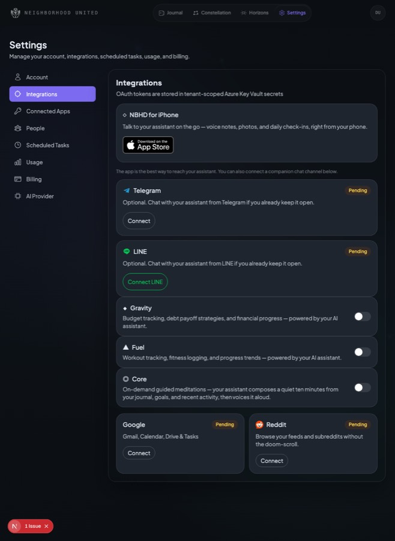
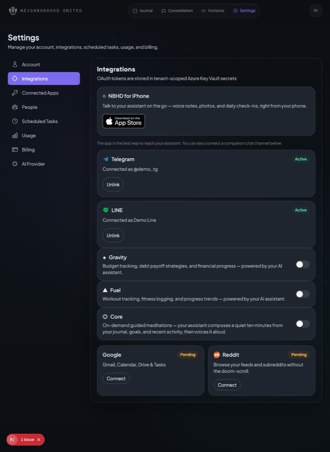
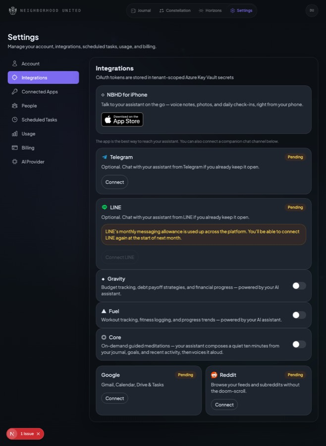
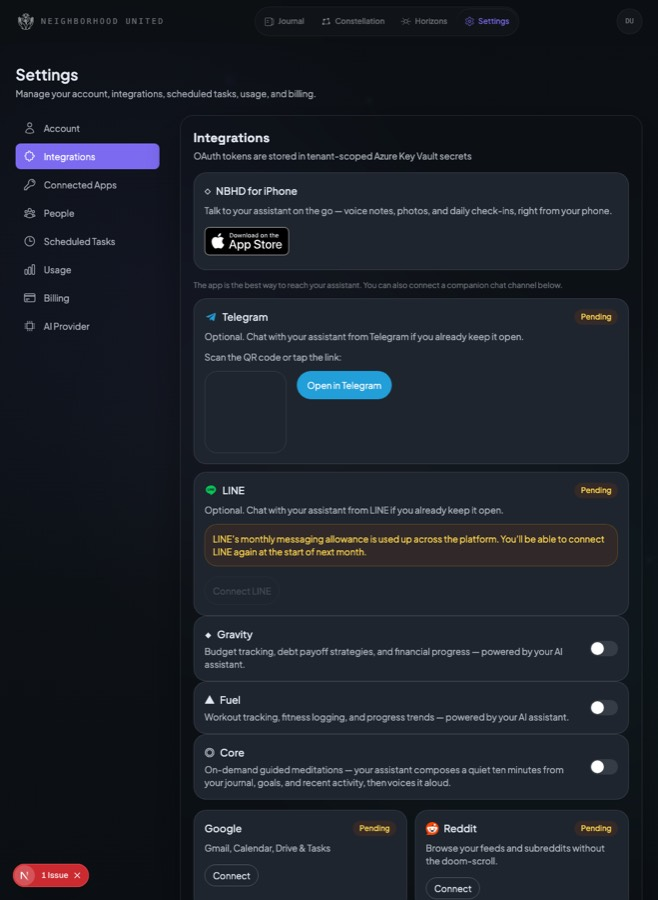
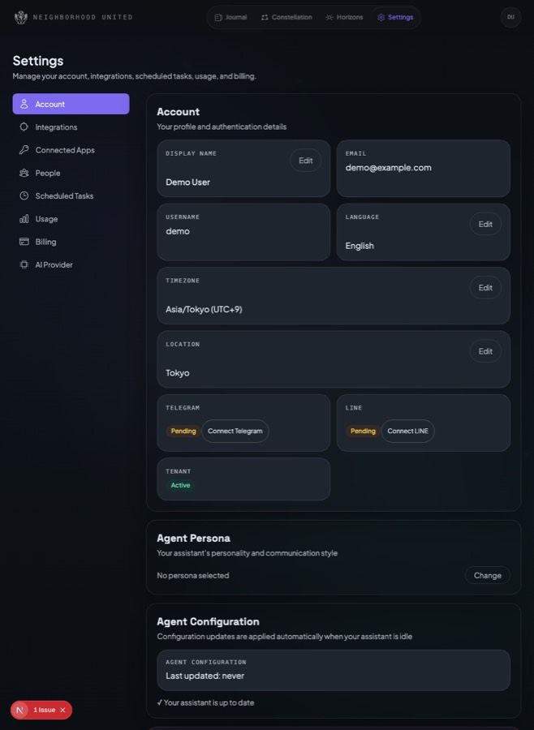

# Settings → channel connect — visual evidence

Screenshots of `/settings/integrations` (and the `/settings` account rows) after
restoring the Telegram/LINE connect flow. Captured against the dev server with the
`telegram/status` and `line/status` API responses stubbed to reach each state
(no real channel linking required). Full-page shots, dark theme.

## Integrations — default (both unlinked)

App Store card stays primary; the two companion channels sit below it with a modest
"the app is the best way to reach your assistant" framing. Each shows a Connect action.

## Integrations — linked (Telegram + LINE connected)

Linked state shows the connected handle (`@username` / display name) and an Unlink button.

## Integrations — unlink confirmation

Unlink is a two-step confirm ("Unlink Telegram? / Confirm unlink / Cancel") so a
tap can't silently drop a channel.

## Integrations — LINE quota exhausted

When the fleet-wide LINE Push monthly allowance is used up (`line/status` →
`quota.exhausted`), the LINE card greys out its Connect button and explains why,
rather than letting someone link a channel the platform can't currently deliver to.

## Integrations — Telegram pairing (QR + deep link)

Clicking Connect generates the one-time QR + `t.me` deep link the endpoint returns.
(The QR box is a placeholder here because the pairing endpoint is stubbed; production
returns a real QR data URL.)

## Account page — read-only channel status rows

The `/settings` account grid regains at-a-glance Telegram/LINE status rows with a
jump link to Integrations when not connected. There is deliberately **no**
preferred-channel toggle — delivery preference is automatic (app-first when the app
is installed).

